[Lab Guide](LAB-GUIDE.md) | [Getting Started →](GETTING-STARTED.md)

---

# Lab Access Guide

Complete these steps **before anything else**. By the end of this guide you will be connected to the VPN, inside VS Code on your lab server, with a terminal open and your ContainerLab topology confirmed healthy.

> **Both Cisco Secure Client and VS Code are already installed on your PC.** You do not need to download or install anything.

---

## What You Need Before Starting

You should have received a **lab credential sheet** with the following information. Confirm you have all values before proceeding:

| Item | Value |
|------|-------|
| **VPN Address** | e.g. `dcloud-sjc-anyconnect.cisco.com` |
| **VPN Username** | _(on your credential sheet)_ |
| **VPN Password** | _(on your credential sheet)_ |
| **Lab Server IP** | `198.18.134.90` (same for all students) |
| **SSH Password** | `C1sco12345` |

> **Do not have your credentials?** Raise your hand and a proctor will bring them to you before you proceed.

---

## Part 1 — Connect to the VPN

### Step 1 — Launch Cisco Secure Client

Find and open the **Cisco Secure Client** application on your laptop.

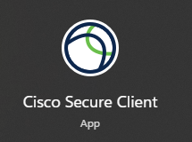

---

### Step 2 — Enter the VPN URL and Connect

The Cisco Secure Client window opens. In the address bar, enter the VPN URL from your credential sheet and click **Connect**.

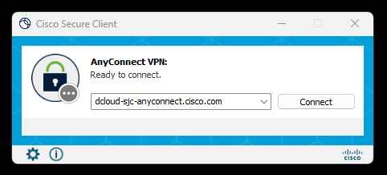

> **Your VPN address is pod-specific** — use the address on your credential sheet, not the one shown in the screenshot.

---

### Step 3 — Enter Your Credentials

A login dialog will appear. Enter your pod username and password from your credential sheet, then click **OK**.

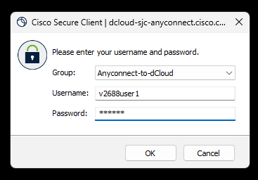

> **Credentials are case-sensitive.** Type them exactly as printed on your credential sheet.

---

### Step 4 — Accept the Connected Dialog

A confirmation dialog appears saying you are connected to the Cisco dCloud platform. Click **Accept**.

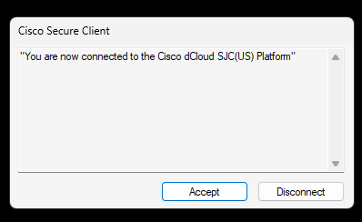

You are now on the dCloud network and can reach your lab server.

---

## Part 2 — Open VS Code and Connect to the Lab Server

### Step 5 — Launch VS Code

Find and open **Visual Studio Code** on your laptop.

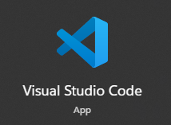

---

### Step 6 — VS Code Opens

The VS Code Welcome screen appears.

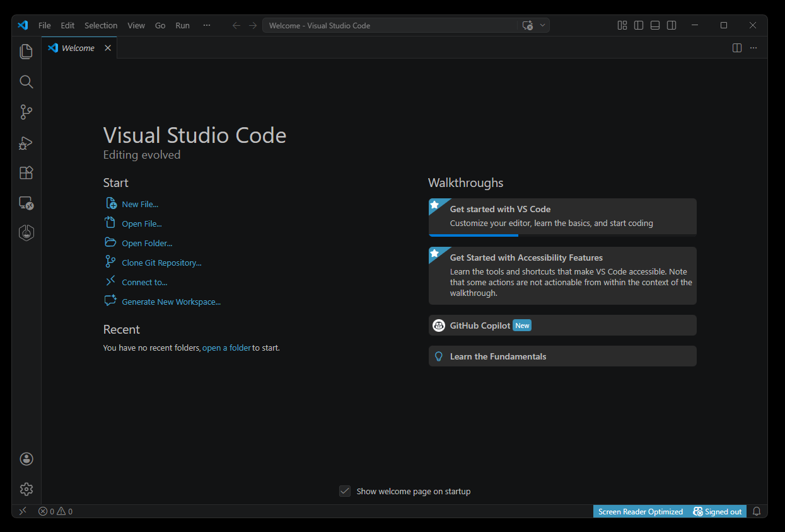

---

### Step 7 — Open the Remote Connection Menu

Click the **remote connection icon** in the very bottom-left corner of VS Code (it looks like two angle brackets `><`). A menu will appear at the top of the screen — click **Connect to Host...**

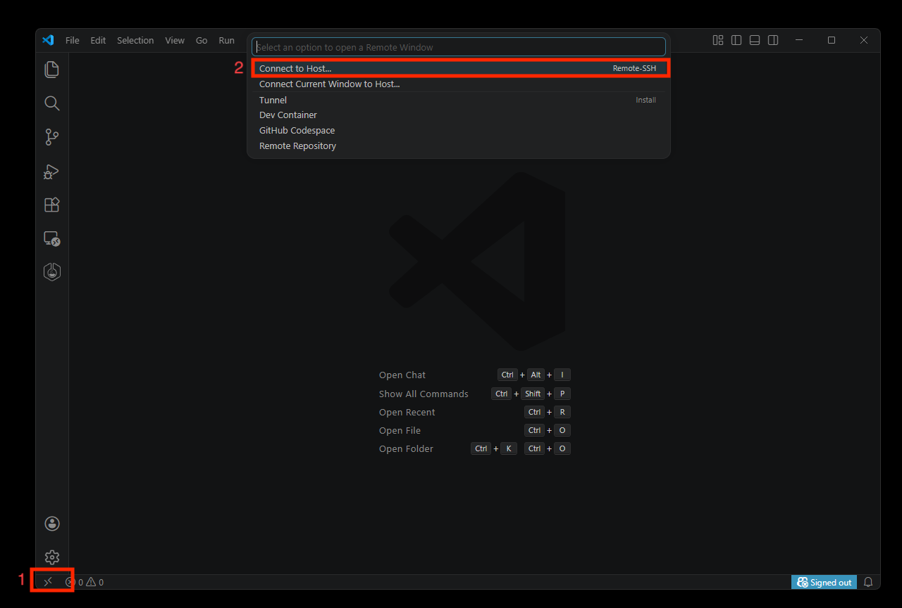

> **Alternative:** Press `Ctrl+Shift+P` to open the Command Palette, type `Remote-SSH: Connect to Host`, and press Enter.

---

### Step 8 — Enter the Lab Server Address

In the bar that appears, type the following and press **Enter**:

```
cisco@198.18.134.90
```

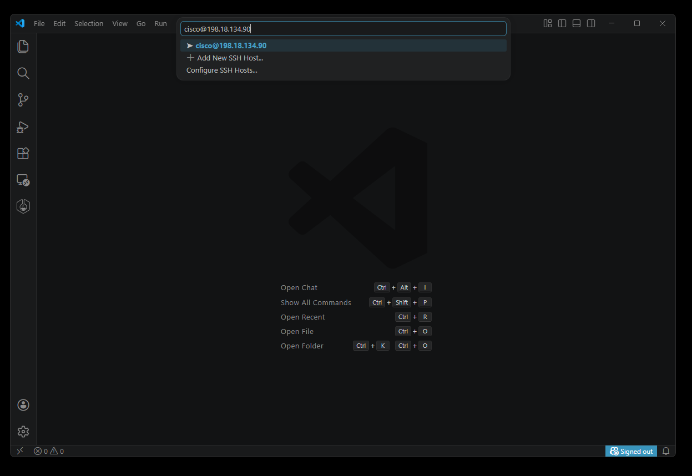

---

### Step 9 — Password Prompt Appears

VS Code will open a new window and prompt you for a password at the top of the screen.

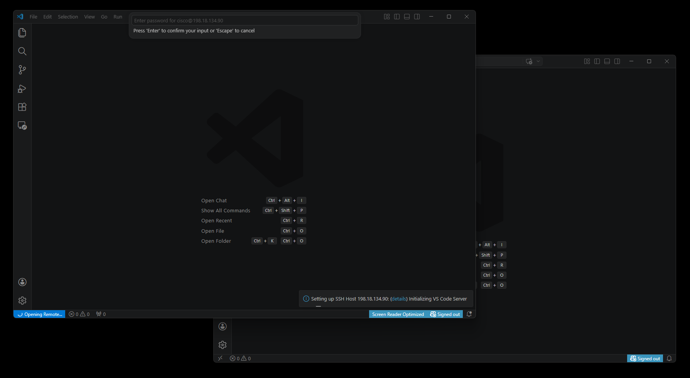

---

### Step 10 — Enter the Password

Type the password and press **Enter**:

```
C1sco12345
```

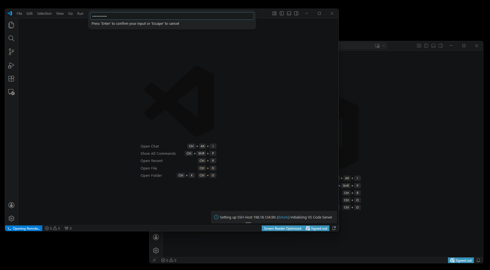

> **The password will not show characters as you type** — this is normal. Just type it and press Enter.

VS Code will connect and initialize the remote session. This may take 15–30 seconds the first time.

---

## Part 3 — Verify ContainerLab is Running

Once connected, VS Code will automatically open a **"Welcome to Containerlab"** tab. This confirms the ContainerLab extension is installed and active on your server.

### Step 11 — Confirm You Are Connected

Look for two things:
- The **"Welcome to Containerlab"** tab is open in the editor
- The **bottom-left status bar** shows `SSH: 198.18.134.90` in blue

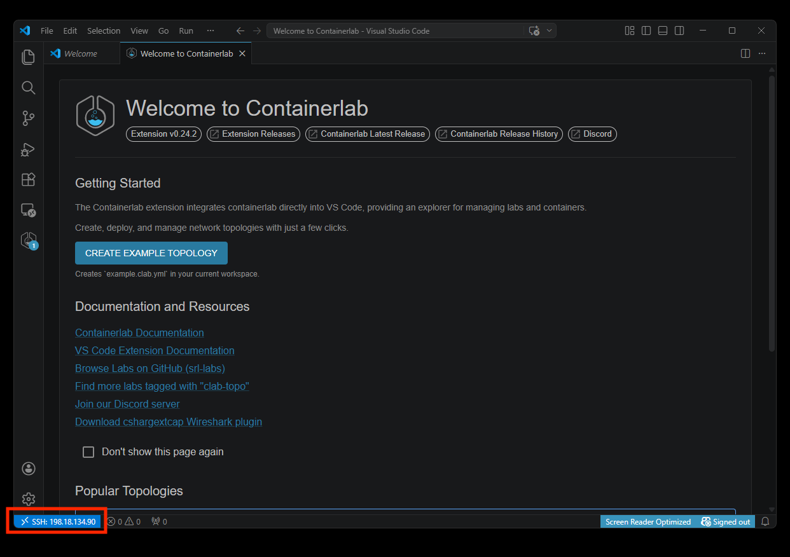

---

### Step 12 — Open the ContainerLab Explorer

Click the **ContainerLab icon** on the left sidebar (the hexagon/network logo). The ContainerLab Explorer panel will open.

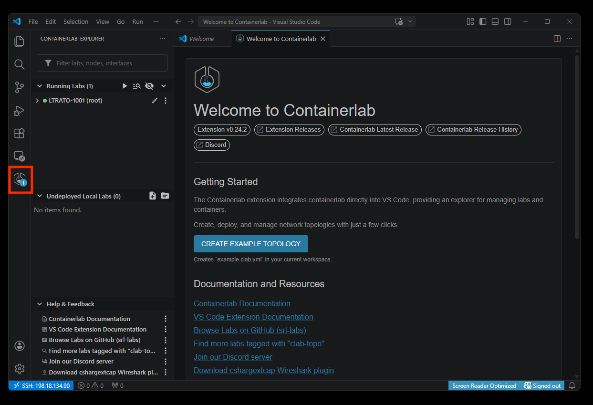

---

### Step 13 — Expand the Lab and Verify All Nodes Are Healthy

Click the arrow next to **LTRATO-1001 (root)** to expand it. You should see all 10 devices listed with a **green dot** next to each one.

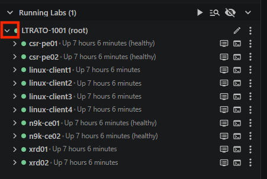

> **Green dot = healthy.** If any device shows a red dot or is missing, notify your instructor — a container may still be booting. Allow 2–3 minutes after the session starts before raising your hand.

---

### Step 14 — View the Topology (Optional)

Click on the **LTRATO-1001** lab name in the explorer to open the interactive topology diagram.

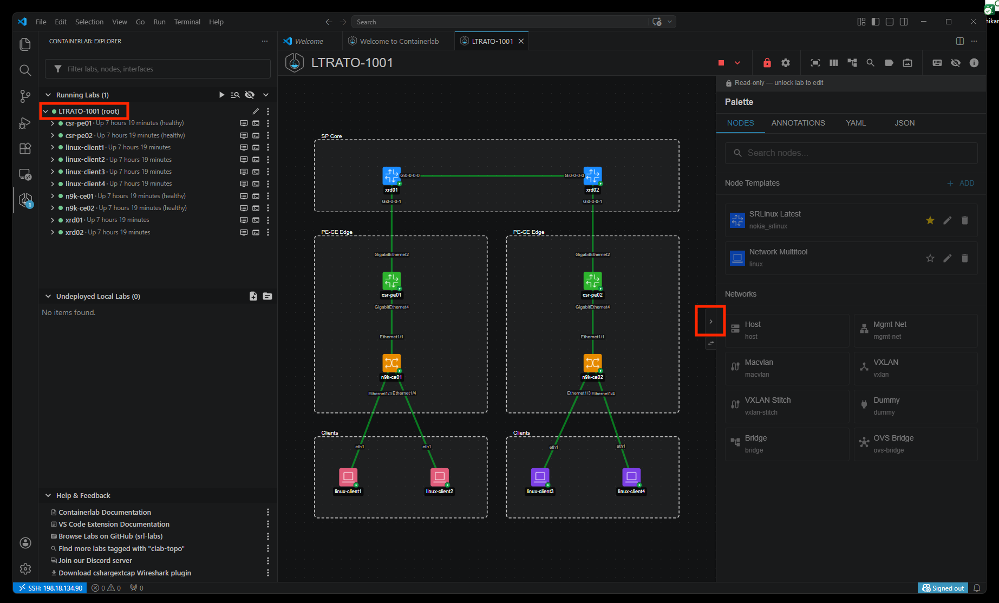

To get a cleaner view, click the **arrow button** on the right edge of the screen to collapse the Palette panel — you won't need it during the lab.

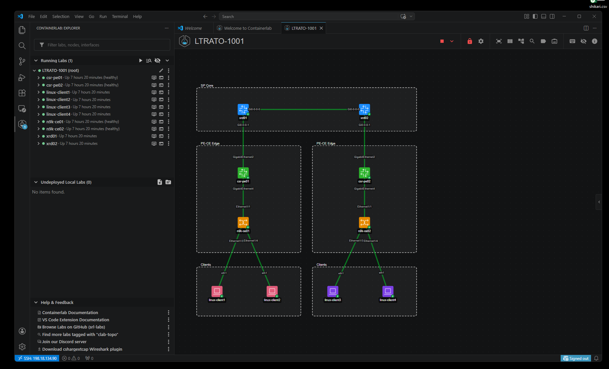

---

## Part 4 — Open Your Terminal

The terminal at the bottom of VS Code is your **main workspace for the entire lab**. All Ansible and Terraform commands are run here.

### Step 15 — Toggle the Terminal Panel

Click the **Toggle Panel** button in the upper-right toolbar, or press `Ctrl+J`.

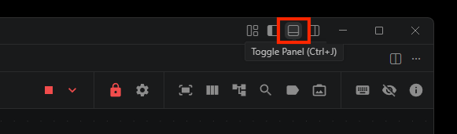

---

### Step 16 — Your Terminal is Open

The terminal panel opens at the bottom of the screen. You should see a prompt:

```
cisco@ubuntu:~$
```

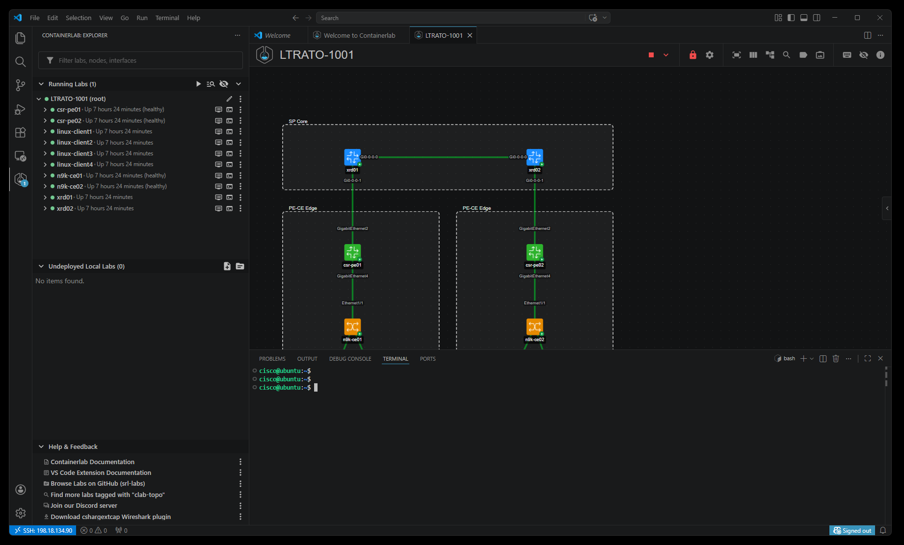

> **This is your workspace.** Every command in this lab is run here. You are logged in as the `cisco` user on your Ubuntu lab server — the same server running all 10 ContainerLab devices.

> **Tip:** If you close the terminal panel by accident, press `Ctrl+J` to bring it back.

---

## Part 5 — Connecting to Devices Directly (Optional)

You do **not** need to SSH into individual devices to complete this lab — Ansible handles all device connections automatically. However, if you want to inspect a device's config or look around, you can connect directly from the ContainerLab Explorer.

### Step 17 — Click the SSH Icon Next to a Device

In the ContainerLab Explorer, hover over any device. Click the **SSH icon** (highlighted in red) that appears to the right of the device name to open a terminal session directly to that device.

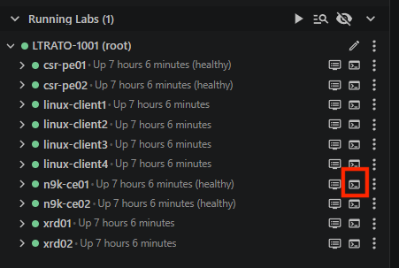

---

### Step 18 — SSH Session Opens; Toggle Between Sessions

The SSH session opens in the terminal panel at the bottom. Multiple sessions appear on the right side of the panel — **bash** is your main workspace, and each SSH connection is listed below it. Click any session name to switch between them.

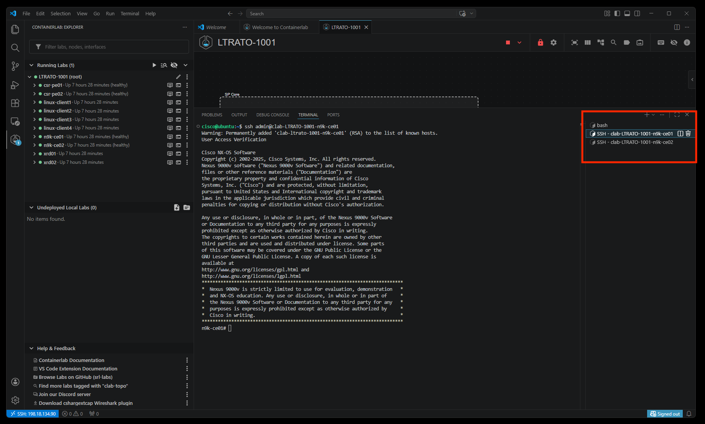

---

### Step 19 — Reopen the Bash Terminal if Needed

If you accidentally close the main bash terminal, click the **`+`** button in the terminal panel header to open a new one.

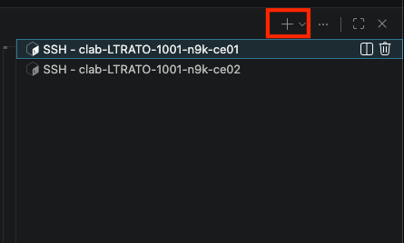

---

## You're Ready

Confirm all of the following before moving on:

- [ ] VPN connected — Cisco Secure Client shows "Connected"
- [ ] VS Code connected — bottom-left shows `SSH: 198.18.134.90` in blue
- [ ] ContainerLab Explorer shows **LTRATO-1001** running with all nodes healthy (green dots)
- [ ] Terminal panel is open with a `cisco@ubuntu:~$` prompt

**All set? Head to [Getting Started](GETTING-STARTED.md) for your next steps.**

---

## Quick Reference

| What | How |
|------|-----|
| **Reconnect VPN** | Open Cisco Secure Client → enter VPN address → Connect → enter credentials |
| **Reconnect VS Code SSH** | Click `><` icon bottom-left → Connect to Host → `cisco@198.18.134.90` |
| **SSH password** | `C1sco12345` |
| **Open a terminal** | `Ctrl+J` or click Toggle Panel in upper-right toolbar |
| **New terminal tab** | Click `+` in the terminal panel header |
| **Connect to a lab device** | Hover over device in ContainerLab Explorer → click SSH icon |
| **Switch terminal sessions** | Click the session name in the right side of the terminal panel |
| **View topology graph** | Click the LTRATO-1001 lab name in the ContainerLab Explorer |

---

## Troubleshooting

| Problem | Solution |
|---------|----------|
| Secure Client says "Connection attempt has failed" | Verify the VPN address matches your credential sheet exactly — check for typos or extra spaces |
| Secure Client says "Login failed" | Re-type your VPN username and password — they are case-sensitive |
| VS Code cannot reach the server | Confirm Cisco Secure Client shows "Connected." If not, reconnect the VPN first |
| VS Code asks for password repeatedly | Make sure you are typing `C1sco12345` exactly — capital C, number 1, lowercase sco |
| VS Code SSH connection times out | The VPN may have disconnected — check and reconnect if needed |
| Terminal shows your local PC, not the server | Check the blue SSH indicator bottom-left of VS Code — if missing, redo Step 7 |
| ContainerLab sidebar is empty | The topology may not be deployed yet — ask a proctor |
| A node shows a red dot in ContainerLab | Do not try to restart it yourself — raise your hand for a proctor |
| Closed the bash terminal by accident | Press `Ctrl+J` to reopen the panel, or click `+` for a new terminal |

> **For any issue not listed here, raise your hand and a proctor will assist you.**

---

[Lab Guide](LAB-GUIDE.md) | [Getting Started →](GETTING-STARTED.md)
