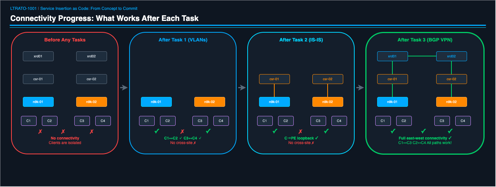
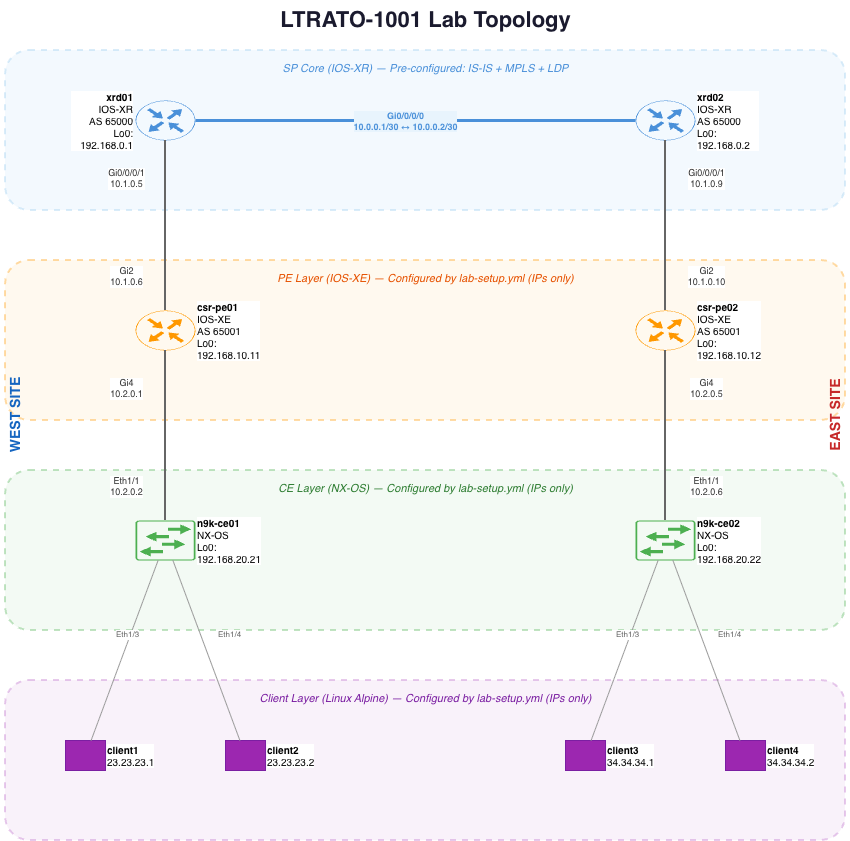
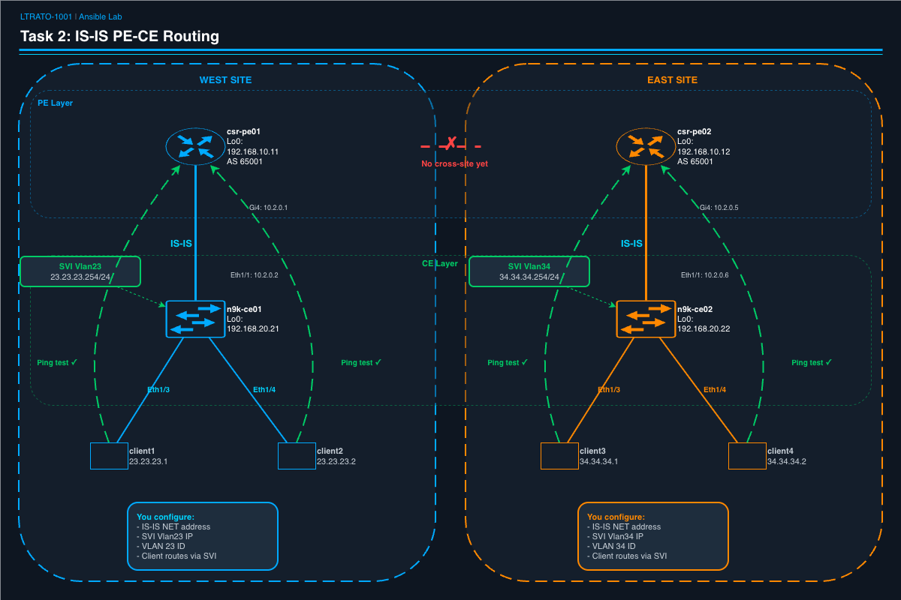
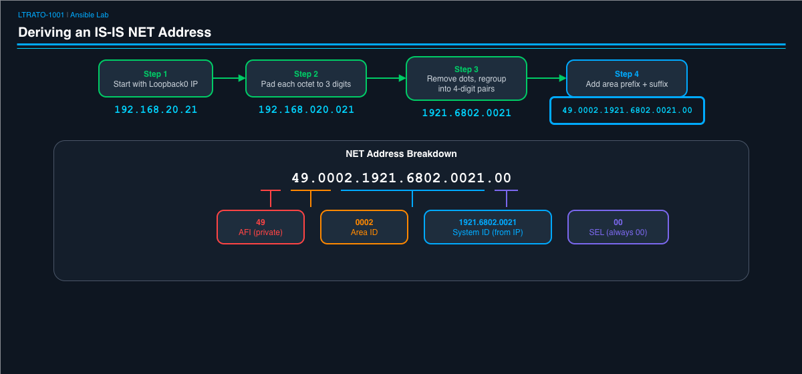

# LTRATO-1001: Automating Service Provider Networks with Ansible

[← Lab Access](LAB-ACCESS.md) | [Getting Started](GETTING-STARTED.md) | [Reference Tables](REFERENCE.md) | [Primer](PRIMER.md)

## Lab Guide

---

## Introduction

Welcome to the Ansible portion of LTRATO-1001! In this section, you will use
**Ansible** to automate the configuration of a multi-vendor service provider
network running on ContainerLab.

You won't just be pressing "run" — you'll be **reading playbooks, filling in
configuration values, and understanding what each piece of automation does
before executing it.** By the end, you'll have built full east-west
connectivity across a service provider core, all through code.

### What You Will Learn

- **Ansible fundamentals:** playbooks, plays, tasks, variables, modules
- **Multi-vendor automation:** configuring NX-OS, IOS-XE, IOS-XR, and Linux
  from a single workflow
- **Infrastructure as Code:** defining network state in YAML, not CLI commands
- **Verification and testing:** automating not just config, but validation

### What You Will Build

| Task | Technology | Outcome |
|------|-----------|---------|
| Task 1 | L2 VLANs (NX-OS) | Clients on the same switch can communicate |
| Task 2 | IS-IS routing (NX-OS + IOS-XE) | Clients can reach their local PE router |
| Task 3 | BGP VPN / Inter-AS Option A (IOS-XR + IOS-XE) | Full east-west connectivity across the SP core |
| Task 4 | Terraform (IOS-XR via gNMI) | Same XRd config as Task 3, different tool |

Each task builds on the previous one. By Task 3, traffic crosses 6 network
devices and 4 different platforms.



---

## Lab Topology



<details>
<summary>Text version of topology (click to expand)</summary>

```
           ┌─────────────┐             ┌─────────────┐
           │    xrd01     │─────────────│    xrd02     │    SP Core (IOS-XR)
           │   AS 65000   │  Gi0/0/0/0  │   AS 65000   │    IS-IS + MPLS
           │ Lo0: .0.1    │             │ Lo0: .0.2    │    (pre-configured)
           └──────┬───────┘             └──────┬───────┘
                  │ Gi0/0/0/1                  │ Gi0/0/0/1
                  │ 10.1.0.5                   │ 10.1.0.9
                  │                            │
                  │ 10.1.0.6                   │ 10.1.0.10
                  │ Gi2                        │ Gi2
           ┌──────┴───────┐             ┌──────┴───────┐
           │   csr-pe01   │             │   csr-pe02   │    PE Routers (IOS-XE)
           │   AS 65001   │             │   AS 65001   │
           │ Lo0: .10.11  │             │ Lo0: .10.12  │
           └──────┬───────┘             └──────┬───────┘
                  │ Gi4                        │ Gi4
                  │ 10.2.0.1                   │ 10.2.0.5
                  │                            │
                  │ 10.2.0.2                   │ 10.2.0.6
                  │ Eth1/1                     │ Eth1/1
           ┌──────┴───────┐             ┌──────┴───────┐
           │   n9k-ce01   │             │   n9k-ce02   │    CE Switches (NX-OS)
           │ Lo0: .20.21  │             │ Lo0: .20.22  │
           └──┬────────┬──┘             └──┬────────┬──┘
           Eth1/3    Eth1/4              Eth1/3    Eth1/4
             │         │                  │         │
          ┌──┴──┐   ┌──┴──┐           ┌──┴──┐   ┌──┴──┐
          │ C1  │   │ C2  │           │ C3  │   │ C4  │    Linux Clients
          │.23.1│   │.23.2│           │.34.1│   │.34.2│
          └─────┘   └─────┘           └─────┘   └─────┘
```

> **Notation:** IP addresses are shortened. For example, `.0.1` means
> `192.168.0.1`, `.10.11` means `192.168.10.11`, `.23.1` means `23.23.23.1`.

</details>

---

## Reference Tables

These tables are your primary reference when filling in playbook variables.
Keep this section open while you work.

### Table 1: VLAN Assignments

| Switch | VLAN ID | VLAN Name | Ports | Connected Clients |
|--------|---------|-----------|-------|-------------------|
| n9k-ce01 | 23 | CLIENT-VLAN-23 | Eth1/3, Eth1/4 | client1 (23.23.23.1), client2 (23.23.23.2) |
| n9k-ce02 | 34 | CLIENT-VLAN-34 | Eth1/3, Eth1/4 | client3 (34.34.34.1), client4 (34.34.34.2) |

### Table 2: IP Addressing

| Device | Interface | IP Address | Subnet | Purpose |
|--------|-----------|-----------|--------|---------|
| **xrd01** | Loopback0 | 192.168.0.1 | /32 | Router ID / iBGP source |
| **xrd01** | Gi0/0/0/0 | 10.0.0.1 | /30 | Core link to xrd02 |
| **xrd01** | Gi0/0/0/1 | 10.1.0.5 | /30 | Link to csr-pe01 |
| **xrd02** | Loopback0 | 192.168.0.2 | /32 | Router ID / iBGP source |
| **xrd02** | Gi0/0/0/0 | 10.0.0.2 | /30 | Core link to xrd01 |
| **xrd02** | Gi0/0/0/1 | 10.1.0.9 | /30 | Link to csr-pe02 |
| **csr-pe01** | Loopback0 | 192.168.10.11 | /32 | Router ID |
| **csr-pe01** | Gi2 | 10.1.0.6 | /30 | Link to xrd01 |
| **csr-pe01** | Gi4 | 10.2.0.1 | /30 | Link to n9k-ce01 |
| **csr-pe02** | Loopback0 | 192.168.10.12 | /32 | Router ID |
| **csr-pe02** | Gi2 | 10.1.0.10 | /30 | Link to xrd02 |
| **csr-pe02** | Gi4 | 10.2.0.5 | /30 | Link to n9k-ce02 |
| **n9k-ce01** | Loopback0 | 192.168.20.21 | /32 | Router ID |
| **n9k-ce01** | Eth1/1 | 10.2.0.2 | /30 | Uplink to csr-pe01 |
| **n9k-ce01** | SVI (Vlan23) | 23.23.23.254 | /24 | Client gateway (west) |
| **n9k-ce02** | Loopback0 | 192.168.20.22 | /32 | Router ID |
| **n9k-ce02** | Eth1/1 | 10.2.0.6 | /30 | Uplink to csr-pe02 |
| **n9k-ce02** | SVI (Vlan34) | 34.34.34.254 | /24 | Client gateway (east) |
| **linux-client1** | eth1 | 23.23.23.1 | /24 | West client |
| **linux-client2** | eth1 | 23.23.23.2 | /24 | West client |
| **linux-client3** | eth1 | 34.34.34.1 | /24 | East client |
| **linux-client4** | eth1 | 34.34.34.2 | /24 | East client |

### Table 3: BGP Peering

| Session | Type | Local Device | Local AS | Local IP | Remote Device | Remote AS | Remote IP |
|---------|------|-------------|----------|----------|---------------|-----------|-----------|
| XRd iBGP | VPNv4 | xrd01 | 65000 | 192.168.0.1 (Lo0) | xrd02 | 65000 | 192.168.0.2 (Lo0) |
| XRd iBGP | VPNv4 | xrd02 | 65000 | 192.168.0.2 (Lo0) | xrd01 | 65000 | 192.168.0.1 (Lo0) |
| West eBGP | IPv4 VRF | xrd01 | 65000 | 10.1.0.5 (Gi0/0/0/1) | csr-pe01 | 65001 | 10.1.0.6 (Gi2) |
| East eBGP | IPv4 VRF | xrd02 | 65000 | 10.1.0.9 (Gi0/0/0/1) | csr-pe02 | 65001 | 10.1.0.10 (Gi2) |

### Table 4: IS-IS Configuration

| Device | Loopback0 IP | IS-IS NET Address | Role |
|--------|-------------|-------------------|------|
| n9k-ce01 | 192.168.20.21 | 49.0002.1921.6802.0021.00 | CE |
| n9k-ce02 | 192.168.20.22 | 49.0002.1921.6802.0022.00 | CE |
| csr-pe01 | 192.168.10.11 | 49.0002.1921.6801.0011.00 | PE |
| csr-pe02 | 192.168.10.12 | 49.0002.1921.6801.0012.00 | PE |

> **How IS-IS NET addresses are derived:** See the "Deriving IS-IS NET
> Addresses" section under Task 2 for a step-by-step walkthrough.

---

## Getting Started

### Step 1: Open Your Terminal

If you completed [Lab Access](LAB-ACCESS.md), your terminal is already open in VS Code with the prompt `cisco@ubuntu:~$`. Use that same terminal for all commands below.

> **Not set up yet?** Go to [Lab Access](LAB-ACCESS.md) first.

### Step 2: Clone the Lab Repository

The lab files need to live directly in your home directory (`/home/cisco/`)
because the Ansible configuration expects them there:

```bash
cd ~
git clone <REPO_URL> .lab-tmp
mv .lab-tmp/* .lab-tmp/.* . 2>/dev/null
rm -rf .lab-tmp
```

Verify the files are in place:

```bash
ls ~/inventory.yml ~/ansible.cfg ~/ce-access-vlan.yml
```

### Step 3: Verify Ansible Is Working

```bash
ansible --version
```

You should see Ansible core 2.x with Python 3.x.

### Step 4: Understand the Inventory

The inventory file defines all the devices Ansible will manage. Open it:

```bash
cat ~/inventory.yml
```

Notice how devices are organized into **groups** (`xrd`, `csr`, `nxos`,
`linux`). Each group has platform-specific connection settings. This is how
Ansible knows which module and transport to use for each device type.

**Key things to notice:**
- `ansible_network_os` tells Ansible which platform collection to use
- `ansible_connection: network_cli` means Ansible connects via SSH and
  sends CLI commands (just like you would manually)
- Different devices use different SSH authentication (keys vs passwords) —
  Ansible handles this transparently

> **💡 Automation Insight:** This inventory file is your single source of truth. Every IP, every credential, every platform mapping — one file. When a device gets replaced or an IP changes, you update it here and every playbook automatically picks up the change. No hunting through 15 scripts to find hardcoded IPs.

### Step 5: Test Connectivity

```bash
ansible all -m ping
```

The **6 network devices** should return `SUCCESS`. The **4 Linux clients will
FAIL** — this is expected and we'll explain why below.

```
xrd01 | SUCCESS => {
    "changed": false,
    "ping": "pong"
}
xrd02 | SUCCESS => {
    "changed": false,
    "ping": "pong"
}
csr-pe01 | SUCCESS => {
    "changed": false,
    "ping": "pong"
}
csr-pe02 | SUCCESS => {
    "changed": false,
    "ping": "pong"
}
n9k-ce01 | SUCCESS => {
    "changed": false,
    "ping": "pong"
}
n9k-ce02 | SUCCESS => {
    "changed": false,
    "ping": "pong"
}
linux-client1 | FAILED! => {
    "changed": false,
    "module_stderr": "/bin/sh: python: not found\n",
    "module_stdout": "",
    "msg": "The module failed to execute correctly..."
}
linux-client2 | FAILED! => { ... }
linux-client3 | FAILED! => { ... }
linux-client4 | FAILED! => { ... }
```

> **Why do the Linux clients fail?** Don't worry — this is expected. The
> `ping` module requires Python on the remote host, but our Linux containers
> are minimal Alpine images with no Python installed. This does **not** mean
> Ansible can't manage them. Our playbooks use the `raw` module for Linux
> tasks, which sends commands directly over SSH without needing Python.
> You'll see this in action in Tasks 1 and 2.

If any of the **6 network devices** show `UNREACHABLE`, let your instructor
know — a device may still be booting or SSH keys may need to be re-injected.

> **What just happened?** The `ping` module doesn't send ICMP — it verifies
> Ansible can connect to each device via SSH and execute a simple command.
> It's a connectivity health check for your automation, not a network ping.
> Each platform uses a different transport: NX-OS and IOS-XR use SSH with
> public keys, IOS-XE uses SSH with a password, and Linux uses raw SSH.
> Ansible handles all of this based on the inventory configuration.

> **💡 Automation Insight:** You just health-checked 10 devices in one command. In a manual workflow, that's 10 SSH sessions, 10 logins, 10 "is this thing on?" checks. Now imagine it's 3 AM and a site goes down — this one-liner tells you instantly which devices are reachable and which aren't. That's why every automation workflow starts with a connectivity check.

---

## Ansible Quick Primer

If you're new to Ansible, take 5 minutes to read this section. Understanding
these concepts will make the rest of the lab much more intuitive.

### What is Ansible?


Ansible is an open-source automation tool that manages infrastructure through
**code** instead of manual CLI sessions. Instead of SSH'ing into 10 devices
and typing commands one by one, you write a YAML file describing the desired
state, and Ansible handles the rest — connecting, authenticating, sending
commands, and verifying results.

**Key properties:**
- **Agentless** — No software needs to be installed on the managed devices.
  Ansible connects over SSH (same as you would manually).
- **Declarative** — You describe *what* the state should be, not the exact
  steps to get there. Ansible figures out what commands to send.
- **Idempotent** — Running the same playbook twice produces the same result.
  If the config is already correct, Ansible makes no changes.
- **Multi-vendor** — One tool handles NX-OS, IOS-XE, IOS-XR, Linux, and more.
  Platform-specific "collections" (plugins) handle the differences.

### Playbook Structure


A **playbook** is a YAML file containing one or more **plays**. Each play
targets a group of devices and runs a series of **tasks**:

```yaml
---                              # YAML document start
- name: "My Play"               # A PLAY targets a group of devices
  hosts: nxos                    # Which devices from inventory to configure
  gather_facts: false            # Skip auto-discovery (required for network devices)

  vars:                          # VARIABLES — data that tasks reference
    my_vlan: 23

  tasks:                         # TASKS — the actual work, executed in order

    - name: "Create VLAN"        # Human-readable description
      cisco.nxos.nxos_vlans:     # MODULE — the Ansible plugin that does the work
        config:
          - vlan_id: "{{ my_vlan }}"   # {{ }} = variable substitution
        state: merged            # "merged" = add without removing existing config
```

**The flow:** Ansible reads the playbook → connects to each host in `hosts:` →
runs each task in order → reports results. If a task fails, Ansible stops on
that host (but continues on others).

### Variables: Separating Data from Logic

The most important concept in this lab is **variable separation**. Look at the
playbook structure:

```yaml
vars:                # ← DATA (what to configure — you edit this)
  vlan_config:
    n9k-ce01:
      id: 23

tasks:               # ← LOGIC (how to configure — already written for you)
  - name: "Create VLAN"
    cisco.nxos.nxos_vlans:
      config:
        - vlan_id: "{{ vlan_config[inventory_hostname].id }}"
```

The `vars` section is the **data** — the specific values for your network.
The `tasks` section is the **logic** — the Ansible modules and their structure.
In this lab, **you edit the data (vars), not the logic (tasks).** This mirrors
real-world IaC practice: engineers change variables in a data file, and the
automation logic stays the same across environments.

The expression `{{ vlan_config[inventory_hostname].id }}` means: "Look up the
current device's hostname in the `vlan_config` dictionary, then get its `id`
field." When Ansible runs on `n9k-ce01`, this resolves to `23`. When it runs
on `n9k-ce02`, it resolves to whatever you set for that switch.

> **💡 Automation Insight:** This data/logic split is the pattern behind every scalable automation system. Think of it this way: the playbook is a template you write once. The variables are a spreadsheet your team fills in. When a new site comes online, nobody touches the automation code — they just add a row to the data.

### Key Concepts Reference

| Concept | What It Means |
|---------|--------------|
| **Play** | A block that targets a group of hosts and runs tasks on them |
| **Task** | A single action (create VLAN, push CLI config, run a command) |
| **Module** | The plugin that performs the action (`nxos_vlans`, `ios_config`, etc.) |
| **Variable** | Data referenced with `{{ }}` — keeps config values separate from logic |
| **Collection** | A package of modules for a specific platform (e.g., `cisco.nxos`) |
| **`hosts:`** | Which inventory group to target (e.g., `nxos`, `csr`, `xrd`, `linux`) |
| **`gather_facts: false`** | Must be set for network devices (they don't support default fact gathering) |
| **`state: merged`** | Add/update config without removing anything that already exists |
| **`register:`** | Save command output into a variable for later display or inspection |
| **`loop:`** | Run the same task multiple times, once per item in a list |
| **`when:`** | Only run this task if a condition is true |
| **Idempotency** | Running the same playbook twice produces the same result — no duplicate config |

### How to Edit Playbooks

Use VS Code (already connected via Remote-SSH) to open and edit the YAML
files. You can also use `nano` or `vi` from the terminal:

```bash
nano ~/ce-access-vlan.yml
```

> **YAML is whitespace-sensitive.** Use spaces (not tabs), and make sure
> your indentation matches the surrounding lines. If your playbook fails
> with a syntax error, check indentation first. A common mistake is using
> 3 spaces instead of 2, or mixing tabs and spaces.

> **Tip:** In VS Code, the bottom status bar shows "Spaces: 2" when the
> file is set to 2-space indentation. If you see "Tab Size: 4", click it
> and switch to spaces.

> **💡 Automation Insight:** This TODO pattern mirrors how real teams work. A senior engineer writes the playbook logic and tests it. A junior engineer or even a NOC operator fills in the variables for each deployment. The automation skill ceiling is low — if you can read a table and type a number, you can deploy infrastructure. That's how automation democratizes network operations.

---

## Task 1: Configure L2 Access VLANs


### Objective

Configure VLANs on the N9K CE switches so that Linux clients on the same
switch can communicate at Layer 2.

**Before Task 1:**
- Client1 (23.23.23.1) CANNOT reach Client2 (23.23.23.2) — no L2 path
- Client3 (34.34.34.1) CANNOT reach Client4 (34.34.34.2)

**After Task 1:**
- Client1 CAN ping Client2 (same switch, same VLAN)
- Client3 CAN ping Client4 (same switch, same VLAN)

### Why VLANs?

The client-facing ports (Eth1/3, Eth1/4) on each N9K switch are currently in
their default state — they operate as independent interfaces with no bridging
between them. Even though client1 and client2 are plugged into the same
physical switch, they can't talk to each other because there's no shared
Layer 2 domain.

**VLANs** (Virtual Local Area Networks) solve this by creating a logical
broadcast domain:

1. **Create a VLAN** — This is a virtual switch fabric inside the physical switch.
   All ports assigned to the same VLAN can communicate at Layer 2.
2. **Convert ports to switchport mode** — NX-OS ports can be either Layer 3
   (routed, each port has its own IP) or Layer 2 (switched, ports share a VLAN).
   We need Layer 2 for client connectivity.
3. **Assign both client ports to the same VLAN** — Now Eth1/3 and Eth1/4 are
   in the same broadcast domain, and frames are bridged between them.

**VLAN IDs matter because they link to client subnets.** West-side clients are
on 23.23.23.0/24 — VLAN 23. East-side clients are on 34.34.34.0/24 — VLAN 34.
This naming convention makes the network topology self-documenting.

This is the foundation — Task 2 adds Layer 3 gateways on these VLANs (SVIs),
and Task 3 carries VLAN routes across the SP core.

### Step 1: Verify the Baseline

Before configuring anything, verify the initial state of the network. Clients
on the same switch cannot reach each other yet — not because something is
broken, but because the VLANs haven't been configured. This is your baseline.

SSH into one of the Linux clients and try to ping its neighbor on the same switch:

```bash
ssh linux-client1 ping -c 3 23.23.23.2
```

You should see **100% packet loss**:

```
PING 23.23.23.2 (23.23.23.2) 56(84) bytes of data.

--- 23.23.23.2 ping statistics ---
3 packets transmitted, 0 received, 100% packet loss, time 2002ms
```

Try the east side too:

```bash
ssh linux-client3 ping -c 3 34.34.34.2
```

Same result — **100% packet loss**. Both pairs of clients are physically
connected to the same switch, but with no VLAN bridging the ports, the frames
have nowhere to go. This is expected — no VLANs have been configured yet.

> **Why start with verification?** In automation, your first step should always
> be to verify the current state. This gives you a baseline to compare against
> after the playbook runs. If you don't know where you started, you can't prove
> you improved anything.

Now let's configure it.

### Exercise: Complete the Playbook

Open the playbook in your editor:

```bash
nano ~/ce-access-vlan.yml
```

Scroll to the `vars:` section near the top. You'll see TODO placeholders:

```yaml
vars:
  vlan_config:
    n9k-ce01:
      id: ___          # TODO: VLAN ID for west-side clients (see Table 1)
      name: "___"      # TODO: Name this VLAN (convention: CLIENT-VLAN-<id>)
    n9k-ce02:
      id: ___          # TODO: VLAN ID for east-side clients (see Table 1)
      name: "___"      # TODO: Name this VLAN (convention: CLIENT-VLAN-<id>)
```

Using **Table 1: VLAN Assignments**, fill in the 4 values:

1. **n9k-ce01 VLAN ID:** The VLAN for west-side clients (client1, client2)
2. **n9k-ce01 VLAN name:** Use the naming convention `CLIENT-VLAN-<id>`
3. **n9k-ce02 VLAN ID:** The VLAN for east-side clients (client3, client4)
4. **n9k-ce02 VLAN name:** Use the naming convention `CLIENT-VLAN-<id>`

Save the file when done.

### Ansible Concepts in This Playbook

Before running, read through the tasks below the vars. Notice:

- **`cisco.nxos.nxos_vlans`** (Step 1) — A *declarative* module. You describe
  the desired state ("VLAN 23 should exist and be active"), and Ansible figures
  out what CLI commands to send. If the VLAN already exists, nothing changes.

- **`cisco.nxos.nxos_config`** (Step 2) — A *raw CLI* module. When no
  purpose-built module exists, you send CLI commands directly. The `parents`
  parameter enters a config context first (like typing `interface Ethernet1/3`).
  This step converts the ports to switchport mode and brings them up — they
  start administratively shut down on a fresh N9Kv.

- **`cisco.nxos.nxos_l2_interfaces`** (Step 3) — Another declarative module
  that assigns VLANs to interfaces. Notice how `{{ vlan_config[inventory_hostname].id }}`
  pulls the VLAN ID from your variables — the same task works on both switches
  because each has different variable values.

- **`loop`** (Steps 2, 5) — Runs the task once per item in the list. This
  avoids duplicating the same task for each interface.

> **💡 Automation Insight:** That `loop:` keyword just saved you from writing the same task twice. Now imagine you have 48 ports to configure instead of 2. Same playbook, bigger list. Automation scales linearly with data, not with effort.

- **`save_when: modified`** (Step 4) — Only writes to startup-config if
  something actually changed. This is idempotent — safe to run repeatedly.

### Run It

```bash
ansible-playbook ~/ce-access-vlan.yml
```

### Understanding the Output

Watch the output as it runs. Ansible uses color-coded status for each task:

- **`changed`** (yellow) = Ansible made a configuration change on the device
- **`ok`** (green) = The task ran but no changes were needed (config already correct)
- **`skipping`** (cyan) = The task's `when` condition was false for this host
- **`failed`** (red) = Something went wrong — read the error message

On the first run, most tasks should show `changed`. Here's what the configuration
tasks look like when they run successfully:

```
PLAY [Task 1 — Configure L2 access VLANs on NX-OS CE switches] *****************

TASK [Step 1 — Create VLAN on each CE switch] **********************************
changed: [n9k-ce02]
changed: [n9k-ce01]

TASK [Step 2 — Convert Eth1/3 and Eth1/4 to switchport mode and bring up] *****
changed: [n9k-ce01] => (item=Ethernet1/3)
changed: [n9k-ce02] => (item=Ethernet1/3)
changed: [n9k-ce01] => (item=Ethernet1/4)
changed: [n9k-ce02] => (item=Ethernet1/4)

TASK [Step 3 — Assign access VLAN to Eth1/3 and Eth1/4] ************************
changed: [n9k-ce02]
changed: [n9k-ce01]

TASK [Step 4 — Save running configuration] *************************************
changed: [n9k-ce01]
changed: [n9k-ce02]

TASK [Step 5 — Bounce client ports (vrnetlab workaround)] **********************
changed: [n9k-ce01] => (item=Ethernet1/3)
changed: [n9k-ce02] => (item=Ethernet1/3)
changed: [n9k-ce01] => (item=Ethernet1/4)
changed: [n9k-ce02] => (item=Ethernet1/4)

TASK [Step 5b — Bring client ports back up] ************************************
changed: [n9k-ce02] => (item=Ethernet1/3)
changed: [n9k-ce01] => (item=Ethernet1/3)
changed: [n9k-ce02] => (item=Ethernet1/4)
changed: [n9k-ce01] => (item=Ethernet1/4)

TASK [Wait for ports to re-initialize (vrnetlab needs ~30s)] *******************
Pausing for 30 seconds
ok: [n9k-ce01]
```

> **What's happening with Steps 5 and 5b?** The playbook shuts down the client
> ports and brings them back up. This is a workaround for ContainerLab's vrnetlab
> — sometimes virtual NIC mappings need a port bounce to properly forward traffic
> after VLAN changes. In a real network, this step wouldn't be needed.

After the config tasks, the playbook runs **verification** and **test** plays
automatically. Here's what successful verification looks like:

> **💡 Automation Insight:** Notice that every playbook includes `show` commands and ping tests *as code*. This is a game-changer: verification isn't something you do after the change — it's part of the change. In production, if a verification task fails, you can automatically trigger a rollback. The playbook becomes a self-validating change window.

```
PLAY [Verify — Check VLAN and port status] *************************************

TASK [Verify — Show VLAN brief] ************************************************
ok: [n9k-ce01]
ok: [n9k-ce02]

TASK [Display VLAN status] *****************************************************
ok: [n9k-ce01] => {
    "vlan_output.stdout_lines": [
        [
            "VLAN Name                             Status    Ports",
            "---- -------------------------------- --------- ---------",
            "1    default                          active    ...",
            "23   CLIENT-VLAN-23                   active    Eth1/3, Eth1/4"
        ]
    ]
}
ok: [n9k-ce02] => {
    "vlan_output.stdout_lines": [
        [
            "VLAN Name                             Status    Ports",
            "---- -------------------------------- --------- ---------",
            "1    default                          active    ...",
            "34   CLIENT-VLAN-34                   active    Eth1/3, Eth1/4"
        ]
    ]
}
```

> **What to look for:** Each switch should have its VLAN (23 or 34) in `active`
> status with both `Eth1/3` and `Eth1/4` listed in the Ports column. If you see
> the VLAN but no ports, the switchport assignment didn't work correctly.

Finally, the ping tests confirm L2 connectivity:

```
PLAY [Test — Ping between clients on the same switch] **************************

TASK [Test — client1 pings client2 (23.23.23.1 → 23.23.23.2)] ******************
changed: [linux-client1]

TASK [Show ping result (client1 → client2)] ************************************
ok: [linux-client1] => {
    "ping_result.stdout_lines": [
        "PING 23.23.23.2 (23.23.23.2) 56(84) bytes of data.",
        "64 bytes from 23.23.23.2: icmp_seq=1 ttl=64 time=4.85 ms",
        "64 bytes from 23.23.23.2: icmp_seq=2 ttl=64 time=4.97 ms",
        "64 bytes from 23.23.23.2: icmp_seq=3 ttl=64 time=2.29 ms",
        "",
        "--- 23.23.23.2 ping statistics ---",
        "3 packets transmitted, 3 received, 0% packet loss, time 2003ms"
    ]
}

TASK [Test — client3 pings client4 (34.34.34.1 → 34.34.34.2)] ******************
changed: [linux-client3]

TASK [Show ping result (client3 → client4)] ************************************
ok: [linux-client3] => {
    "ping_result.stdout_lines": [
        "PING 34.34.34.2 (34.34.34.2) 56(84) bytes of data.",
        "64 bytes from 34.34.34.2: icmp_seq=1 ttl=64 time=6.21 ms",
        "64 bytes from 34.34.34.2: icmp_seq=2 ttl=64 time=1.76 ms",
        "64 bytes from 34.34.34.2: icmp_seq=3 ttl=64 time=2.12 ms",
        "",
        "--- 34.34.34.2 ping statistics ---",
        "3 packets transmitted, 3 received, 0% packet loss, time 2003ms"
    ]
}
```

The **PLAY RECAP** at the very end gives you a summary of everything that happened:

```
PLAY RECAP *********************************************************************
linux-client1              : ok=2    changed=1    unreachable=0    failed=0
linux-client3              : ok=2    changed=1    unreachable=0    failed=0
n9k-ce01                   : ok=11   changed=6    unreachable=0    failed=0
n9k-ce02                   : ok=10   changed=6    unreachable=0    failed=0
```

> **Reading the recap:** Each line is a device. `changed=6` means 6 tasks made
> changes. `failed=0` means nothing went wrong. If you see `failed=1` or higher,
> scroll up to find the red error message — it will tell you exactly which task
> failed and why.

### Checkpoint

Confirm these results from the playbook output:

- [ ] `show vlan brief` shows your VLANs with Eth1/3 and Eth1/4 assigned
- [ ] client1 → client2 ping: **3 packets transmitted, 3 received, 0% packet loss**
- [ ] client3 → client4 ping: **3 packets transmitted, 3 received, 0% packet loss**
- [ ] PLAY RECAP shows **failed=0** for all devices

> **Troubleshooting:** If pings fail, verify you entered the correct VLAN IDs.
> The VLAN IDs must match Table 1, because the client IP addresses are already
> assigned to specific subnets. If you see a YAML syntax error, check that your
> values line up with the surrounding indentation — YAML is very picky about
> whitespace.

> **💡 Automation Insight:** You just configured 2 switches, created 2 VLANs, assigned 4 ports, and verified connectivity — without logging into a single device. Manually, that's 2 SSH sessions, ~12 CLI commands each, and copy-pasting between windows hoping you don't typo a VLAN ID. The playbook took seconds.

---

## Task 1b: Configuration Drift & Remediation

### Objective

Demonstrate how Ansible detects and repairs configuration drift — when
someone (or something) changes a device's config outside of automation,
causing it to deviate from the desired state.

**Before Task 1b:**
- Everything is working — client1 can ping client2, client3 can ping client4

**After Task 1b:**
- You'll manually break the network, then watch Ansible find and fix the
  exact change — without touching anything else

### Why This Matters

In production networks, configuration drift is one of the most common causes
of outages. It happens every day:

- An engineer SSHs in at 2 AM to make a "quick fix" and forgets to update
  the automation
- A firmware upgrade resets an interface to its default state
- A colleague changes a port config on the wrong switch

The traditional response is to troubleshoot manually — SSH in, compare the
running config to what you *think* it should be, and hope you catch the
difference. That doesn't scale.

With automation, your playbook **is** the source of truth. When something
drifts, you don't troubleshoot — you re-run the playbook. Ansible compares
the device's current state against the desired state, fixes only what
changed, and leaves everything else untouched. This is idempotency working
for you in the real world.

### Step 1: Break Something

SSH into **n9k-ce01** and manually shut down the client1 port. This simulates
an unauthorized change — maybe someone disabled the port while debugging a
different issue and forgot to re-enable it.

From the n9k-ce01 CLI:

```
configure terminal
interface Ethernet1/3
  shutdown
end
```

### Step 2: Confirm the Damage

Verify that client1 can no longer reach client2:

```bash
ansible linux-client1 -m raw -a "ping -c 3 -W 2 23.23.23.2"
```

You should see **100% packet loss**:

```
linux-client1 | FAILED | rc=1 >>
PING 23.23.23.2 (23.23.23.2) 56(84) bytes of data.
From 23.23.23.1 icmp_seq=1 Destination Host Unreachable
From 23.23.23.1 icmp_seq=2 Destination Host Unreachable
From 23.23.23.1 icmp_seq=3 Destination Host Unreachable

--- 23.23.23.2 ping statistics ---
3 packets transmitted, 0 received, +3 errors, 100% packet loss, time 2055ms
```

One manual change on one interface, and connectivity is broken. In a network
with hundreds of switches, finding this would be a needle in a haystack.

### Step 3: Let Ansible Fix It

Re-run the exact same playbook you ran in Task 1:

```bash
ansible-playbook ~/ce-access-vlan.yml
```

### Understanding the Output

Watch the output carefully this time. Compare it to your first run:

```
TASK [Step 1 — Create VLAN on each CE switch] **********************************
ok: [n9k-ce01]
ok: [n9k-ce02]

TASK [Step 2 — Convert Eth1/3 and Eth1/4 to switchport mode and bring up] ******
changed: [n9k-ce01] => (item=Ethernet1/3)
changed: [n9k-ce01] => (item=Ethernet1/4)
changed: [n9k-ce02] => (item=Ethernet1/3)
changed: [n9k-ce02] => (item=Ethernet1/4)

TASK [Step 3 — Assign access VLAN to Eth1/3 and Eth1/4] ************************
ok: [n9k-ce01]
ok: [n9k-ce02]
```

Notice the difference:

- **Step 1** shows `ok` — the VLANs already exist. Nothing to do.
- **Step 2** shows `changed` — Ansible detected that Ethernet1/3 was shut
  down and brought it back up. This is where the drift was repaired.
- **Step 3** shows `ok` — the VLAN assignment was still correct. The shutdown
  didn't remove it.

Ansible didn't blindly reconfigure everything. It checked each task against
the device's current state and only changed what was actually wrong. That's
the power of idempotency — it's not just "safe to re-run," it's a
**drift detection and remediation engine**.

### Step 4: Verify the Fix

Check the playbook's ping output:

```
TASK [Show ping result (client1 → client2)] ************************************
ok: [linux-client1] => {
    "ping_result.stdout_lines": [
        "PING 23.23.23.2 (23.23.23.2) 56(84) bytes of data.",
        "64 bytes from 23.23.23.2: icmp_seq=1 ttl=64 time=2.70 ms",
        "64 bytes from 23.23.23.2: icmp_seq=2 ttl=64 time=1.73 ms",
        "64 bytes from 23.23.23.2: icmp_seq=3 ttl=64 time=1.74 ms",
        "",
        "--- 23.23.23.2 ping statistics ---",
        "3 packets transmitted, 3 received, 0% packet loss, time 2004ms"
    ]
}
```

**0% packet loss.** Connectivity restored.

### Checkpoint

- [ ] You manually shut down Ethernet1/3 on n9k-ce01
- [ ] client1 → client2 ping showed **100% packet loss**
- [ ] Re-running the playbook showed `changed` on Step 2 (the drifted task)
- [ ] Re-running the playbook showed `ok` on Steps 1 and 3 (nothing else touched)
- [ ] client1 → client2 ping is back to **0% packet loss**

> **💡 Automation Insight:** In production, teams schedule playbook runs every
> few hours as a compliance check. If nothing drifted, every task reports `ok`
> and `changed=0`. If something did drift, the playbook fixes it automatically
> and the `changed` count tells you exactly how many things were out of spec.
> You just turned a 45-minute troubleshooting session into a 30-second
> playbook run.

---

## Task 2: IS-IS PE-CE Routing



### Objective

Configure IS-IS routing between the N9K CE switches and CSR PE routers, and
create gateway SVIs (Switch Virtual Interfaces) so Linux clients can reach
beyond their local switch.

**Before Task 2:**
- Clients can only reach other clients on the same switch
- No routing exists between CE and PE

**After Task 2:**
- Client1/2 can ping csr-pe01 Loopback0 (192.168.10.11)
- Client3/4 can ping csr-pe02 Loopback0 (192.168.10.12)

### Why IS-IS?

Right now, the N9K switches and CSR PE routers have IP addresses on their
shared links, but no routing protocol is exchanging routes between them.
IS-IS (Intermediate System to Intermediate System) is the IGP commonly used
in service provider networks. It will:

1. Form **adjacencies** between directly-connected routers
2. **Advertise** connected subnets (including client VLANs) into the routing table
3. Give each router a path to reach the other's networks

We also need to create **SVIs** (Switched Virtual Interfaces) — these are
Layer 3 gateways on the VLAN interfaces. Without an SVI, clients have L2
connectivity but no default gateway to reach anything beyond their local switch.

### Deriving IS-IS NET Addresses



IS-IS uses a **NET** (Network Entity Title) to uniquely identify each router.
The format is:

```
49.0002.<system-id>.00
```

The **system-id** is derived from the router's Loopback0 IP address. Here's
how to convert an IP address to a system-id:

**Example:** n9k-ce01 has Loopback0 IP `192.168.20.21`

1. Pad each octet to 3 digits: `192.168.020.021`
2. Regroup into 3 pairs of 4 digits: `1921.6802.0021`
3. Build the full NET: `49.0002.1921.6802.0021.00`

**Try it yourself:** What is the NET for csr-pe01 (Loopback0: `192.168.10.11`)?

1. Pad: `192.168.010.011`
2. Regroup: `1921.6801.0011`
3. NET: `49.0002.1921.6801.0011.00`

Check your answers against **Table 4: IS-IS Configuration**.

### Exercise: Complete the Playbook

This playbook has **three** plays with variables to fill in. Open it:

```bash
nano ~/igp-pe-ce.yml
```

#### Play 1 — NX-OS CE Switches

Scroll to the first `vars:` section. You'll see these TODO placeholders:

```yaml
vars:
  isis_config:
    n9k-ce01:
      net: "___"         # TODO: IS-IS NET for n9k-ce01 (see "Deriving IS-IS NET Addresses")
      vlan_id: ___       # TODO: Must match the VLAN ID you used in Task 1
      svi_ip: "___"      # TODO: Gateway IP/mask for west clients (see Table 2)
    n9k-ce02:
      net: "___"         # TODO: IS-IS NET for n9k-ce02
      vlan_id: ___       # TODO: Must match the VLAN ID you used in Task 1
      svi_ip: "___"      # TODO: Gateway IP/mask for east clients (see Table 2)
```

Using **Table 4** and **Table 2**, fill in these values:

| Variable | Hint | Where to Find It |
|----------|------|-------------------|
| `net` for n9k-ce01 | IS-IS NET derived from 192.168.20.21 | Table 4 or derive it yourself |
| `net` for n9k-ce02 | IS-IS NET derived from 192.168.20.22 | Table 4 or derive it yourself |
| `vlan_id` for n9k-ce01 | Must match what you used in Task 1 | Your Task 1 values |
| `vlan_id` for n9k-ce02 | Must match what you used in Task 1 | Your Task 1 values |
| `svi_ip` for n9k-ce01 | Gateway IP/mask for 23.23.23.0/24 | Table 2, look for "SVI (Vlan23)" |
| `svi_ip` for n9k-ce02 | Gateway IP/mask for 34.34.34.0/24 | Table 2, look for "SVI (Vlan34)" |

> **Important:** The `svi_ip` values must include the subnet mask (e.g., `23.23.23.254/24`).
> The `/24` tells the switch what subnet this gateway belongs to.

> **Why must `vlan_id` match Task 1?** The SVI (Switch Virtual Interface) is
> created on a specific VLAN. If you use VLAN 23 for west clients in Task 1 but
> a different VLAN here, the SVI won't be in the same broadcast domain as the
> clients, and they won't be able to use it as their gateway.

#### Play 2 — CSR PE Routers

Scroll down to the second `vars:` section:

```yaml
vars:
  isis_config:
    csr-pe01:
      net: "___"         # TODO: IS-IS NET for csr-pe01
    csr-pe02:
      net: "___"         # TODO: IS-IS NET for csr-pe02
```

Using **Table 4**, fill in:

| Variable | Hint | Where to Find It |
|----------|------|-------------------|
| `net` for csr-pe01 | IS-IS NET derived from 192.168.10.11 | Table 4 or derive it yourself |
| `net` for csr-pe02 | IS-IS NET derived from 192.168.10.12 | Table 4 or derive it yourself |

> **Practice the derivation:** Try converting `192.168.10.11` to a NET without
> looking at Table 4. Pad each octet to 3 digits (`192.168.010.011`), regroup
> (`1921.6801.0011`), then build the NET (`49.0002.1921.6801.0011.00`). Check
> your answer against the table.

#### Play 3 — Linux Client Routes

Scroll down to the third `vars:` section:

```yaml
vars:
  route_config:
    linux-client1:
      gateway: ___         # TODO: SVI gateway IP for west clients
      routes:
        - ___              # TODO: CSR PE loopback subnet (e.g., x.x.x.0/24)
        - ___              # TODO: West PE-CE link subnet (see Table 2)
    linux-client2:
      gateway: ___         # TODO: Same gateway as client1 (same switch)
      routes:
        - ___              # TODO: Same routes as client1
        - ___
    linux-client3:
      gateway: ___         # TODO: SVI gateway IP for east clients
      routes:
        - ___              # TODO: CSR PE loopback subnet
        - ___              # TODO: East PE-CE link subnet (see Table 2)
    linux-client4:
      gateway: ___         # TODO: Same gateway as client3 (same switch)
      routes:
        - ___              # TODO: Same routes as client3
        - ___
```

Using **Table 2**, fill in:

| Variable | Hint | Where to Find It |
|----------|------|-------------------|
| `gateway` for client1/2 | SVI IP without the mask | Table 2, "SVI (Vlan23)" row |
| `gateway` for client3/4 | SVI IP without the mask | Table 2, "SVI (Vlan34)" row |
| First route (all clients) | Where CSR PE loopbacks live | Both PEs are in 192.168.10.0/24 |
| Second route (client1/2) | West PE-CE link | Table 2, csr-pe01 Gi4 row |
| Second route (client3/4) | East PE-CE link | Table 2, csr-pe02 Gi4 row |

> **Why do clients need static routes?** The Linux clients are simple hosts —
> they don't run any routing protocols. Without explicit routes, they only know
> about their own /24 subnet. We need to tell them: "To reach the CSR PE
> loopback or PE-CE link, send traffic to your SVI gateway." In a real network,
> you might use DHCP to push a default gateway instead, but static routes let
> you see exactly what's happening.

> **Why two routes per client?** Each client needs to reach: (1) the CSR PE
> loopback (for the Task 2 ping test), and (2) the PE-CE link subnet (because
> traffic from the PE may source from the PE-CE interface IP, and the client
> needs a return path).

Save the file when done.

### Ansible Concepts in This Playbook

- **Multi-platform orchestration** — One playbook with three plays, each
  targeting a different device group (`nxos`, `csr`, `linux`). Ansible runs
  them in sequence, handling the platform differences transparently.

- **`parents`** — Enters a config context before pushing commands. `parents:
  router isis CORE` is like typing `router isis CORE` on the CLI, then the
  `lines` are the sub-commands.

- **`ansible.builtin.raw`** — Runs a raw shell command on Linux hosts. We
  use this because Alpine Linux containers don't have Python installed (which
  normal Ansible modules require).

- **`wait_for`** — Pauses until SSH is responsive. CSR1000v can be slow to
  process config, and we need to wait for it to settle before the next play.

- **Platform differences** — Notice that NX-OS puts `isis passive-interface`
  under the *interface*, while IOS puts `passive-interface` under the *router
  process*. Same feature, different syntax. This is a real-world challenge
  when writing multi-vendor automation.

### Run It

```bash
ansible-playbook ~/igp-pe-ce.yml
```

This playbook takes about 3 minutes. It configures three different platforms
in sequence: NX-OS switches first, then CSR PE routers, then Linux clients.

### Understanding the Output

**Play 1 — NX-OS configuration** creates IS-IS and SVIs:

```
PLAY [Task 2 — Configure IS-IS and gateway SVIs on NX-OS CE switches] **********

TASK [Step 1 — Enable IS-IS feature on NX-OS] **********************************
changed: [n9k-ce01]
changed: [n9k-ce02]

TASK [Step 2 — Configure IS-IS process] ****************************************
changed: [n9k-ce01]
changed: [n9k-ce02]

TASK [Step 3 — Create SVI as client gateway and add to IS-IS] ******************
changed: [n9k-ce02]
changed: [n9k-ce01]

TASK [Step 4 — Add uplink Eth1/1 to IS-IS] *************************************
changed: [n9k-ce02]
changed: [n9k-ce01]

TASK [Step 5 — Add Loopback0 to IS-IS] *****************************************
changed: [n9k-ce01]
changed: [n9k-ce02]

TASK [Step 6 — Save running configuration] *************************************
changed: [n9k-ce02]
changed: [n9k-ce01]
```

> **What just happened?** Step 1 enables the IS-IS feature (`feature isis` on
> NX-OS). Steps 2-5 create the IS-IS process, add the SVI, uplink, and
> loopback to IS-IS. The SVI acts as the default gateway for your client VLAN.
> The uplink (Eth1/1) is the path to the CSR PE. The loopback is advertised so
> other routers can reach this switch's router ID.

**Play 2 — CSR PE configuration** creates IS-IS on the PE routers:

```
PLAY [Task 2 — Configure IS-IS on CSR PE routers] ******************************

TASK [Step 1 — Configure IS-IS process] ****************************************
changed: [csr-pe02]
changed: [csr-pe01]

TASK [Step 2 — Add Loopback0 to IS-IS] *****************************************
changed: [csr-pe01]
changed: [csr-pe02]

TASK [Step 2b — Set Loopback0 as passive in IS-IS process] *********************
changed: [csr-pe02]
changed: [csr-pe01]

TASK [Step 3 — Add GigabitEthernet4 to IS-IS (PE-CE link)] *********************
changed: [csr-pe02]
changed: [csr-pe01]

TASK [Step 4 — Wait for CSR to stabilize] **************************************
ok: [csr-pe01]
ok: [csr-pe02]
```

> **Why is Loopback0 passive?** A passive interface advertises its IP into IS-IS
> (so other routers learn the route) but doesn't try to form an adjacency on it.
> Loopbacks are virtual — there's no neighbor on the other end. Notice the
> platform difference: on NX-OS, passive is configured under the *interface*
> (`isis passive-interface level-2`), but on IOS-XE, it's configured under the
> *router process* (`passive-interface Loopback0`). Same feature, different CLI.

**Play 3 — Linux routes** adds static routes so clients can reach the PE:

> **Heads-up — Jinja2 warning:** You may see a warning like
> `[WARNING]: conditional statements should not include jinja2 templating`
> and the task name may display as `Add route to << error 1 >> via SVI gateway`.
> This is a **cosmetic issue only** — the task name references `{{ item }}`
> which Ansible can't resolve until the loop starts. The routes are applied
> correctly despite the warning.

```
PLAY [Task 2 — Add default routes on Linux clients] ****************************

TASK [Add route to 192.168.10.0/24 via SVI gateway] ***************************
changed: [linux-client1] => (item=192.168.10.0/24)
changed: [linux-client1] => (item=10.2.0.0/30)
changed: [linux-client3] => (item=192.168.10.0/24)
changed: [linux-client3] => (item=10.2.0.4/30)
changed: [linux-client2] => (item=192.168.10.0/24)
changed: [linux-client4] => (item=192.168.10.0/24)
changed: [linux-client2] => (item=10.2.0.0/30)
changed: [linux-client4] => (item=10.2.0.4/30)
```

> **Notice the `loop` in action:** Each client runs the task twice — once per
> route in its `routes` list. The `=> (item=...)` shows which route is being
> added on each iteration. This is how Ansible avoids writing four nearly-identical
> tasks for four different clients.

**Verification plays** show IS-IS adjacencies and routes:

```
PLAY [Verify — IS-IS neighbors and routes] *************************************

TASK [Display IS-IS neighbors] *************************************************
ok: [n9k-ce01] => {
    "isis_neighbors.stdout_lines": [
        [
            "IS-IS process: CORE VRF: default",
            "IS-IS adjacency database:",
            "System ID       SNPA            Level  State  Hold Time  Interface",
            "csr-pe01        N/A             2      UP     00:00:27   Ethernet1/1"
        ]
    ]
}
ok: [n9k-ce02] => {
    "isis_neighbors.stdout_lines": [
        [
            "IS-IS process: CORE VRF: default",
            "IS-IS adjacency database:",
            "System ID       SNPA            Level  State  Hold Time  Interface",
            "csr-pe02        N/A             2      UP     00:00:27   Ethernet1/1"
        ]
    ]
}
```

> **What to look for:** The `State` column should say `UP` — this means the
> IS-IS adjacency has formed between the CE switch and its PE router. The
> `Interface` should be `Ethernet1/1` (the uplink). If you see `INIT` instead
> of `UP`, the neighbor's IS-IS process might not be configured yet, or the
> NET addresses might be malformed.

```
TASK [Display IS-IS routes] ****************************************************
ok: [n9k-ce01] => {
    "isis_routes.stdout_lines": [
        [
            "IP Route Table for VRF \"default\"",
            "192.168.10.11/32, ubest/mbest: 1/0",
            "    *via 10.2.0.1, Eth1/1, [115/40], isis-CORE, L2"
        ]
    ]
}
```

> **Reading the route table:** `192.168.10.11/32` is csr-pe01's Loopback0 —
> learned via IS-IS (`isis-CORE, L2`) through the uplink (`Eth1/1`). The `[115/40]`
> means IS-IS preference 115, metric 40. If this route doesn't appear, check
> that the CSR PE's Loopback0 was added to IS-IS and that the adjacency is `UP`.

The CSR PE verification shows the same from the other side:

```
TASK [Display IS-IS neighbors] *************************************************
ok: [csr-pe01] => {
    "isis_neighbors.stdout_lines": [
        [
            "Tag CORE:",
            "System Id       Type Interface     IP Address      State Holdtime Circuit Id",
            "n9k-ce01        L2   Gi4           10.2.0.2        UP    23       01"
        ]
    ]
}
```

> **Cross-check:** csr-pe01 sees n9k-ce01 as a Level 2 neighbor on Gi4 (the
> PE-CE link). The IP `10.2.0.2` is n9k-ce01's Eth1/1 address. Both sides
> must show `UP` for routes to flow.

**Ping tests** confirm end-to-end reachability from clients to PE loopbacks:

```
PLAY [Test — Linux clients ping CSR PE loopback] *******************************

TASK [Show ping result] ********************************************************
ok: [linux-client1] => {
    "ping_result.stdout_lines": [
        "PING 192.168.10.11 (192.168.10.11) 56(84) bytes of data.",
        "64 bytes from 192.168.10.11: icmp_seq=2 ttl=254 time=4.99 ms",
        "64 bytes from 192.168.10.11: icmp_seq=3 ttl=254 time=4.16 ms",
        "",
        "--- 192.168.10.11 ping statistics ---",
        "3 packets transmitted, 2 received, 33.3333% packet loss, time 2014ms"
    ]
}
```

> **Why 2 out of 3?** The first ping packet is often lost because the ARP table
> is empty. When client1 sends the first ICMP packet, the network needs to
> resolve MAC addresses at each hop. By the time the second packet arrives,
> ARP entries are cached and traffic flows. **2 out of 3 received is a pass.**
> If you see 0 received, something is wrong.

> **TTL=254** tells you the packet crossed 2 hops: client1 → n9k-ce01 SVI →
> csr-pe01 Loopback0. Each hop decrements the TTL by 1 (starting from 256).

```
PLAY RECAP *********************************************************************
csr-pe01                   : ok=9    changed=4    unreachable=0    failed=0
csr-pe02                   : ok=9    changed=4    unreachable=0    failed=0
linux-client1              : ok=3    changed=2    unreachable=0    failed=0
linux-client2              : ok=3    changed=2    unreachable=0    failed=0
linux-client3              : ok=3    changed=2    unreachable=0    failed=0
linux-client4              : ok=3    changed=2    unreachable=0    failed=0
n9k-ce01                   : ok=10   changed=6    unreachable=0    failed=0
n9k-ce02                   : ok=10   changed=6    unreachable=0    failed=0
```

### Checkpoint

Confirm these results from the playbook output:

- [ ] IS-IS neighbors show **`UP`** on both N9K switches and both CSR PEs
- [ ] IS-IS routes appear in the routing table (CSR PE loopback and client subnets)
- [ ] All 4 clients can ping their local CSR PE loopback: **2/3 or 3/3 packets received**
- [ ] PLAY RECAP shows **failed=0** for all devices

> **Note:** The first ping packet may be lost due to ARP resolution — this is
> normal. 2 out of 3 packets received is a pass.

> **Troubleshooting:** If IS-IS neighbors don't come up, check that your NET
> addresses are correctly formatted (the system-id must be unique per device,
> and all must be in area `49.0002`). If pings fail but IS-IS is up, verify
> the SVI IPs match your client subnets and that the Linux client routes point
> to the correct gateway.

> **💡 Automation Insight:** This playbook touched 8 devices across 3 different platforms (NX-OS, IOS-XE, Linux) in a single run. In a manual workflow, you'd need to context-switch between 3 different CLI syntaxes and remember which command goes where. Ansible handled that for you — same YAML, different collections under the hood.

---

## Task 3: Inter-AS Option A (Full East-West Connectivity)


### Objective

Configure Inter-AS Option A so that west-side clients (1, 2) can reach
east-side clients (3, 4) across the full SP core. This is the most complex
task — it touches all 4 platforms and introduces BGP, VRFs, and route
redistribution.

**Before Task 3:**
- Client1 can reach Client2 and csr-pe01, but NOT Client3/4
- Client3 can reach Client4 and csr-pe02, but NOT Client1/2

**After Task 3:**
- Full east-west: Client1 pings Client3, Client2 pings Client4
- Traffic path: Client1 → N9K-CE01 → CSR-PE01 → XRd01 → XRd02 → CSR-PE02 → N9K-CE02 → Client3

### Why Inter-AS Option A?

Right now, each side of the network is isolated. The CSR PEs know about their
local clients via IS-IS, but there's no mechanism to carry those routes across
the SP core (xrd01 ↔ xrd02). Client1 can ping csr-pe01, but not client3.

**Inter-AS Option A** solves this with three components working together:

#### 1. VRFs (Virtual Routing and Forwarding)

A VRF is like a separate routing table inside a router. The XRd core routers
run both SP infrastructure traffic (IS-IS, MPLS, management) and customer
traffic — these must be isolated. The VRF named `Customer-CLIVE` creates a
dedicated routing table for customer traffic.

When we assign Gi0/0/0/1 (the link to the CSR PE) to the VRF, that interface
moves out of the global routing table and into the VRF's table. The CSR PE
routes are only visible inside the VRF — they don't leak into the SP core's
IS-IS topology. This is how real SPs keep thousands of customers isolated on
shared infrastructure.

#### 2. MP-BGP VPNv4 (iBGP between XRd routers)

The iBGP VPNv4 session carries VRF routes across the SP core between xrd01
and xrd02. "VPNv4" means the routes include a **Route Distinguisher (RD)** —
a tag that identifies which VRF they belong to, even if two VRFs use the same
IP addresses.

This session uses Loopback0 addresses (`192.168.0.1` ↔ `192.168.0.2`),
which are reachable via the pre-configured IS-IS/MPLS core. Using loopbacks
instead of link IPs makes the BGP session resilient — if one physical link
goes down, MPLS can reroute traffic to reach the same loopback.

**Route Targets (RT)** control which VRFs import which routes. In our lab,
both XRd routers use `65000:1` for import and export, so VRF routes from
xrd01 are imported into xrd02's VRF and vice versa.

#### 3. eBGP at the PE Edge

Each XRd router peers with its local CSR PE via eBGP inside the VRF:
- xrd01 (AS 65000) ↔ csr-pe01 (AS 65001)
- xrd02 (AS 65000) ↔ csr-pe02 (AS 65001)

The CSR PEs redistribute IS-IS routes into BGP (so client subnets get
advertised), and BGP routes back into IS-IS (so remote subnets become
reachable locally). This two-way redistribution is the glue that connects
the eBGP edge to the VPNv4 core.

**Key concept — `as-override`:** Both CSR PEs are in AS 65001. When xrd01
receives a route from csr-pe01 (AS path: `65001`), it carries it via iBGP to
xrd02, which tries to advertise it to csr-pe02. But csr-pe02 sees AS 65001
already in the path — BGP loop prevention says "I'm in AS 65001, this route
has already been through AS 65001, drop it." The `as-override` command on the
XRd replaces the remote AS (65001) with its own AS (65000) in the AS-path,
bypassing this check. This is a standard SP technique when multiple PE sites
share the same AS number.

#### The Big Picture

Here's the complete data flow when client1 pings client3:

```
client1 (23.23.23.1)
  → n9k-ce01 SVI (23.23.23.254)     ← static route via SVI gateway
  → csr-pe01 (IS-IS route)          ← IS-IS carries the route to XRd
  → xrd01 VRF (eBGP from CSR)       ← eBGP brings it into the VRF
  → xrd02 VRF (iBGP VPNv4)          ← VPNv4 carries it across the core
  → csr-pe02 (eBGP from XRd)        ← eBGP pushes it to the remote CSR
  → n9k-ce02 SVI (IS-IS route)      ← IS-IS redistributes it locally
  → client3 (34.34.34.1)            ← arrives at destination
```

Every layer you configured (VLANs, IS-IS, BGP, VRF, static routes) plays
a role in this path. Remove any one, and the packet can't get through.

### Exercise: Complete the Playbook

This playbook has **three** plays with variables — the most complex one yet.
Open it:

```bash
nano ~/inter-as-option-a.yml
```

Take a moment to scroll through the entire playbook before editing. You'll
notice it has 6 plays total: 3 config plays, a convergence pause, and 2
verification/test plays. The TODO placeholders are only in the first 3 plays.

#### Play 1 — XRd Core Routers (VRF + BGP)

Scroll to the first `vars:` section:

```yaml
vars:
  xrd_config:
    xrd01:
      remote_lo: ___           # TODO: xrd02's Loopback0 IP (iBGP VPNv4 peer)
      gi1_ip: ___              # TODO: xrd01's Gi0/0/0/1 IP toward csr-pe01
      gi1_mask: ___            # TODO: Subnet mask for the /30 link
      csr_peer: ___            # TODO: csr-pe01's IP on the same /30 link
    xrd02:
      remote_lo: ___           # TODO: xrd01's Loopback0 IP (iBGP VPNv4 peer)
      gi1_ip: ___              # TODO: xrd02's Gi0/0/0/1 IP toward csr-pe02
      gi1_mask: ___            # TODO: Subnet mask for the /30 link
      csr_peer: ___            # TODO: csr-pe02's IP on the same /30 link
```

Using **Table 2** and **Table 3**, fill in:

| Variable | Hint | Where to Find It |
|----------|------|-------------------|
| `remote_lo` for xrd01 | xrd02's Loopback0 IP | Table 2, xrd02 Loopback0 row |
| `remote_lo` for xrd02 | xrd01's Loopback0 IP | Table 2, xrd01 Loopback0 row |
| `gi1_ip` for xrd01 | xrd01's IP on Gi0/0/0/1 | Table 2, xrd01 Gi0/0/0/1 row |
| `gi1_ip` for xrd02 | xrd02's IP on Gi0/0/0/1 | Table 2, xrd02 Gi0/0/0/1 row |
| `gi1_mask` (both) | Subnet mask for /30 | Always `255.255.255.252` for /30 |
| `csr_peer` for xrd01 | csr-pe01's IP toward xrd01 | Table 2, csr-pe01 Gi2 row |
| `csr_peer` for xrd02 | csr-pe02's IP toward xrd02 | Table 2, csr-pe02 Gi2 row |

> **Understanding the relationships:** Each XRd router needs to know two things:
> (1) its iBGP VPNv4 peer (`remote_lo` — the *other* XRd's loopback, reachable
> via the pre-configured IS-IS/MPLS core), and (2) its eBGP peer (`csr_peer` —
> the CSR PE on the same /30 link). These are two completely different BGP
> sessions serving different purposes.

> **Why IPs and not hostnames?** BGP peering requires exact IP addresses. The
> iBGP session uses loopback IPs (stable, doesn't go down if a single link
> flaps). The eBGP session uses directly-connected link IPs (so the TCP session
> follows the physical path).

#### Play 2 — CSR PE Routers (eBGP)

Scroll to the second `vars:` section:

```yaml
vars:
  bgp_config:
    csr-pe01:
      xrd_peer: ___          # TODO: xrd01's Gi0/0/0/1 IP (eBGP neighbor)
    csr-pe02:
      xrd_peer: ___          # TODO: xrd02's Gi0/0/0/1 IP (eBGP neighbor)
```

Using **Table 3**, fill in:

| Variable | Hint | Where to Find It |
|----------|------|-------------------|
| `xrd_peer` for csr-pe01 | xrd01's Gi0/0/0/1 IP | Table 2, xrd01 Gi0/0/0/1 row |
| `xrd_peer` for csr-pe02 | xrd02's Gi0/0/0/1 IP | Table 2, xrd02 Gi0/0/0/1 row |

> **Cross-check your work:** The `csr_peer` you entered in Play 1 for xrd01 and
> the `xrd_peer` here for csr-pe01 are **two ends of the same link**. They should
> be different IPs on the same /30 subnet. For example, if xrd01's `csr_peer` is
> `10.1.0.6`, then csr-pe01's `xrd_peer` should be `10.1.0.5` (the other end).
> If these don't match, the eBGP session won't establish.

#### Play 3 — Linux Client Cross-Site Routes

Scroll to the third `vars:` section:

```yaml
vars:
  cross_routes:
    linux-client1:
      dest: ___              # TODO: East-side client subnet (x.x.x.0/24)
      gw: ___                # TODO: West SVI gateway IP
    linux-client2:
      dest: ___              # TODO: Same as client1 (same switch)
      gw: ___                # TODO: Same as client1
    linux-client3:
      dest: ___              # TODO: West-side client subnet (x.x.x.0/24)
      gw: ___                # TODO: East SVI gateway IP
    linux-client4:
      dest: ___              # TODO: Same as client3 (same switch)
      gw: ___                # TODO: Same as client3
```

Using **Table 2**, fill in:

| Variable | Hint | Where to Find It |
|----------|------|-------------------|
| `dest` for client1/2 | The *remote* client subnet (east side) | Client3/4 are on 34.34.34.0/24 |
| `dest` for client3/4 | The *remote* client subnet (west side) | Client1/2 are on 23.23.23.0/24 |
| `gw` for client1/2 | West-side SVI gateway (no mask) | Same as Task 2 gateway |
| `gw` for client3/4 | East-side SVI gateway (no mask) | Same as Task 2 gateway |

> **Why do we need these routes?** In Task 2, we gave clients routes to reach
> their local PE. But now traffic needs to cross the entire SP core. West clients
> need a route to the east client subnet (and vice versa). The SVI gateway
> handles the forwarding — it sends the traffic up to the CSR PE, which uses
> BGP to reach the other side.

> **Think about the full path:** When client1 (23.23.23.1) pings client3
> (34.34.34.1), the packet follows this path:
> `client1 → n9k-ce01 SVI → csr-pe01 → xrd01 → xrd02 → csr-pe02 → n9k-ce02 SVI → client3`
> That's **6 hops** across **4 different platforms** — and you're configuring it
> all from a single Ansible playbook.

Save the file when done.

### Ansible Concepts in This Playbook

- **`cisco.iosxr.iosxr_command`** — Pushes raw CLI commands to IOS-XR. We use
  this instead of `iosxr_config` because the config module relies on internal
  commands that XRd doesn't support. Each task enters config mode (`configure
  terminal`), pushes commands, commits, and exits (`end`).

- **IOS-XR commit model** — Unlike IOS (where config takes effect immediately),
  IOS-XR requires an explicit `commit` to apply changes. This is a safety
  feature — you can review changes before committing.

- **Multiple plays in one playbook** — This playbook has 6 plays targeting
  different device groups. Ansible runs them in order: XRd config → CSR config
  → Linux routes → convergence pause → verification → testing.

- **`ansible.builtin.pause`** — Waits 90 seconds for BGP sessions to establish
  and routes to propagate. BGP convergence takes time, especially the iBGP
  VPNv4 session between XRd routers.

### Run It

```bash
ansible-playbook ~/inter-as-option-a.yml
```

This playbook takes about 4-5 minutes to complete, including a 90-second pause
for BGP convergence. Be patient — the pause is there for a reason.

### Understanding the Output

**Play 1 — XRd configuration** sets up VRF, MPLS VPN, and BGP:

```
PLAY [Task 3 — Configure VRF and BGP on XRd core routers] **********************

TASK [Step 1 — Create PASS-ALL route-policy] ***********************************
ok: [xrd02]
ok: [xrd01]

TASK [Step 2 — Create VRF Customer-CLIVE with route-targets] *******************
ok: [xrd01]
ok: [xrd02]

TASK [Step 3 — Assign Gi0/0/0/1 to VRF and re-apply IP] ************************
ok: [xrd01]
ok: [xrd02]

TASK [Step 4a — Configure BGP process and iBGP VPNv4 neighbor] *****************
ok: [xrd01]
ok: [xrd02]

TASK [Step 5a — Configure VRF RD and redistribution in BGP] ********************
ok: [xrd01]
ok: [xrd02]

TASK [Step 5b — Configure eBGP neighbor in VRF with route-policies] ************
ok: [xrd02]
ok: [xrd01]
```

> **Why do the XRd tasks show `ok` instead of `changed`?** These tasks use
> `iosxr_command` (raw CLI mode) instead of `iosxr_config` (declarative mode).
> The raw module sends commands and checks for errors, but it can't detect
> whether the config already existed. It reports `ok` because no error occurred.
> This is a trade-off — the module works reliably with XRd, even though it
> loses the ability to show `changed` status.

> **What are all these steps doing?**
> - **Step 1** creates a route-policy named `PASS-ALL` — it accepts all routes (needed for eBGP)
> - **Step 2** creates a VRF named `Customer-CLIVE` with route-target import/export
> - **Step 3** moves the PE-facing interface (Gi0/0/0/1) into the VRF and reapplies its IP
> - **Step 4a** creates the iBGP VPNv4 session between xrd01 and xrd02 (uses your `remote_lo` value)
> - **Step 5a** sets the VRF route-distinguisher and enables route redistribution
> - **Step 5b** creates the eBGP session to the CSR PE inside the VRF (uses your `csr_peer` value)

The verification task shows the complete BGP config on each XRd:

```
TASK [Display BGP config] ******************************************************
ok: [xrd01] => {
    "bgp_check.stdout_lines": [
        [
            "router bgp 65000",
            " address-family vpnv4 unicast",
            " !",
            " neighbor 192.168.0.2",
            "  remote-as 65000",
            "  update-source Loopback0",
            "  address-family vpnv4 unicast",
            "   next-hop-self",
            "  !",
            " !",
            " vrf Customer-CLIVE",
            "  rd 65000:1",
            "  address-family ipv4 unicast",
            "   redistribute connected",
            "  !",
            "  neighbor 10.1.0.6",
            "   remote-as 65001",
            "   address-family ipv4 unicast",
            "    route-policy PASS-ALL in",
            "    route-policy PASS-ALL out",
            "    as-override",
            "   !",
            "  !",
            " !",
            "!"
        ]
    ]
}
```

> **Reading the BGP config:** This is the complete `router bgp` hierarchy on
> xrd01. Look for: (1) `neighbor 192.168.0.2` — that's your `remote_lo` value
> (the iBGP VPNv4 peer), (2) `neighbor 10.1.0.6` — that's your `csr_peer`
> value (the eBGP neighbor inside the VRF), and (3) `as-override` — without
> this, BGP would drop routes from AS 65001 when it sees the same AS on the
> other side (both CSR PEs share AS 65001).

**Play 2 — CSR PE configuration** sets up eBGP and IS-IS redistribution:

```
PLAY [Task 3 — Configure BGP on CSR PE routers] ********************************

TASK [Step 1 — Configure BGP AS 65001 and eBGP neighbor] ***********************
changed: [csr-pe01]
changed: [csr-pe02]

TASK [Step 2 — Configure BGP address-family and redistribution] ****************
changed: [csr-pe02]
changed: [csr-pe01]

TASK [Step 3 — Redistribute BGP into IS-IS] ************************************
changed: [csr-pe02]
changed: [csr-pe01]

TASK [Step 4 — Wait for CSR to stabilize] **************************************
ok: [csr-pe02]
ok: [csr-pe01]
```

> **What is route redistribution?** The CSR PEs sit between two routing
> protocols: IS-IS (toward the N9K CE) and BGP (toward the XRd core). Step 2
> redistributes IS-IS routes *into* BGP (so local client subnets get advertised
> to the remote side), and Step 3 redistributes BGP routes *into* IS-IS (so
> remote client subnets become reachable from the local CE switch). This
> two-way redistribution is what makes end-to-end connectivity possible.

**Play 3 — Linux cross-site routes** adds the final piece:

```
PLAY [Task 3 — Add cross-site routes on Linux clients] *************************

TASK [Add route to remote client subnet] ***************************************
changed: [linux-client1]
changed: [linux-client2]
changed: [linux-client3]
changed: [linux-client4]
```

**Convergence pause** — the playbook then waits for BGP:

```
PLAY [Wait for BGP convergence] ************************************************

TASK [Pause 90 seconds for BGP to converge] ************************************
Pausing for 90 seconds
(ctrl+C then 'C' = continue early, ctrl+C then 'A' = abort)
ok: [localhost]
```

> **Why 90 seconds?** BGP convergence is not instant. The iBGP VPNv4 session
> between xrd01 and xrd02 needs to: (1) establish the TCP connection, (2)
> exchange OPEN messages, (3) negotiate capabilities (VPNv4 address-family),
> (4) exchange UPDATE messages with VPN prefixes, and (5) install routes in
> the VRF. This process can take 60-90 seconds on virtual routers, especially
> on a fresh boot. The pause ensures routes are fully propagated before the
> ping test runs.

**Verification plays** show BGP session status and learned routes:

```
TASK [Display BGP VPNv4 summary] ***********************************************
ok: [xrd01] => {
    "bgp_summary.stdout_lines": [
        [
            "BGP router identifier 192.168.0.1, local AS number 65000",
            "...
            "Neighbor        Spk    AS MsgRcvd MsgSent   TblVer  InQ OutQ  Up/Down  St/PfxRcd",
            "192.168.0.2       0 65000      17      17       15    0    0 00:11:43          3"
        ]
    ]
}
```

> **Reading the BGP summary:** The key columns are:
> - **Neighbor**: `192.168.0.2` — the iBGP VPNv4 peer (xrd02's loopback)
> - **Up/Down**: `00:11:43` — the session has been up for 11 minutes (good!)
> - **St/PfxRcd**: `3` — three prefixes received from the peer
>
> If `St/PfxRcd` shows a state like `Idle` or `Active` instead of a number,
> the BGP session hasn't established. Check your `remote_lo` values.

The VRF route table shows all learned prefixes:

```
TASK [Display VRF routes] ******************************************************
ok: [xrd01] => {
    "bgp_routes.stdout_lines": [
        [
            "...
            "   Network            Next Hop        Metric LocPrf Weight Path",
            "*> 10.1.0.4/30        0.0.0.0              0         32768 ?",
            "*>i10.1.0.8/30        192.168.0.2          0    100      0 ?",
            "*> 23.23.23.0/24      10.1.0.6            50             0 65001 ?",
            "*>i34.34.34.0/24      192.168.0.2         50    100      0 65001 ?",
            "*> 192.168.20.21/32   10.1.0.6            11             0 65001 ?",
            "*>i192.168.20.22/32   192.168.0.2         11    100      0 65001 ?",
            "",
            "Processed 6 prefixes, 6 paths"
        ]
    ]
}
```

> **Reading the VRF route table:** Each line is a route in the VRF:
> - `*>` = best path, locally originated or from eBGP
> - `*>i` = best path, learned via iBGP (the `i` means "internal" — from the other XRd)
> - Look for both client subnets: `23.23.23.0/24` (west) and `34.34.34.0/24` (east)
> - **6 prefixes** is the expected total — if you see fewer, a route isn't propagating
>
> On xrd01, the west subnet (`23.23.23.0/24`) comes from eBGP (via csr-pe01),
> and the east subnet (`34.34.34.0/24`) comes from iBGP (via xrd02, which
> learned it from csr-pe02). This is Inter-AS Option A in action — each side
> advertises its local routes, and the VPNv4 core carries them across.

The CSR BGP verification confirms eBGP sessions are up:

```
TASK [Display BGP summary] *****************************************************
ok: [csr-pe01] => {
    "bgp_summary.stdout_lines": [
        [
            "BGP router identifier 192.168.10.11, local AS number 65001",
            "...
            "Neighbor        V    AS MsgRcvd MsgSent   TblVer  InQ OutQ Up/Down  State/PfxRcd",
            "10.1.0.5        4 65000       9       6        5    0    0 00:01:18        4"
        ]
    ]
}
```

> **CSR BGP summary:** csr-pe01 peers with xrd01 (`10.1.0.5`) and has received
> 4 prefixes. The `State/PfxRcd` column showing a number (not `Idle`/`Active`)
> confirms the session is `Established`.

**The final ping tests** — the moment of truth:

```
PLAY [Test — Full east-west client connectivity] *******************************

TASK [Show ping result] ********************************************************
ok: [linux-client1] => {
    "ping_result.stdout_lines": [
        "PING 34.34.34.1 (34.34.34.1) 56(84) bytes of data.",
        "64 bytes from 34.34.34.1: icmp_seq=1 ttl=58 time=16.6 ms",
        "64 bytes from 34.34.34.1: icmp_seq=2 ttl=58 time=8.56 ms",
        "64 bytes from 34.34.34.1: icmp_seq=3 ttl=58 time=9.20 ms",
        "",
        "--- 34.34.34.1 ping statistics ---",
        "3 packets transmitted, 3 received, 0% packet loss, time 2002ms"
    ]
}
ok: [linux-client2] => {
    "ping_result.stdout_lines": [
        "PING 34.34.34.2 (34.34.34.2) 56(84) bytes of data.",
        "64 bytes from 34.34.34.2: icmp_seq=1 ttl=58 time=11.5 ms",
        "64 bytes from 34.34.34.2: icmp_seq=2 ttl=58 time=44.1 ms",
        "64 bytes from 34.34.34.2: icmp_seq=3 ttl=58 time=45.4 ms",
        "",
        "--- 34.34.34.2 ping statistics ---",
        "3 packets transmitted, 3 received, 0% packet loss, time 2001ms"
    ]
}
ok: [linux-client3] => {
    "ping_result.stdout_lines": [
        "PING 23.23.23.1 (23.23.23.1) 56(84) bytes of data.",
        "64 bytes from 23.23.23.1: icmp_seq=1 ttl=58 time=45.2 ms",
        "64 bytes from 23.23.23.1: icmp_seq=2 ttl=58 time=41.6 ms",
        "64 bytes from 23.23.23.1: icmp_seq=3 ttl=58 time=81.3 ms",
        "",
        "--- 23.23.23.1 ping statistics ---",
        "3 packets transmitted, 3 received, 0% packet loss, time 2002ms"
    ]
}
ok: [linux-client4] => {
    "ping_result.stdout_lines": [
        "PING 23.23.23.2 (23.23.23.2) 56(84) bytes of data.",
        "64 bytes from 23.23.23.2: icmp_seq=1 ttl=58 time=74.4 ms",
        "64 bytes from 23.23.23.2: icmp_seq=2 ttl=58 time=70.1 ms",
        "64 bytes from 23.23.23.2: icmp_seq=3 ttl=58 time=27.1 ms",
        "",
        "--- 23.23.23.2 ping statistics ---",
        "3 packets transmitted, 3 received, 0% packet loss, time 2003ms"
    ]
}
```

> **TTL=58** tells you the packet crossed 6 hops (256 - 58 = 198... actually,
> Linux starts with TTL=64, so 64 - 58 = 6 hops). The path is:
> `client1 → n9k-ce01 → csr-pe01 → xrd01 → xrd02 → csr-pe02 → n9k-ce02 → client3`
> (7 devices but 6 L3 hops). Each hop decrements the TTL by 1.

> **Why are latencies higher for cross-site?** These packets traverse the entire
> virtual SP core — 6 router hops running as containers on a single server.
> Latencies of 10-80ms are normal for this lab environment. In a real SP network
> with hardware routers, cross-site latency would be much lower.

```
PLAY RECAP *********************************************************************
csr-pe01                   : ok=8    changed=3    unreachable=0    failed=0
csr-pe02                   : ok=8    changed=3    unreachable=0    failed=0
linux-client1              : ok=3    changed=2    unreachable=0    failed=0
linux-client2              : ok=3    changed=2    unreachable=0    failed=0
linux-client3              : ok=3    changed=2    unreachable=0    failed=0
linux-client4              : ok=3    changed=2    unreachable=0    failed=0
localhost                  : ok=1    changed=0    unreachable=0    failed=0
xrd01                      : ok=12   changed=0    unreachable=0    failed=0
xrd02                      : ok=12   changed=0    unreachable=0    failed=0
```

### Checkpoint

Confirm these results from the playbook output:

- [ ] XRd `show run router bgp` displays VRF, VPNv4, and eBGP neighbor config
- [ ] XRd BGP VPNv4 summary shows **3 prefixes received** from the iBGP peer
- [ ] XRd VRF routes show **6 prefixes** (both client subnets, both PE-CE links, both loopbacks)
- [ ] CSR BGP summary shows an **established** session (number in State/PfxRcd, not `Idle`/`Active`)
- [ ] client1 → client3 ping: **packets received** (2/3 or 3/3)
- [ ] client2 → client4 ping: **packets received** (2/3 or 3/3)
- [ ] client3 → client1 ping: **packets received** (2/3 or 3/3)
- [ ] client4 → client2 ping: **packets received** (2/3 or 3/3)
- [ ] PLAY RECAP shows **failed=0** for all devices

**Congratulations!** If all four cross-site pings succeed, you've built full
east-west connectivity across a multi-vendor SP network entirely through Ansible
automation. Traffic from client1 (23.23.23.1) is now reaching client3
(34.34.34.1) across VLANs, IS-IS, MPLS VPN, and BGP — all configured by code.

> **Troubleshooting:**
> - If BGP sessions show `Idle` or `Active`: check your `remote_lo`, `gi1_ip`,
>   and `csr_peer` / `xrd_peer` values. The IPs must match Table 2 exactly.
> - If BGP is up but shows 0 prefixes: wait another 30-60 seconds. VPNv4
>   convergence can be slow on virtual routers.
> - If pings fail but BGP shows prefixes: check that your Linux client `dest`
>   and `gw` values are correct, and verify the routes from Task 2 are still
>   in place.
> - Try running the playbook again — it's fully idempotent. Sometimes a second
>   run with a fresh 90-second pause is all it takes.

> **💡 Automation Insight:** Look at your 3 playbooks — they total ~300 lines of YAML. You just built full east-west L3VPN connectivity across 10 devices and 4 platforms. Now imagine onboarding a new customer site: duplicate the variables, change the IPs, run the playbook. That's the real power — the logic never changes, only the data.

---

## Idempotency Check

A key property of well-written automation is **idempotency** — running the
same playbook twice produces the same result, with no unintended side effects.
This is one of the most important concepts in Infrastructure as Code.

### Why Idempotency Matters

Imagine you have a playbook that configures 100 routers. It runs at 2 AM as
part of a CI/CD pipeline. Halfway through, a network blip causes 10 routers
to fail. You fix the blip and re-run the playbook. What happens?

- **Without idempotency:** The 90 routers that already have the config get
  *duplicate* entries. VLANs get recreated, routes get doubled, interfaces
  flap unnecessarily. You've made the problem worse.

- **With idempotency:** The 90 routers report `ok` (no changes needed). The
  10 failed routers get configured. Everything converges to the desired state.
  This is safe, repeatable automation.

### See It in Action

Re-run the Task 1 playbook:

```bash
ansible-playbook ~/ce-access-vlan.yml
```

Compare the output to your first run. Notice the differences:

**First run:**
```
TASK [Step 1 — Create VLAN on each CE switch] **********************************
changed: [n9k-ce01]
changed: [n9k-ce02]
```

**Second run:**
```
TASK [Step 1 — Create VLAN on each CE switch] **********************************
ok: [n9k-ce01]
ok: [n9k-ce02]
```

The `changed` → `ok` shift means Ansible checked the device, found the VLAN
already exists with the correct config, and made no changes. The PLAY RECAP
will show `changed=0` for most devices on the second run.

> **Exception:** Some tasks always show `changed` because their modules can't
> detect existing state. The port bounce tasks (shut/no-shut) and Linux `raw`
> commands always report `changed`. The XRd tasks using `iosxr_command` always
> report `ok` (but for the opposite reason — they can't detect whether they
> made a change). These are module limitations, not playbook bugs.

> **💡 Automation Insight:** You just ran the same playbook twice and nothing broke. That `changed=0` output is the most underrated feature in automation. It means you can schedule this playbook to run every hour, and it will silently fix any config drift without touching what's already correct. That's how production teams keep 10,000 devices in compliance.

### What This Means for Production

In a real environment, idempotent playbooks enable:
- **Scheduled enforcement** — Run the playbook hourly to catch and fix config drift
- **Safe re-runs** — If something fails, just re-run. No need to figure out
  which parts succeeded and skip them
- **CI/CD integration** — Trigger playbooks on git push, knowing they'll
  only change what's different
- **Disaster recovery** — After a device replacement, run the full playbook
  to bring it to the desired state

---

## Task 4: Terraform — Same Config, Different Tool

In Tasks 1-3, you used **Ansible** to push configuration via CLI over SSH.
Now you'll use **Terraform** to configure the same XRd routers — same outcome,
different approach. This gives you a direct comparison of two leading
Infrastructure as Code tools on the same problem.

### Objective

Use Terraform to configure VRF, BGP, and route-policies on both XRd core
routers. This is the **same configuration** that Ansible applied in Task 3's
Play 1 (XRd portion only) — but expressed as Terraform resources instead of
Ansible tasks.

**Before Task 4:**
- XRd routers have no VRF, BGP VPNv4, or route-policies (Task 3 config has
  been torn down)
- East-west pings fail (no path across the SP core)

**After Task 4:**
- Full east-west connectivity restored: Client1 pings Client3
- Same configuration as Task 3, applied via Terraform + gNMI

### Ansible vs Terraform — Key Differences

Before you start, understand what makes these tools different:

| | Ansible | Terraform |
|---|---------|-----------|
| **Approach** | Procedural — tasks run in order | Declarative — describe desired state |
| **Protocol** | SSH (CLI commands) | gNMI (YANG models) |
| **State tracking** | None — re-reads device each run | State file tracks what it manages |
| **Preview changes** | `--check` mode (limited) | `terraform plan` (exact diff) |
| **Rollback** | Write a separate "undo" playbook | `terraform destroy` removes everything |
| **Drift detection** | Re-run and check for `changed` | `terraform plan` shows exact drift |
| **Config format** | YAML playbook with CLI strings | HCL with typed resource attributes |

> **Key insight:** Ansible pushes CLI commands through SSH — it speaks the same
> language a human operator would. Terraform speaks gNMI, which maps directly
> to YANG data models. Neither is "better" — they solve the same problem from
> different angles.

### Step 0: Tear Down the Ansible Config

Before Terraform can manage the XRd configuration, we need to remove what
Ansible created in Task 3. Run the teardown playbook:

```bash
cd ~/task4-terraform
ansible-playbook -i ~/inventory.yml teardown-xrd.yml
```

Expected output — 4 tasks, all `changed`:

```
PLAY [Tear down XRd BGP/VRF config (prepare for Terraform)] **

TASK [Remove BGP VRF and iBGP VPNv4 config] ***
changed: [xrd01]
changed: [xrd02]

TASK [Remove VRF Customer-CLIVE] **************
changed: [xrd01]
changed: [xrd02]

TASK [Remove VRF from Gi0/0/0/1 and clear IP] *
changed: [xrd01]
changed: [xrd02]

TASK [Remove route-policy PASS-ALL] ***********
changed: [xrd01]
changed: [xrd02]

PLAY RECAP ************************************
xrd01   : ok=4    changed=4    failed=0
xrd02   : ok=4    changed=4    failed=0
```

> **Why tear down first?** Terraform tracks what it manages in a state file.
> If Ansible already created the configuration, Terraform doesn't know about
> it — it would try to create duplicate resources. Starting clean lets
> Terraform own the full lifecycle.

### Terraform Quick Primer

If this is your first time with Terraform, here are the key concepts:

**Files you'll work with:**

| File | Purpose |
|------|---------|
| `main.tf` | Resource definitions — what to create (already written) |
| `variables.tf` | Variable declarations with types and descriptions |
| `terraform.tfvars` | Variable values — **this is what you fill in** |

**The workflow:**

```
terraform init    →  Download the IOS-XR provider plugin
terraform plan    →  Preview exactly what will be created (read this!)
terraform apply   →  Push the configuration to the devices
terraform plan    →  Run again — should show "No changes" (idempotency)
terraform destroy →  Clean removal of everything Terraform created
```

**How it connects to the routers:**

Terraform uses the **CiscoDevNet/iosxr** provider, which communicates via
**gNMI** (gRPC Network Management Interface) on port 9339. gNMI speaks
YANG models natively — unlike Ansible's CLI-over-SSH approach, there's no
screen-scraping or regex parsing. Each Terraform resource maps directly to
a YANG model path.

### Exercise: Complete the Variables

The `main.tf` file is already written — read through it to understand the
resources, but **don't edit it**. Your job is to fill in the variable values
in `terraform.tfvars`.

Open the variables file:

```bash
nano terraform.tfvars
```

#### BGP AS Numbers

Find the two `___` placeholders for BGP:

```hcl
bgp_asn      = "___"       # TODO: SP core AS number (XRd routers)
customer_asn = "___"       # TODO: Customer PE AS number (CSR routers)
```

Using **Table 3: BGP Peering**, fill in:

| Variable | Hint | Where to Find It |
|----------|------|-------------------|
| `bgp_asn` | The AS shared by both XRd routers | Table 3, "Local AS" for xrd01/xrd02 |
| `customer_asn` | The AS shared by both CSR PEs | Table 3, "Remote AS" for csr-pe01/csr-pe02 |

#### Per-Router Configuration

Scroll down to the `xrd_config` block — same variables you filled in for
Task 3, same reference tables:

```hcl
xrd_config = {
  xrd01 = {
    remote_lo = "___"       # TODO: xrd02's Loopback0 IP
    gi1_ip    = "___"       # TODO: xrd01's Gi0/0/0/1 IP toward csr-pe01
    gi1_mask  = "___"       # TODO: Subnet mask for the /30 link
    csr_peer  = "___"       # TODO: csr-pe01's IP on the same /30 link
  }
  xrd02 = {
    remote_lo = "___"       # TODO: xrd01's Loopback0 IP
    gi1_ip    = "___"       # TODO: xrd02's Gi0/0/0/1 IP toward csr-pe02
    gi1_mask  = "___"       # TODO: Subnet mask for the /30 link
    csr_peer  = "___"       # TODO: csr-pe02's IP on the same /30 link
  }
}
```

Using **Table 2** and **Table 3**, fill in:

| Variable | Hint | Where to Find It |
|----------|------|-------------------|
| `remote_lo` for xrd01 | xrd02's Loopback0 IP | Table 2, xrd02 Loopback0 row |
| `remote_lo` for xrd02 | xrd01's Loopback0 IP | Table 2, xrd01 Loopback0 row |
| `gi1_ip` for xrd01 | xrd01's IP on Gi0/0/0/1 | Table 2, xrd01 Gi0/0/0/1 row |
| `gi1_ip` for xrd02 | xrd02's IP on Gi0/0/0/1 | Table 2, xrd02 Gi0/0/0/1 row |
| `gi1_mask` (both) | Subnet mask for /30 | Always `255.255.255.252` for /30 |
| `csr_peer` for xrd01 | csr-pe01's IP toward xrd01 | Table 2, csr-pe01 Gi2 row |
| `csr_peer` for xrd02 | csr-pe02's IP toward xrd02 | Table 2, csr-pe02 Gi2 row |

> **Notice:** These are the exact same values you used in Task 3. The data
> doesn't change — only the tool consuming it.

### Read the Code: main.tf Walkthrough

Before running Terraform, **read through `main.tf`** and notice how it
compares to the Ansible playbook:

| Step | What It Does | Terraform Resource | Ansible Equivalent |
|------|-------------|-------------------|-------------------|
| 1 | Route-policy PASS-ALL | `iosxr_route_policy` | `iosxr_config` with RPL text |
| 2 | VRF with route-targets | `iosxr_vrf` | `iosxr_config` with CLI lines |
| 3 | Interface VRF + IP | `iosxr_interface_ethernet` | `iosxr_config` with interface parents |
| 4 | BGP process + iBGP neighbor | `iosxr_router_bgp` | `iosxr_config` with `router bgp` parents |
| 4b | VPNv4 address-family | `iosxr_router_bgp_address_family` | Nested in same `iosxr_config` task |
| 4c | iBGP neighbor AF activation | `iosxr_router_bgp_neighbor_address_family` | Nested in same `iosxr_config` task |
| 5 | BGP VRF + eBGP neighbor | `iosxr_router_bgp_vrf` | `iosxr_config` with `vrf` parents |
| 5b | VRF address-family | `iosxr_router_bgp_vrf_address_family` | Nested in same task |
| 5c | Neighbor route-policies | `iosxr_router_bgp_vrf_neighbor_address_family` | Nested in same task |

> **Key difference:** In Ansible, one `iosxr_config` task pushes a block of
> CLI commands. In Terraform, each configuration element is a separate
> **resource** with typed attributes. More verbose, but each piece is
> independently trackable, plannable, and destroyable.

### Run It

#### Step 1: Install the IOS-XR Terraform Provider

Terraform needs the CiscoDevNet IOS-XR provider to manage XRd routers via
gNMI. This provider isn't in the default Terraform Registry, so we download
it manually and place it in the local filesystem mirror.

Run these commands to download and install the provider:

```bash
mkdir -p ~/.terraform.d/plugins/registry.terraform.io/ciscodevnet/iosxr/0.7.1/linux_amd64
curl -sL https://github.com/CiscoDevNet/terraform-provider-iosxr/releases/download/v0.7.1/terraform-provider-iosxr_0.7.1_linux_amd64.zip \
  -o /tmp/terraform-provider-iosxr.zip
unzip -o /tmp/terraform-provider-iosxr.zip \
  -d ~/.terraform.d/plugins/registry.terraform.io/ciscodevnet/iosxr/0.7.1/linux_amd64/
rm /tmp/terraform-provider-iosxr.zip
```

Verify the binary is in place:

```bash
ls -la ~/.terraform.d/plugins/registry.terraform.io/ciscodevnet/iosxr/0.7.1/linux_amd64/
```

You should see `terraform-provider-iosxr_v0.7.1` (about 30 MB).

> **Why a local mirror?** The lab server uses a `.terraformrc` file that tells
> Terraform to load CiscoDevNet providers from the local filesystem instead of
> the public registry. This ensures consistent versions and works in
> environments with restricted internet access. You're placing the binary
> exactly where `.terraformrc` tells Terraform to look.

#### Step 2: Initialize Terraform

Download the IOS-XR provider plugin:

```bash
terraform init
```

Expected output:

```
Initializing the backend...
Initializing provider plugins...
- Finding ciscodevnet/iosxr versions matching ">= 0.5.0"...
- Installing ciscodevnet/iosxr v0.7.1...
- Installed ciscodevnet/iosxr v0.7.1 (unauthenticated)
Terraform has created a lock file .terraform.lock.hcl to record the provider
selections it made above. Include this file in your version control repository
so that Terraform can guarantee to make the same selections by default when
you run "terraform init" in the future.


Warning: Incomplete lock file information for providers

Due to your customized provider installation methods, Terraform was forced to
calculate lock file checksums locally for the following providers:
  - ciscodevnet/iosxr

The current .terraform.lock.hcl file only includes checksums for linux_amd64,
so Terraform running on another platform will fail to install these
providers.

To calculate additional checksums for another platform, run:
  terraform providers lock -platform=linux_amd64
(where linux_amd64 is the platform to generate)
Terraform has been successfully initialized!

You may now begin working with Terraform. Try running "terraform plan" to see
any changes that are required for your infrastructure. All Terraform commands
should now work.

If you ever set or change modules or backend configuration for Terraform,
rerun this command to reinitialize your working directory. If you forget, other
commands will detect it and remind you to do so if necessary.
```

> **Don't worry about the warnings.** The "unauthenticated" and "incomplete lock
> file" messages are expected — we're using a local filesystem mirror for the
> provider plugin instead of downloading from the Terraform Registry. This is
> normal in lab and air-gapped environments.

#### Step 3: Preview the Changes

This is where Terraform shines — you see exactly what will happen before
anything touches the routers:

```bash
terraform plan
```

Read the output carefully. Terraform shows every resource it will create,
with every attribute value. You should see **18 resources to add** across
both XRd routers (9 per router).

<details>
<summary>Full terraform plan output (click to expand)</summary>

```
Terraform used the selected providers to generate the following execution
plan. Resource actions are indicated with the following symbols:
  + create

Terraform will perform the following actions:

  # iosxr_interface_ethernet.gi1_xrd01 will be created
  + resource "iosxr_interface_ethernet" "gi1_xrd01" {
      + device       = "xrd01"
      + id           = (known after apply)
      + ipv4_address = "10.1.0.5"
      + ipv4_netmask = "255.255.255.252"
      + name         = "0/0/0/1"
      + shutdown     = false
      + type         = "GigabitEthernet"
      + vrf          = "Customer-CLIVE"
    }

  # iosxr_interface_ethernet.gi1_xrd02 will be created
  + resource "iosxr_interface_ethernet" "gi1_xrd02" {
      + device       = "xrd02"
      + id           = (known after apply)
      + ipv4_address = "10.1.0.9"
      + ipv4_netmask = "255.255.255.252"
      + name         = "0/0/0/1"
      + shutdown     = false
      + type         = "GigabitEthernet"
      + vrf          = "Customer-CLIVE"
    }

  # iosxr_route_policy.pass_all_xrd01 will be created
  + resource "iosxr_route_policy" "pass_all_xrd01" {
      + device            = "xrd01"
      + id                = (known after apply)
      + route_policy_name = "PASS-ALL"
      + rpl               = <<-EOT
            route-policy PASS-ALL
              pass
            end-policy
        EOT
    }

  # iosxr_route_policy.pass_all_xrd02 will be created
  + resource "iosxr_route_policy" "pass_all_xrd02" {
      + device            = "xrd02"
      + id                = (known after apply)
      + route_policy_name = "PASS-ALL"
      + rpl               = <<-EOT
            route-policy PASS-ALL
              pass
            end-policy
        EOT
    }

  # iosxr_router_bgp.bgp_xrd01 will be created
  + resource "iosxr_router_bgp" "bgp_xrd01" {
      + as_number = "65000"
      + device    = "xrd01"
      + id        = (known after apply)
      + neighbors = [
          + {
              + address       = "192.168.0.2"
              + remote_as     = "65000"
              + update_source = "Loopback0"
            },
        ]
    }

  # iosxr_router_bgp.bgp_xrd02 will be created
  + resource "iosxr_router_bgp" "bgp_xrd02" {
      + as_number = "65000"
      + device    = "xrd02"
      + id        = (known after apply)
      + neighbors = [
          + {
              + address       = "192.168.0.1"
              + remote_as     = "65000"
              + update_source = "Loopback0"
            },
        ]
    }

  # iosxr_router_bgp_address_family.vpnv4_xrd01 will be created
  + resource "iosxr_router_bgp_address_family" "vpnv4_xrd01" {
      + af_name   = "vpnv4-unicast"
      + as_number = "65000"
      + device    = "xrd01"
      + id        = (known after apply)
    }

  # iosxr_router_bgp_address_family.vpnv4_xrd02 will be created
  + resource "iosxr_router_bgp_address_family" "vpnv4_xrd02" {
      + af_name   = "vpnv4-unicast"
      + as_number = "65000"
      + device    = "xrd02"
      + id        = (known after apply)
    }

  # iosxr_router_bgp_neighbor_address_family.vpnv4_nbr_xrd01 will be created
  + resource "iosxr_router_bgp_neighbor_address_family" "vpnv4_nbr_xrd01" {
      + address   = "192.168.0.2"
      + af_name   = "vpnv4-unicast"
      + as_number = "65000"
      + device    = "xrd01"
      + id        = (known after apply)
    }

  # iosxr_router_bgp_neighbor_address_family.vpnv4_nbr_xrd02 will be created
  + resource "iosxr_router_bgp_neighbor_address_family" "vpnv4_nbr_xrd02" {
      + address   = "192.168.0.1"
      + af_name   = "vpnv4-unicast"
      + as_number = "65000"
      + device    = "xrd02"
      + id        = (known after apply)
    }

  # iosxr_router_bgp_vrf.vrf_bgp_xrd01 will be created
  + resource "iosxr_router_bgp_vrf" "vrf_bgp_xrd01" {
      + as_number             = "65000"
      + device                = "xrd01"
      + id                    = (known after apply)
      + neighbors             = [
          + {
              + address     = "10.1.0.6"
              + as_override = "enable"
              + remote_as   = "65001"
            },
        ]
      + rd_two_byte_as_index  = 1
      + rd_two_byte_as_number = "65000"
      + vrf_name              = "Customer-CLIVE"
    }

  # iosxr_router_bgp_vrf.vrf_bgp_xrd02 will be created
  + resource "iosxr_router_bgp_vrf" "vrf_bgp_xrd02" {
      + as_number             = "65000"
      + device                = "xrd02"
      + id                    = (known after apply)
      + neighbors             = [
          + {
              + address     = "10.1.0.10"
              + as_override = "enable"
              + remote_as   = "65001"
            },
        ]
      + rd_two_byte_as_index  = 1
      + rd_two_byte_as_number = "65000"
      + vrf_name              = "Customer-CLIVE"
    }

  # iosxr_router_bgp_vrf_address_family.vrf_af_xrd01 will be created
  + resource "iosxr_router_bgp_vrf_address_family" "vrf_af_xrd01" {
      + af_name                = "ipv4-unicast"
      + as_number              = "65000"
      + device                 = "xrd01"
      + id                     = (known after apply)
      + redistribute_connected = true
      + vrf_name               = "Customer-CLIVE"
    }

  # iosxr_router_bgp_vrf_address_family.vrf_af_xrd02 will be created
  + resource "iosxr_router_bgp_vrf_address_family" "vrf_af_xrd02" {
      + af_name                = "ipv4-unicast"
      + as_number              = "65000"
      + device                 = "xrd02"
      + id                     = (known after apply)
      + redistribute_connected = true
      + vrf_name               = "Customer-CLIVE"
    }

  # iosxr_router_bgp_vrf_neighbor_address_family.vrf_nbr_af_xrd01 will be created
  + resource "iosxr_router_bgp_vrf_neighbor_address_family" "vrf_nbr_af_xrd01" {
      + address          = "10.1.0.6"
      + af_name          = "ipv4-unicast"
      + as_number        = "65000"
      + device           = "xrd01"
      + id               = (known after apply)
      + route_policy_in  = "PASS-ALL"
      + route_policy_out = "PASS-ALL"
      + vrf_name         = "Customer-CLIVE"
    }

  # iosxr_router_bgp_vrf_neighbor_address_family.vrf_nbr_af_xrd02 will be created
  + resource "iosxr_router_bgp_vrf_neighbor_address_family" "vrf_nbr_af_xrd02" {
      + address          = "10.1.0.10"
      + af_name          = "ipv4-unicast"
      + as_number        = "65000"
      + device           = "xrd02"
      + id               = (known after apply)
      + route_policy_in  = "PASS-ALL"
      + route_policy_out = "PASS-ALL"
      + vrf_name         = "Customer-CLIVE"
    }

  # iosxr_vrf.customer_clive_xrd01 will be created
  + resource "iosxr_vrf" "customer_clive_xrd01" {
      + device                                              = "xrd01"
      + id                                                  = (known after apply)
      + ipv4_unicast                                        = true
      + ipv4_unicast_export_route_target_two_byte_as_format = [
          + {
              + asn2_index         = 1
              + stitching          = "disable"
              + two_byte_as_number = 65000
            },
        ]
      + ipv4_unicast_import_route_target_two_byte_as_format = [
          + {
              + asn2_index         = 1
              + stitching          = "disable"
              + two_byte_as_number = 65000
            },
        ]
      + vrf_name                                            = "Customer-CLIVE"
    }

  # iosxr_vrf.customer_clive_xrd02 will be created
  + resource "iosxr_vrf" "customer_clive_xrd02" {
      + device                                              = "xrd02"
      + id                                                  = (known after apply)
      + ipv4_unicast                                        = true
      + ipv4_unicast_export_route_target_two_byte_as_format = [
          + {
              + asn2_index         = 1
              + stitching          = "disable"
              + two_byte_as_number = 65000
            },
        ]
      + ipv4_unicast_import_route_target_two_byte_as_format = [
          + {
              + asn2_index         = 1
              + stitching          = "disable"
              + two_byte_as_number = 65000
            },
        ]
      + vrf_name                                            = "Customer-CLIVE"
    }

Plan: 18 to add, 0 to change, 0 to destroy.
```

</details>

Take a moment to read through the plan. Notice how each resource maps to
something you configured manually in Task 3:

| Plan Resource | What It Creates |
|---------------|----------------|
| `iosxr_route_policy.pass_all_xrd01/02` | The `PASS-ALL` route-policy on each router |
| `iosxr_vrf.customer_clive_xrd01/02` | VRF `Customer-CLIVE` with RT import/export `65000:1` |
| `iosxr_interface_ethernet.gi1_xrd01/02` | Gi0/0/0/1 with VRF, IP address, and `shutdown = false` |
| `iosxr_router_bgp.bgp_xrd01/02` | BGP AS 65000 with iBGP neighbor (update-source Loopback0) |
| `iosxr_router_bgp_address_family.vpnv4_xrd01/02` | VPNv4 unicast address-family |
| `iosxr_router_bgp_neighbor_address_family.vpnv4_nbr_xrd01/02` | VPNv4 activation on the iBGP neighbor |
| `iosxr_router_bgp_vrf.vrf_bgp_xrd01/02` | BGP VRF with eBGP neighbor (AS 65001, as-override) |
| `iosxr_router_bgp_vrf_address_family.vrf_af_xrd01/02` | VRF IPv4 unicast with redistribute connected |
| `iosxr_router_bgp_vrf_neighbor_address_family.vrf_nbr_af_xrd01/02` | VRF neighbor route-policies (PASS-ALL in/out) |

Every attribute value in the `+` lines came from **your** `terraform.tfvars`
entries. If any IP address or AS number looks wrong, **fix it now** in
`terraform.tfvars` and re-run `terraform plan` — nothing has touched the
routers yet.

> **Compare to Ansible:** With Ansible, `--check` mode gives you a rough
> idea of what will change, but it can't show you the exact attribute values.
> Terraform's plan is precise — it tells you exactly which attributes will be
> set on which device, before a single byte is sent.

#### Step 4: Apply the Configuration

Push the config to both XRd routers:

```bash
terraform apply
```

Terraform will show the full plan again and ask for confirmation. Type `yes`:

```
Do you want to perform these actions?
  Terraform will perform the actions described above.
  Only 'yes' will be accepted to approve.

  Enter a value: yes
```

Watch the resources being created — Terraform automatically determines the
correct order based on `depends_on` relationships (VRF before interface,
BGP before VRF-BGP):

```
iosxr_route_policy.pass_all_xrd01: Creating...
iosxr_route_policy.pass_all_xrd02: Creating...
iosxr_vrf.customer_clive_xrd01: Creating...
iosxr_vrf.customer_clive_xrd02: Creating...
iosxr_router_bgp.bgp_xrd01: Creating...
iosxr_router_bgp.bgp_xrd02: Creating...
iosxr_route_policy.pass_all_xrd02: Creation complete after 1s
iosxr_route_policy.pass_all_xrd01: Creation complete after 1s
iosxr_vrf.customer_clive_xrd02: Creation complete after 1s
iosxr_vrf.customer_clive_xrd01: Creation complete after 1s
iosxr_interface_ethernet.gi1_xrd02: Creating...
iosxr_interface_ethernet.gi1_xrd01: Creating...
iosxr_router_bgp.bgp_xrd02: Creation complete after 1s
iosxr_router_bgp.bgp_xrd01: Creation complete after 1s
iosxr_router_bgp_address_family.vpnv4_xrd02: Creating...
iosxr_router_bgp_address_family.vpnv4_xrd01: Creating...
iosxr_router_bgp_vrf.vrf_bgp_xrd01: Creating...
iosxr_router_bgp_vrf.vrf_bgp_xrd02: Creating...
iosxr_interface_ethernet.gi1_xrd02: Creation complete after 0s
iosxr_interface_ethernet.gi1_xrd01: Creation complete after 0s
iosxr_router_bgp_address_family.vpnv4_xrd02: Creation complete after 0s
iosxr_router_bgp_neighbor_address_family.vpnv4_nbr_xrd02: Creating...
iosxr_router_bgp_address_family.vpnv4_xrd01: Creation complete after 1s
iosxr_router_bgp_neighbor_address_family.vpnv4_nbr_xrd01: Creating...
iosxr_router_bgp_vrf.vrf_bgp_xrd02: Creation complete after 1s
iosxr_router_bgp_vrf_neighbor_address_family.vrf_nbr_af_xrd02: Creating...
iosxr_router_bgp_vrf.vrf_bgp_xrd01: Creation complete after 1s
iosxr_router_bgp_vrf_address_family.vrf_af_xrd02: Creating...
iosxr_router_bgp_vrf_neighbor_address_family.vrf_nbr_af_xrd01: Creating...
iosxr_router_bgp_vrf_address_family.vrf_af_xrd01: Creating...
iosxr_router_bgp_neighbor_address_family.vpnv4_nbr_xrd02: Creation complete after 0s
iosxr_router_bgp_neighbor_address_family.vpnv4_nbr_xrd01: Creation complete after 0s
iosxr_router_bgp_vrf_address_family.vrf_af_xrd02: Creation complete after 0s
iosxr_router_bgp_vrf_address_family.vrf_af_xrd01: Creation complete after 1s

Apply complete! Resources: 18 added, 0 changed, 0 destroyed.
```

> **Timing race note:** On the first apply, you may see an error on the last
> 2 resources (`vrf_nbr_af_xrd01` / `vrf_nbr_af_xrd02`) with the message
> `"The address family has not been initialized"`. This is a gNMI timing
> issue — the VRF address-family hasn't fully committed on the device before
> Terraform tries to configure the neighbor under it. **This is normal.**
> Simply run `terraform apply` again and Terraform will create just the 2
> remaining resources:
>
> ```
> Plan: 2 to add, 0 to change, 0 to destroy.
> ...
> Apply complete! Resources: 2 added, 0 changed, 0 destroyed.
> ```
>
> This is a great teaching moment: Terraform is **idempotent and resumable**.
> A partial failure doesn't corrupt anything — you just re-apply and it
> picks up where it left off.

> **Speed comparison:** Terraform applies all 18 resources in about 3-5
> seconds via gNMI. The equivalent Ansible playbook takes longer because
> it runs tasks sequentially over SSH. gNMI's structured data means less
> back-and-forth with the device.

### Verify: Check for Drift

Run the plan again — it should show no changes:

```bash
terraform plan
```

Terraform reads the live configuration from both routers via gNMI, compares
it against the state file, and reports:

```
iosxr_route_policy.pass_all_xrd02: Refreshing state...
iosxr_route_policy.pass_all_xrd01: Refreshing state...
iosxr_vrf.customer_clive_xrd02: Refreshing state...
iosxr_vrf.customer_clive_xrd01: Refreshing state...
iosxr_router_bgp.bgp_xrd02: Refreshing state...
iosxr_router_bgp.bgp_xrd01: Refreshing state...
iosxr_interface_ethernet.gi1_xrd02: Refreshing state...
iosxr_interface_ethernet.gi1_xrd01: Refreshing state...
iosxr_router_bgp_address_family.vpnv4_xrd01: Refreshing state...
iosxr_router_bgp_address_family.vpnv4_xrd02: Refreshing state...
iosxr_router_bgp_vrf.vrf_bgp_xrd01: Refreshing state...
iosxr_router_bgp_vrf.vrf_bgp_xrd02: Refreshing state...
iosxr_router_bgp_neighbor_address_family.vpnv4_nbr_xrd01: Refreshing state...
iosxr_router_bgp_neighbor_address_family.vpnv4_nbr_xrd02: Refreshing state...
iosxr_router_bgp_vrf_neighbor_address_family.vrf_nbr_af_xrd01: Refreshing state...
iosxr_router_bgp_vrf_address_family.vrf_af_xrd01: Refreshing state...
iosxr_router_bgp_vrf_address_family.vrf_af_xrd02: Refreshing state...
iosxr_router_bgp_vrf_neighbor_address_family.vrf_nbr_af_xrd02: Refreshing state...

No changes. Your infrastructure matches the configuration.

Terraform has compared your real infrastructure against your configuration
and found no differences, so no changes are needed.
```

Notice the "Refreshing state..." lines — Terraform is actively reading the
live device config via gNMI and comparing every attribute against what it
expects. All 18 resources match, so the output is "No changes."

This is Terraform's version of idempotency. The state file records what
was created, and `plan` compares it against the live device config. If
someone manually changed something on the router, this command would show
you exactly what drifted (you'll see this in Task 4b).

### Verify: East-West Connectivity

Test that the configuration works — same ping test as Task 3:

```bash
cd ~
ansible -i inventory.yml linux-client1 -m raw -a "ping -c 3 34.34.34.1"
```

> **Note:** After `terraform apply`, BGP needs about 30-60 seconds to
> converge — the iBGP VPNv4 session must establish and exchange VPN labels
> before end-to-end traffic flows. If you get 100% packet loss, wait a
> minute and try again.

Expected output — 100% success:

```
linux-client1 | CHANGED | rc=0 >>
PING 34.34.34.1 (34.34.34.1) 56(84) bytes of data.
64 bytes from 34.34.34.1: icmp_seq=1 ttl=58 time=13.4 ms
64 bytes from 34.34.34.1: icmp_seq=2 ttl=58 time=10.5 ms
64 bytes from 34.34.34.1: icmp_seq=3 ttl=58 time=10.1 ms

--- 34.34.34.1 ping statistics ---
3 packets transmitted, 3 received, 0% packet loss, time 2003ms
rtt min/avg/max/mdev = 10.117/11.334/13.350/1.435 ms
```

Full east-west connectivity — rebuilt entirely with Terraform. The traffic
path is identical to Task 3: client1 (23.23.23.1) → n9k-ce01 → csr-pe01 →
xrd01 → xrd02 → csr-pe02 → n9k-ce02 → client3 (34.34.34.1), crossing
6 devices, 4 platforms, and 3 protocols (VLAN, IS-IS, BGP VPN).

### Bonus: Clean Destroy

One of Terraform's strongest features is clean teardown. Try it:

```bash
cd ~/task4-terraform
terraform destroy
```

Type `yes` when prompted. Terraform removes all 18 resources in reverse
dependency order — leaf resources first, then their parents:

<details>
<summary>Full terraform destroy output (click to expand)</summary>

```
Terraform will perform the following actions:

  # iosxr_interface_ethernet.gi1_xrd01 will be destroyed
  - resource "iosxr_interface_ethernet" "gi1_xrd01" {
      - device       = "xrd01" -> null
      - ipv4_address = "10.1.0.5" -> null
      - ipv4_netmask = "255.255.255.252" -> null
      - name         = "0/0/0/1" -> null
      - shutdown     = false -> null
      - type         = "GigabitEthernet" -> null
      - vrf          = "Customer-CLIVE" -> null
    }

  # iosxr_interface_ethernet.gi1_xrd02 will be destroyed
  - resource "iosxr_interface_ethernet" "gi1_xrd02" {
      - device       = "xrd02" -> null
      - ipv4_address = "10.1.0.9" -> null
      - ipv4_netmask = "255.255.255.252" -> null
      - name         = "0/0/0/1" -> null
      - shutdown     = false -> null
      - type         = "GigabitEthernet" -> null
      - vrf          = "Customer-CLIVE" -> null
    }

  ... (all 18 resources shown with - destroy markers)

Plan: 0 to add, 0 to change, 18 to destroy.

iosxr_router_bgp_neighbor_address_family.vpnv4_nbr_xrd01: Destroying...
iosxr_router_bgp_neighbor_address_family.vpnv4_nbr_xrd02: Destroying...
iosxr_router_bgp_vrf_address_family.vrf_af_xrd01: Destroying...
iosxr_router_bgp_vrf_address_family.vrf_af_xrd02: Destroying...
iosxr_router_bgp_vrf_neighbor_address_family.vrf_nbr_af_xrd02: Destroying...
iosxr_router_bgp_vrf_neighbor_address_family.vrf_nbr_af_xrd01: Destroying...
iosxr_interface_ethernet.gi1_xrd02: Destroying...
iosxr_interface_ethernet.gi1_xrd01: Destroying...
iosxr_router_bgp_neighbor_address_family.vpnv4_nbr_xrd02: Destruction complete after 0s
iosxr_router_bgp_address_family.vpnv4_xrd02: Destroying...
iosxr_router_bgp_vrf_neighbor_address_family.vrf_nbr_af_xrd01: Destruction complete after 1s
iosxr_route_policy.pass_all_xrd01: Destroying...
iosxr_router_bgp_vrf_neighbor_address_family.vrf_nbr_af_xrd02: Destruction complete after 1s
iosxr_route_policy.pass_all_xrd02: Destroying...
iosxr_router_bgp_vrf_address_family.vrf_af_xrd01: Destruction complete after 1s
iosxr_router_bgp_vrf.vrf_bgp_xrd01: Destroying...
iosxr_router_bgp_vrf_address_family.vrf_af_xrd02: Destruction complete after 1s
iosxr_router_bgp_vrf.vrf_bgp_xrd02: Destroying...
iosxr_router_bgp_neighbor_address_family.vpnv4_nbr_xrd01: Destruction complete after 1s
iosxr_router_bgp_address_family.vpnv4_xrd01: Destroying...
iosxr_interface_ethernet.gi1_xrd02: Destruction complete after 1s
iosxr_interface_ethernet.gi1_xrd01: Destruction complete after 1s
iosxr_route_policy.pass_all_xrd02: Destruction complete after 1s
iosxr_route_policy.pass_all_xrd01: Destruction complete after 0s
iosxr_router_bgp_vrf.vrf_bgp_xrd01: Destruction complete after 1s
iosxr_vrf.customer_clive_xrd01: Destroying...
iosxr_router_bgp_vrf.vrf_bgp_xrd02: Destruction complete after 1s
iosxr_vrf.customer_clive_xrd02: Destroying...
iosxr_router_bgp_address_family.vpnv4_xrd01: Destruction complete after 1s
iosxr_router_bgp.bgp_xrd01: Destroying...
iosxr_router_bgp_address_family.vpnv4_xrd02: Destruction complete after 0s
iosxr_router_bgp.bgp_xrd02: Destroying...
iosxr_vrf.customer_clive_xrd02: Destruction complete after 0s
iosxr_vrf.customer_clive_xrd01: Destruction complete after 0s
iosxr_router_bgp.bgp_xrd01: Destruction complete after 0s
iosxr_router_bgp.bgp_xrd02: Destruction complete after 1s

Destroy complete! Resources: 18 destroyed.
```

</details>

> **Timing race note:** Similar to apply, you may see a gNMI error during
> destroy (e.g., `"The address family cannot be disabled; there are still
> neighbors/groups which have configuration for it"`). This is the same race
> condition — just run `terraform destroy` again and the remaining 1-2
> resources will be cleaned up.

Verify the config is gone — pings should fail:

```bash
cd ~
ansible -i inventory.yml linux-client1 -m raw -a "ping -c 3 -W 2 34.34.34.1"
```

Expected output — 100% loss:

```
linux-client1 | FAILED | rc=1 >>
PING 34.34.34.1 (34.34.34.1) 56(84) bytes of data.

--- 34.34.34.1 ping statistics ---
3 packets transmitted, 0 received, 100% packet loss, time 2025ms
```

The VRF, BGP, and route-policies have been cleanly removed from both XRd
routers. The data plane is down because the SP core no longer carries the
customer VPN routes.

**Now re-apply the config** before moving to Task 4b:

```bash
cd ~/task4-terraform
terraform apply -auto-approve
```

(If you see the timing error, run `terraform apply -auto-approve` once more.)

Wait about 90 seconds for BGP to converge, then confirm east-west pings
are working again before proceeding.

> **Compare to Ansible:** To undo Ansible's work, you'd need to write a
> separate teardown playbook (like we did in Step 0). Terraform tracks what
> it created and can remove exactly those resources — nothing more, nothing
> less. And re-creating everything is just `terraform apply` away.

### Checkpoint

- [ ] IOS-XR provider binary installed in local mirror
- [ ] `terraform init` loaded the IOS-XR provider
- [ ] `terraform plan` showed 18 resources to add
- [ ] `terraform apply` created all 18 resources successfully
- [ ] `terraform plan` (second run) showed "No changes"
- [ ] East-west ping from client1 to client3 succeeded
- [ ] (Bonus) `terraform destroy` cleanly removed all config

> **Automation Insight:** You just configured the same network with two
> different tools. In practice, teams often use both: Terraform for
> provisioning (spinning up infrastructure from scratch) and Ansible for
> day-2 operations (ongoing config changes, compliance checks, OS upgrades).
> Understanding both gives you the flexibility to choose the right tool for
> each job.

---

## Task 4b: Terraform Drift Detection & Remediation

In Task 1b, you saw how Ansible handles configuration drift — you broke
something, re-ran the playbook, and Ansible fixed it. The output showed
`changed` on the affected tasks, but you had to infer *what* changed.

Terraform takes drift detection further. When someone manually changes a
router's configuration, `terraform plan` shows you the **exact diff** —
which attribute changed, what the current value is, and what Terraform will
set it back to. No guessing, no re-reading show commands.

### Objective

Manually break the XRd configuration, use `terraform plan` to detect the
exact drift, and `terraform apply` to remediate it.

**Before drift:**
- East-west pings working (client1 → client3)
- `terraform plan` shows "No changes"

**After remediation:**
- East-west pings restored
- `terraform plan` shows "No changes" again

### Step 1: Break Something

> **Important:** If you ran `terraform destroy` in the bonus step above,
> first re-apply the config: `terraform apply -auto-approve`

Manually shut down the PE-facing interface on xrd01. Use the ContainerLab
VS Code extension to open a terminal to **xrd01**, then run:

```
configure
interface GigabitEthernet0/0/0/1
 shutdown
commit
end
```

> **Alternative — SSH from the jump host terminal:**
> ```bash
> ssh -i ~/.ssh/id_rsa clab@172.20.20.10
> ```
> Then run the same IOS-XR commands above. Type `exit` when done.

This simulates a common real-world scenario — someone logs into a router
and makes an out-of-band change that breaks connectivity.

### Step 2: Confirm the Damage

Verify that east-west connectivity is broken:

```bash
cd ~
ansible -i inventory.yml linux-client1 -m raw -a "ping -c 3 -W 2 34.34.34.1"
```

Expected output — 100% packet loss:

```
linux-client1 | FAILED | rc=1 >>
PING 34.34.34.1 (34.34.34.1) 56(84) bytes of data.

--- 34.34.34.1 ping statistics ---
3 packets transmitted, 0 received, 100% packet loss, time 2048ms
```

The interface is down, so the eBGP VRF session to csr-pe01 drops, VPN
routes are withdrawn, and client1 has no path to reach client3's network.

### Step 3: Detect the Drift

This is where Terraform shines. Run:

```bash
cd ~/task4-terraform
terraform plan
```

Terraform reads the live device configuration via gNMI, compares it against
the state file, and shows you exactly what drifted:

```
iosxr_route_policy.pass_all_xrd01: Refreshing state...
iosxr_route_policy.pass_all_xrd02: Refreshing state...
iosxr_vrf.customer_clive_xrd02: Refreshing state...
iosxr_vrf.customer_clive_xrd01: Refreshing state...
iosxr_router_bgp.bgp_xrd02: Refreshing state...
iosxr_router_bgp.bgp_xrd01: Refreshing state...
iosxr_interface_ethernet.gi1_xrd02: Refreshing state...
iosxr_interface_ethernet.gi1_xrd01: Refreshing state...
iosxr_router_bgp_address_family.vpnv4_xrd01: Refreshing state...
iosxr_router_bgp_address_family.vpnv4_xrd02: Refreshing state...
iosxr_router_bgp_vrf.vrf_bgp_xrd01: Refreshing state...
iosxr_router_bgp_vrf.vrf_bgp_xrd02: Refreshing state...
iosxr_router_bgp_neighbor_address_family.vpnv4_nbr_xrd01: Refreshing state...
iosxr_router_bgp_neighbor_address_family.vpnv4_nbr_xrd02: Refreshing state...
iosxr_router_bgp_vrf_address_family.vrf_af_xrd02: Refreshing state...
iosxr_router_bgp_vrf_neighbor_address_family.vrf_nbr_af_xrd02: Refreshing state...
iosxr_router_bgp_vrf_address_family.vrf_af_xrd01: Refreshing state...
iosxr_router_bgp_vrf_neighbor_address_family.vrf_nbr_af_xrd01: Refreshing state...

Terraform used the selected providers to generate the following execution
plan. Resource actions are indicated with the following symbols:
  ~ update in-place

Terraform will perform the following actions:

  # iosxr_interface_ethernet.gi1_xrd01 will be updated in-place
  ~ resource "iosxr_interface_ethernet" "gi1_xrd01" {
        id           = "Cisco-IOS-XR-um-interface-cfg:/interfaces/interface[interface-name=GigabitEthernet0/0/0/1]"
        name         = "0/0/0/1"
      ~ shutdown     = true -> false
        # (5 unchanged attributes hidden)
    }

Plan: 0 to add, 1 to change, 0 to destroy.
```

Read this output carefully — it's packed with information:

- **"Refreshing state..."** — Terraform read all 18 resources from the live
  devices via gNMI. It checked every VRF, every interface, every BGP config.
- **Only 1 resource drifted** — `iosxr_interface_ethernet.gi1_xrd01` on
  device `xrd01`
- **The exact change** — `shutdown = true -> false` — the interface is
  currently shut (`true`) and Terraform will set it to `false` (no shutdown)
- **Everything else matched** — 17 other resources show no drift
- **"0 to add, 1 to change, 0 to destroy"** — surgical precision

> **Compare to Ansible:** When you re-ran the Task 1 playbook after breaking
> a port, Ansible showed `changed: [n9k-ce01]` — you knew *something* changed,
> but had to read the task name to figure out what. Terraform's plan tells you
> the exact attribute (`shutdown = true → false`), the exact resource
> (`gi1_xrd01`), and the exact device (`xrd01`). This precision matters when
> you're managing hundreds of resources across dozens of devices.
>
> And critically: **`terraform plan` didn't change anything.** It's a
> read-only operation. You can run it as many times as you want — against
> production, against lab, against anything — without risk. Ansible's
> equivalent (`--check`) can sometimes trigger side effects on certain
> modules.

### Step 4: Let Terraform Fix It

Apply the remediation:

```bash
terraform apply -auto-approve
```

Expected output — watch Terraform refresh all 18 resources, find the one
that drifted, and fix only that:

```
iosxr_route_policy.pass_all_xrd02: Refreshing state...
iosxr_route_policy.pass_all_xrd01: Refreshing state...
iosxr_vrf.customer_clive_xrd01: Refreshing state...
iosxr_vrf.customer_clive_xrd02: Refreshing state...
iosxr_router_bgp.bgp_xrd02: Refreshing state...
iosxr_router_bgp.bgp_xrd01: Refreshing state...
iosxr_interface_ethernet.gi1_xrd02: Refreshing state...
iosxr_interface_ethernet.gi1_xrd01: Refreshing state...
iosxr_router_bgp_address_family.vpnv4_xrd02: Refreshing state...
iosxr_router_bgp_address_family.vpnv4_xrd01: Refreshing state...
iosxr_router_bgp_vrf.vrf_bgp_xrd01: Refreshing state...
iosxr_router_bgp_vrf.vrf_bgp_xrd02: Refreshing state...
iosxr_router_bgp_neighbor_address_family.vpnv4_nbr_xrd02: Refreshing state...
iosxr_router_bgp_neighbor_address_family.vpnv4_nbr_xrd01: Refreshing state...
iosxr_router_bgp_vrf_address_family.vrf_af_xrd02: Refreshing state...
iosxr_router_bgp_vrf_neighbor_address_family.vrf_nbr_af_xrd02: Refreshing state...
iosxr_router_bgp_vrf_address_family.vrf_af_xrd01: Refreshing state...
iosxr_router_bgp_vrf_neighbor_address_family.vrf_nbr_af_xrd01: Refreshing state...

Terraform used the selected providers to generate the following execution
plan. Resource actions are indicated with the following symbols:
  ~ update in-place

Terraform will perform the following actions:

  # iosxr_interface_ethernet.gi1_xrd01 will be updated in-place
  ~ resource "iosxr_interface_ethernet" "gi1_xrd01" {
        id           = "Cisco-IOS-XR-um-interface-cfg:/interfaces/interface[interface-name=GigabitEthernet0/0/0/1]"
        name         = "0/0/0/1"
      ~ shutdown     = true -> false
        # (5 unchanged attributes hidden)
    }

Plan: 0 to add, 1 to change, 0 to destroy.
iosxr_interface_ethernet.gi1_xrd01: Modifying...
iosxr_interface_ethernet.gi1_xrd01: Modifications complete after 0s

Apply complete! Resources: 0 added, 1 changed, 0 destroyed.
```

Notice: **0 added, 1 changed, 0 destroyed.** Terraform only touched the
one resource that drifted — `gi1_xrd01` on `xrd01`. The other 17 resources
across both routers were left completely alone. It didn't re-push the VRF,
didn't re-create the BGP config, didn't touch xrd02 at all.

### Step 5: Verify the Fix

Confirm connectivity is restored:

```bash
cd ~
ansible -i inventory.yml linux-client1 -m raw -a "ping -c 3 34.34.34.1"
```

> **Note:** Wait about 30-60 seconds after the apply for BGP to reconverge.
> The eBGP VRF session needs to re-establish and exchange routes before
> end-to-end traffic flows.

Expected output — 100% success:

```
linux-client1 | CHANGED | rc=0 >>
PING 34.34.34.1 (34.34.34.1) 56(84) bytes of data.
64 bytes from 34.34.34.1: icmp_seq=1 ttl=58 time=13.4 ms
64 bytes from 34.34.34.1: icmp_seq=2 ttl=58 time=10.5 ms
64 bytes from 34.34.34.1: icmp_seq=3 ttl=58 time=10.1 ms

--- 34.34.34.1 ping statistics ---
3 packets transmitted, 3 received, 0% packet loss, time 2003ms
rtt min/avg/max/mdev = 10.117/11.334/13.350/1.435 ms
```

Now confirm Terraform sees no remaining drift:

```bash
cd ~/task4-terraform
terraform plan
```

```
iosxr_route_policy.pass_all_xrd01: Refreshing state...
iosxr_route_policy.pass_all_xrd02: Refreshing state...
iosxr_vrf.customer_clive_xrd02: Refreshing state...
iosxr_vrf.customer_clive_xrd01: Refreshing state...
iosxr_router_bgp.bgp_xrd02: Refreshing state...
iosxr_router_bgp.bgp_xrd01: Refreshing state...
iosxr_interface_ethernet.gi1_xrd02: Refreshing state...
iosxr_interface_ethernet.gi1_xrd01: Refreshing state...
iosxr_router_bgp_address_family.vpnv4_xrd01: Refreshing state...
iosxr_router_bgp_address_family.vpnv4_xrd02: Refreshing state...
iosxr_router_bgp_vrf.vrf_bgp_xrd01: Refreshing state...
iosxr_router_bgp_vrf.vrf_bgp_xrd02: Refreshing state...
iosxr_router_bgp_neighbor_address_family.vpnv4_nbr_xrd01: Refreshing state...
iosxr_router_bgp_neighbor_address_family.vpnv4_nbr_xrd02: Refreshing state...
iosxr_router_bgp_vrf_neighbor_address_family.vrf_nbr_af_xrd01: Refreshing state...
iosxr_router_bgp_vrf_address_family.vrf_af_xrd01: Refreshing state...
iosxr_router_bgp_vrf_address_family.vrf_af_xrd02: Refreshing state...
iosxr_router_bgp_vrf_neighbor_address_family.vrf_nbr_af_xrd02: Refreshing state...

No changes. Your infrastructure matches the configuration.

Terraform has compared your real infrastructure against your configuration
and found no differences, so no changes are needed.
```

All 18 resources refreshed, all 18 match. The drift has been fully
remediated. The full cycle is complete:

1. **Detect** — `terraform plan` found the exact drift
2. **Fix** — `terraform apply` corrected only what changed
3. **Verify** — `terraform plan` confirms everything is back in sync

### Drift Detection: Ansible vs Terraform

| | Ansible (Task 1b) | Terraform (Task 4b) |
|---|-------------------|---------------------|
| **Detect drift** | Re-run playbook, look for `changed` | `terraform plan` shows exact diff |
| **What you learn** | "Something changed on this device" | "shutdown changed from false to true on gi1_xrd01" |
| **Remediate** | Re-run the same playbook | `terraform apply` |
| **Scope of fix** | Re-pushes all config (idempotent but broad) | Only changes what drifted |
| **Without running?** | Must execute to detect | `plan` is read-only — safe to run anytime |

> **Key insight:** Terraform's state file is a double-edged sword. It enables
> precise drift detection, but it also means Terraform only knows about
> resources **it created**. If someone adds a new interface or route outside
> of Terraform, it won't detect that. Ansible, with no state file, re-evaluates
> the full config every time — different trade-off.

### Checkpoint

- [ ] Manually shut down Gi0/0/0/1 on xrd01
- [ ] Confirmed east-west pings broke
- [ ] `terraform plan` showed the exact drift (`shutdown = true → false`)
- [ ] `terraform apply` fixed only the drifted resource
- [ ] East-west pings restored
- [ ] `terraform plan` confirmed "No changes"

> **Automation Insight:** In production, teams run `terraform plan` on a
> schedule (via CI/CD) against live infrastructure. If the plan shows any
> changes, it triggers an alert — someone made an out-of-band change. The
> team can then decide whether to remediate (apply the plan) or update the
> code to match the new reality. Either way, drift is visible, not hidden.

---

## What You've Accomplished

By completing all 4 tasks, you've automated the configuration of a full
service provider network from the ground up — using two different tools:

| Layer | What You Built | Devices Configured | Task |
|-------|---------------|-------------------|------|
| **L2 Switching** | VLANs, access ports | 2 NX-OS switches | Task 1 |
| **L3 Routing (IGP)** | IS-IS adjacencies, SVIs, static routes | 2 NX-OS + 2 IOS-XE + 4 Linux | Task 2 |
| **L3 VPN (BGP)** | VRFs, iBGP VPNv4, eBGP, redistribution | 2 IOS-XR + 2 IOS-XE + 4 Linux | Task 3 |
| **Terraform IaC** | Same XRd config via gNMI | 2 IOS-XR | Task 4 |
| **Verification** | Automated show commands and ping tests | All 10 devices | Every task |

**By the numbers:**
- **10 devices** managed from a single control node
- **4 different platforms** (NX-OS, IOS-XE, IOS-XR, Linux) with 3 different
  connection methods (network_cli with keys, network_cli with password, raw SSH)
- **2 IaC tools** (Ansible + Terraform) compared side-by-side on the same
  configuration
- **~32 configuration values** you filled in by hand, referencing topology
  diagrams and IP tables — just like real network planning
- **3 Ansible playbooks** + **1 Terraform config** — replacing what would be
  hundreds of manual CLI commands across a dozen SSH sessions
- **0 manual device logins** — everything was done through automation

### Key Takeaways

1. **Separation of data and logic** — Variables hold the "what" (IPs, VLANs,
   AS numbers), tasks hold the "how" (which module, which CLI commands). In
   production, you'd move the variables into separate files (group_vars,
   host_vars) so different teams can manage data and logic independently.

2. **Multi-vendor orchestration** — One playbook can configure NX-OS, IOS-XE,
   IOS-XR, and Linux in sequence. Ansible handles the platform differences
   through collections (`cisco.nxos`, `cisco.ios`, `cisco.iosxr`). You write
   one workflow; the collections translate it to each vendor's CLI.

3. **Idempotency** — Well-written playbooks are safe to run repeatedly. This
   is essential for CI/CD pipelines and production automation. You can schedule
   them to run hourly to catch config drift, or trigger them on git commits.

4. **Verification as code** — Every playbook includes verification and testing
   plays. Never assume config was applied correctly — automate the `show`
   commands and ping tests too. In production, these verification plays can
   trigger rollbacks if expected state isn't met.

5. **Infrastructure as Code (IaC)** — Everything you did today is stored in
   YAML and HCL files that can be version-controlled with Git, reviewed in
   pull requests, tested in CI pipelines, and audited for compliance. No more
   mystery changes — every change is documented in code.

6. **Right tool for the job** — Ansible and Terraform both automate network
   configuration, but they approach it differently. Ansible excels at
   multi-vendor orchestration and day-2 operations (compliance, patching,
   ad-hoc commands). Terraform excels at provisioning, state tracking, and
   clean lifecycle management (plan, apply, destroy). Most teams use both.

> **Automation Insight:** Everything you built today is in version-controllable YAML and HCL files. In a production workflow, these go into a Git repo. Someone opens a pull request to change a VLAN ID, a teammate reviews it, CI runs the playbook in a test environment, and only then does it hit production. No more mystery changes — every change has an author, a timestamp, and a review trail.

---

## Troubleshooting

> **💡 Automation Insight:** When something fails, Ansible tells you exactly which task, on which device, with what error. Compare that to a manual change where you're SSH'd into 4 devices and something stops working — was it the last command? The one before? A different device entirely? Structured automation gives you a built-in audit trail for every failure.

### Common Issues by Symptom

#### Playbook fails with YAML syntax error

```
ERROR! Syntax Error while loading YAML.
  mapping values are not allowed in this context
```

This almost always means **indentation is wrong**. YAML uses spaces (not tabs),
and the number of spaces matters. Common mistakes:
- Using 3 spaces instead of 2
- Mixing tabs and spaces (invisible but fatal)
- Misaligning a value with its siblings

**Fix:** Open the file in VS Code, which highlights YAML errors. Make sure
your filled-in values line up with the surrounding lines. Compare your
indentation to the comments on each line.

#### Playbook fails with "variable is undefined"

```
FAILED! => {"msg": "'___' is undefined"}
```

This means you left a TODO placeholder (`___`) unfilled. Ansible tried to
use it as a variable name and couldn't find it. Go back to the playbook
and fill in all the `___` values.

#### Playbook fails to connect to a device

```
UNREACHABLE! => {"msg": "Failed to connect to the host via ssh"}
```

- Check the device is reachable: `ping 172.20.20.X` (see inventory for IPs)
- For CSR: SSH may have hung after a config push. Wait 60 seconds and retry.
- For Linux clients: Try `ssh -i ~/.ssh/id_ed25519 root@172.20.20.40 hostname`
- If multiple devices are unreachable, the lab topology may need a re-deploy.
  Let your instructor know.

#### Ping tests fail after Task 1

- Verify VLANs exist and have correct ports:
  ```bash
  ansible nxos -m cisco.nxos.nxos_command -a "commands='show vlan brief'"
  ```
- Check that Eth1/3 and Eth1/4 are in the correct VLAN (23 on ce01, 34 on ce02)
- Make sure VLAN IDs match Table 1 — if you used the wrong ID, the SVI in
  Task 2 won't be in the same broadcast domain as the clients

#### IS-IS neighbors not coming up (Task 2)

- **Check NET format:** Each NET must follow `49.0002.XXXX.XXXX.XXXX.00`.
  A common mistake is wrong padding (e.g., `192.168.10.11` should pad to
  `192.168.010.011`, not `192.168.100.110`)
- **Check interface IPs:** Make sure Eth1/1 and Gi4 have IPs on the same /30
  ```bash
  ansible nxos -m cisco.nxos.nxos_command -a "commands='show ip interface brief'"
  ansible csr -m cisco.ios.ios_command -a "commands='show ip interface brief'"
  ```
- **Check IS-IS is enabled on the interface:** Both Eth1/1 (NX-OS) and Gi4 (IOS-XE)
  must be in the IS-IS process

#### BGP sessions not establishing (Task 3)

BGP issues almost always come down to IP addresses:
- **iBGP VPNv4 (`remote_lo`):** Must be the *other* XRd's Loopback0 IP.
  These loopbacks must be reachable via the pre-configured IS-IS/MPLS core.
- **eBGP (`csr_peer` / `xrd_peer`):** Must be the correct IPs on the /30 link.
  These are directly connected, so if the IP is wrong, BGP can't even start
  the TCP handshake.
- **Cross-check:** xrd01's `csr_peer` and csr-pe01's `xrd_peer` must be on
  the same /30 subnet but different IPs.

Check BGP status manually:
```bash
ansible xrd -m cisco.iosxr.iosxr_command -a "commands='show bgp vpnv4 unicast summary'"
ansible csr -m cisco.ios.ios_command -a "commands='show ip bgp summary'"
```

#### Cross-site pings fail but BGP is up

- **Check VRF routes:** Make sure both client subnets appear in the VRF table
  ```bash
  ansible xrd -m cisco.iosxr.iosxr_command -a "commands='show bgp vrf Customer-CLIVE'"
  ```
- **Check Linux routes:** Make sure clients have routes to the remote subnet
  ```bash
  ansible linux -m raw -a "ip route show"
  ```
- **Wait longer:** BGP VPNv4 convergence can take over 60 seconds on virtual
  routers. Try pinging manually after waiting:
  ```bash
  ansible linux-client1 -m raw -a "ping -c 3 -W 2 34.34.34.1"
  ```
- **Re-run the playbook:** All playbooks are idempotent. A second run with a
  fresh 90-second pause often resolves timing issues.

### General Tips

- **Always read the error message** — Ansible is verbose. The error text
  usually tells you exactly what went wrong and which task failed.
- **Re-run is safe** — All playbooks are idempotent. When in doubt, fix
  your values and re-run. It won't create duplicate config.
- **Check the solution files** — If you're stuck, peek at `solutions/` for
  the correct values:
  ```bash
  cat ~/interactive/solutions/ce-access-vlan.yml | head -20
  ```
