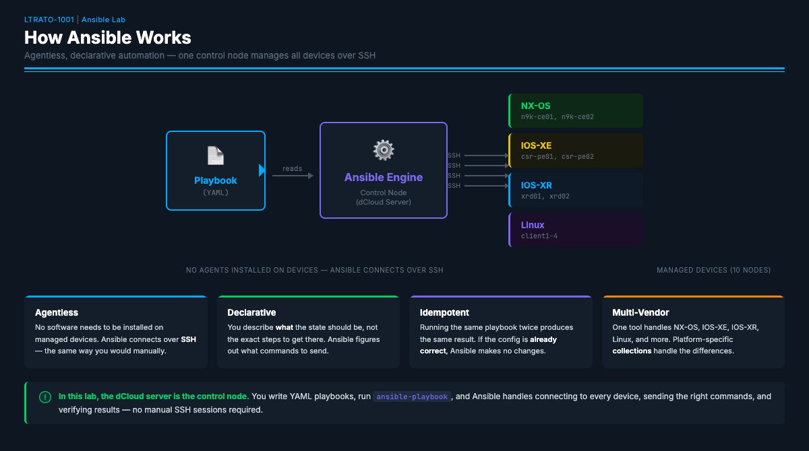
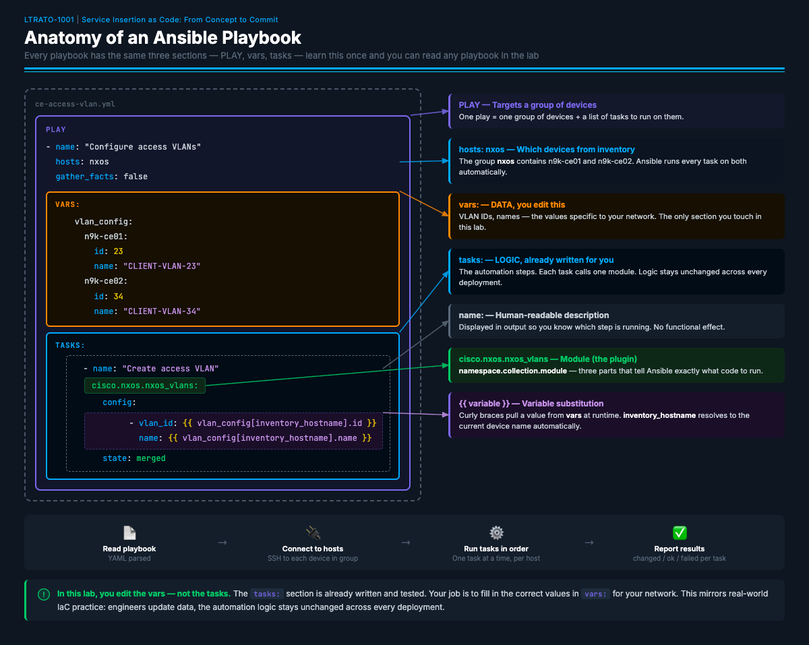
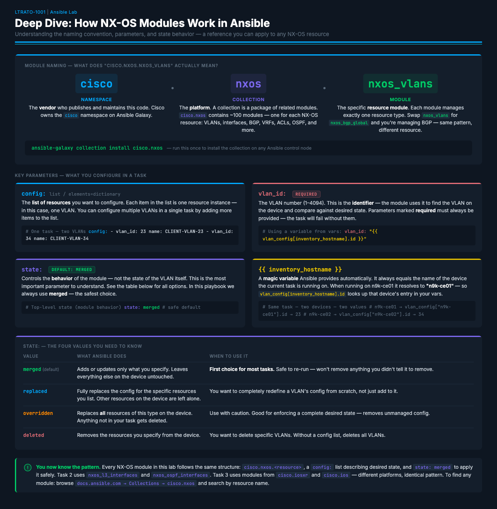

← [Getting Started](GETTING-STARTED.md) | [Lab Guide](LAB-GUIDE.md) | [Task 1 →](TASK1.md)

---

## Ansible Quick Primer

If you're new to Ansible, take 5 minutes to read this section. Understanding
these concepts will make the rest of the lab much more intuitive.

### What is Ansible?



Ansible is an open-source automation tool that manages infrastructure through
**code** instead of manual CLI sessions. Instead of SSH'ing into 10 devices
and typing commands one by one, you write a YAML file describing the desired
state, and Ansible handles the rest — connecting, authenticating, sending
commands, and verifying results.

**Key properties:**
- **Agentless** — No software needs to be installed on the managed devices.
  Ansible connects over SSH (same as you would manually).
- **Declarative** — You describe *what* the state should be, not the exact
  steps to get there. Ansible figures out what commands to send.
- **Idempotent** — Running the same playbook twice produces the same result.
  If the config is already correct, Ansible makes no changes.
- **Multi-vendor** — One tool handles NX-OS, IOS-XE, IOS-XR, Linux, and more.
  Platform-specific "collections" (plugins) handle the differences.

### Playbook Structure



A **playbook** is a YAML file containing one or more **plays**. Each play
targets a group of devices and runs a series of **tasks**:

```yaml
---                              # YAML document start
- name: "My Play"               # A PLAY targets a group of devices
  hosts: nxos                    # Which devices from inventory to configure
  gather_facts: false            # Skip auto-discovery (required for network devices)

  vars:                          # VARIABLES — data that tasks reference
    my_vlan: 23

  tasks:                         # TASKS — the actual work, executed in order

    - name: "Create VLAN"        # Human-readable description
      cisco.nxos.nxos_vlans:     # MODULE — the Ansible plugin that does the work
        config:
          - vlan_id: "{{ my_vlan }}"   # {{ }} = variable substitution
        state: merged            # "merged" = add without removing existing config
```

**The flow:** Ansible reads the playbook → connects to each host in `hosts:` →
runs each task in order → reports results. If a task fails, Ansible stops on
that host (but continues on others).

### Variables: Separating Data from Logic

The most important concept in this lab is **variable separation**. Look at the
playbook structure:

```yaml
vars:                # ← DATA (what to configure — you edit this)
  vlan_config:
    n9k-ce01:
      id: 23

tasks:               # ← LOGIC (how to configure — already written for you)
  - name: "Create VLAN"
    cisco.nxos.nxos_vlans:
      config:
        - vlan_id: "{{ vlan_config[inventory_hostname].id }}"
```

The `vars` section is the **data** — the specific values for your network.
The `tasks` section is the **logic** — the Ansible modules and their structure.
In this lab, **you edit the data (vars), not the logic (tasks).** This mirrors
real-world IaC practice: engineers change variables in a data file, and the
automation logic stays the same across environments.

The expression `{{ vlan_config[inventory_hostname].id }}` means: "Look up the
current device's hostname in the `vlan_config` dictionary, then get its `id`
field." When Ansible runs on `n9k-ce01`, this resolves to `23`. When it runs
on `n9k-ce02`, it resolves to whatever you set for that switch.

> **Automation Insight:** This data/logic split is the pattern behind every scalable automation system. Think of it this way: the playbook is a template you write once. The variables are a spreadsheet your team fills in. When a new site comes online, nobody touches the automation code — they just add a row to the data.

### Key Concepts Reference

| Concept | What It Means |
|---------|--------------|
| **Play** | A block that targets a group of hosts and runs tasks on them |
| **Task** | A single action (create VLAN, push CLI config, run a command) |
| **Module** | The plugin that performs the action (`nxos_vlans`, `ios_config`, etc.) |
| **Variable** | Data referenced with `{{ }}` — keeps config values separate from logic |
| **Collection** | A package of modules for a specific platform (e.g., `cisco.nxos`) |
| **`hosts:`** | Which inventory group to target (e.g., `nxos`, `csr`, `xrd`, `linux`) |
| **`gather_facts: false`** | Must be set for network devices (they don't support default fact gathering) |
| **`state: merged`** | Add/update config without removing anything that already exists |
| **`register:`** | Save command output into a variable for later display or inspection |
| **`loop:`** | Run the same task multiple times, once per item in a list |
| **`when:`** | Only run this task if a condition is true |
| **Idempotency** | Running the same playbook twice produces the same result — no duplicate config |

### How to Edit Playbooks

Use VS Code (already connected via Remote-SSH) to open and edit the YAML
files. You can also use `nano` or `vi` from the terminal:

```bash
nano ~/ce-access-vlan.yml
```

> **YAML is whitespace-sensitive.** Use spaces (not tabs), and make sure
> your indentation matches the surrounding lines. If your playbook fails
> with a syntax error, check indentation first. A common mistake is using
> 3 spaces instead of 2, or mixing tabs and spaces.

> **Tip:** In VS Code, the bottom status bar shows "Spaces: 2" when the
> file is set to 2-space indentation. If you see "Tab Size: 4", click it
> and switch to spaces.

> **Automation Insight:** This TODO pattern mirrors how real teams work. A senior engineer writes the playbook logic and tests it. A junior engineer or even a NOC operator fills in the variables for each deployment. The automation skill ceiling is low — if you can read a table and type a number, you can deploy infrastructure. That's how automation democratizes network operations.

---

### Cisco NX-OS Resource Modules



Every task in this lab uses modules from the `cisco.nxos` collection. Understanding the naming convention and `state:` behavior once means you can read any task in the lab — and build your own.

#### Module Naming — What does `cisco.nxos.nxos_vlans` actually mean?

| Part | Value | What it is |
|---|---|---|
| **Namespace** | `cisco` | The vendor who publishes and maintains the code on Ansible Galaxy |
| **Collection** | `nxos` | The platform. `cisco.nxos` contains ~100 modules — one per NX-OS resource: VLANs, interfaces, BGP, VRFs, ACLs, OSPF, and more |
| **Module** | `nxos_vlans` | The specific resource module. Swap it for `nxos_bgp_global` and you're managing BGP — same pattern, different resource |

#### The `state:` Values You Need to Know

Every NX-OS resource module accepts a top-level `state:` parameter that controls **what Ansible does**, not the state of the resource itself.

| Value | What Ansible does | When to use it |
|---|---|---|
| `merged` *(default)* | Adds or updates only what you specify. Leaves everything else on the device untouched. | First choice for most tasks. Safe to re-run — won't remove anything you didn't tell it to. |
| `replaced` | Fully replaces the config for the specific resources you list. Other resources on the device are left alone. | You want to completely redefine a resource's config from scratch. |
| `overridden` | Replaces **all** resources of this type on the device. Anything not in your task gets deleted. | Enforcing a complete desired state — removes unmanaged config. Use with caution. |
| `deleted` | Removes the resources you specify. Without a `config:` list, deletes all resources of this type. | You want to delete specific resources. |

> **`config.state` vs. top-level `state:` — don't mix these up.** Some modules have a `config.state` field (e.g., `nxos_vlans` has `config.state: active/suspend` to control whether a VLAN is operational). That is completely separate from the top-level `state:` which controls Ansible's behavior. If you see both in a module's parameters, they do different things.

#### Finding Documentation for Any Module

The playbooks in this lab were written for you — but if you ever want to understand a module more deeply, add a new resource, or build your own playbook from scratch, the Ansible documentation is where you start.

**1. Go to the `cisco.nxos` collection index:**

> <https://docs.ansible.com/projects/ansible/latest/collections/cisco/nxos/>

This page lists every module in the collection. Scroll down to the **Modules** section to browse — each one is a clickable link to its full documentation page.

**2. Click the module you want — for example `nxos_vlans`:**

> <https://docs.ansible.com/projects/ansible/latest/collections/cisco/nxos/nxos_vlans_module.html>

Every module page has the same structure. Read in this order:

- **Synopsis** — one sentence describing what the module manages
- **Parameters** — everything you can configure, with types and defaults
- **Examples** — working YAML for each `state:` value — the fastest way to understand what the module actually does

**3. Read the Parameters table.** Here's what it looks like for `nxos_vlans` as a worked example:

| Parameter | Type | Required | What it does |
|---|---|---|---|
| `config` | list | no | List of VLAN dictionaries — one item per VLAN you want to configure |
| `config.vlan_id` | integer | **yes** | The VLAN number (1–4094) — used to identify the VLAN on the device |
| `config.name` | string | no | Human-readable name for the VLAN |
| `config.state` | string | no | Operational state of the VLAN itself — `active` or `suspend` |
| `config.enabled` | boolean | no | Admin state — `true` = no shutdown, `false` = shutdown |
| `state` | string | no | Module behavior — `merged` (default), `replaced`, `overridden`, `deleted` |

**4. The URL pattern works for every module in this lab:**

```
https://docs.ansible.com/projects/ansible/latest/collections/cisco/nxos/<module_name>_module.html
```

| Module | Used in | Documentation URL |
|---|---|---|
| `nxos_vlans` | Task 1 | `…/nxos_vlans_module.html` |
| `nxos_interfaces` | Task 1 | `…/nxos_interfaces_module.html` |
| `nxos_l2_interfaces` | Task 1 | `…/nxos_l2_interfaces_module.html` |
| `nxos_l3_interfaces` | Task 2 | `…/nxos_l3_interfaces_module.html` |
| `nxos_ospf_interfaces` | Task 2 | `…/nxos_ospf_interfaces_module.html` |

---

← [Getting Started](GETTING-STARTED.md) | [Lab Guide](LAB-GUIDE.md) | [Task 1 →](TASK1.md)
