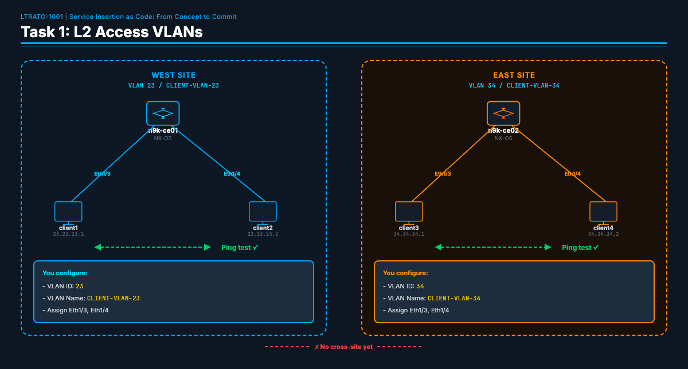
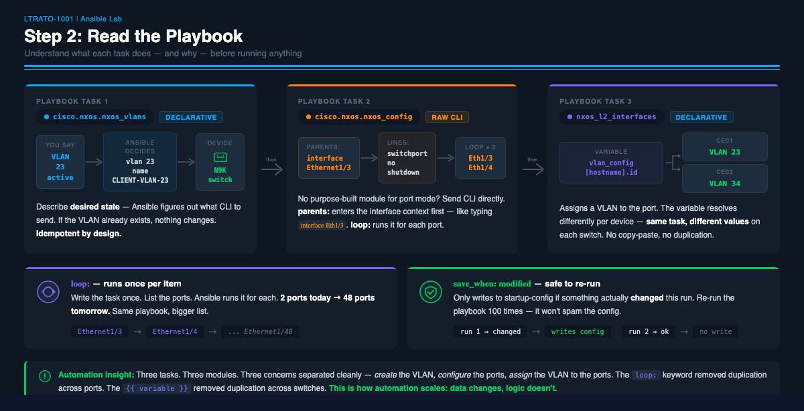

← [Primer](PRIMER.md) | [Lab Guide](LAB-GUIDE.md) | [Task 2 →](TASK2.md)

---

## Task 1: Configure L2 Access VLANs



### Objective

Configure VLANs on the N9K CE switches so that Linux clients on the same
switch can communicate at Layer 2.

**Before Task 1:**
- Client1 (23.23.23.1) CANNOT reach Client2 (23.23.23.2) — no L2 path
- Client3 (34.34.34.1) CANNOT reach Client4 (34.34.34.2)

**After Task 1:**
- Client1 CAN ping Client2 (same switch, same VLAN)
- Client3 CAN ping Client4 (same switch, same VLAN)

### Why VLANs?

The client-facing ports (Eth1/3, Eth1/4) on each N9K switch are currently in
their default state — they operate as independent interfaces with no bridging
between them. Even though client1 and client2 are plugged into the same
physical switch, they can't talk to each other because there's no shared
Layer 2 domain.

**VLANs** (Virtual Local Area Networks) solve this by creating a logical
broadcast domain:

1. **Create a VLAN** — This is a virtual switch fabric inside the physical switch.
   All ports assigned to the same VLAN can communicate at Layer 2.
2. **Convert ports to switchport mode** — NX-OS ports can be either Layer 3
   (routed, each port has its own IP) or Layer 2 (switched, ports share a VLAN).
   We need Layer 2 for client connectivity.
3. **Assign both client ports to the same VLAN** — Now Eth1/3 and Eth1/4 are
   in the same broadcast domain, and frames are bridged between them.

**VLAN IDs matter because they link to client subnets.** West-side clients are
on 23.23.23.0/24 — VLAN 23. East-side clients are on 34.34.34.0/24 — VLAN 34.
This naming convention makes the network topology self-documenting.

This is the foundation — Task 2 adds Layer 3 gateways on these VLANs (SVIs),
and Task 3 carries VLAN routes across the SP core.

### Step 1: Verify the Baseline

Before configuring anything, verify the initial state of the network. Clients
on the same switch cannot reach each other yet — not because something is
broken, but because the VLANs haven't been configured. This is your baseline.

From the server terminal, SSH into linux-client1 and try to ping its neighbor
on the same switch. You could SSH into the client first and then run the ping
from there — but here we use the shorthand form that passes the command directly
over SSH in one line:

```bash
ssh linux-client1 ping -c 3 23.23.23.2
```

You should see **100% packet loss**:

```
PING 23.23.23.2 (23.23.23.2) 56(84) bytes of data.

--- 23.23.23.2 ping statistics ---
3 packets transmitted, 0 received, 100% packet loss, time 2002ms
```

Try the east side the same way:

```bash
ssh linux-client3 ping -c 3 34.34.34.2
```

Same result — **100% packet loss**. Both pairs of clients are physically
connected to the same switch, but with no VLAN bridging the ports, the frames
have nowhere to go. This is expected — no VLANs have been configured yet.

> **Why start with verification?** In automation, your first step should always
> be to verify the current state. This gives you a baseline to compare against
> after the playbook runs. If you don't know where you started, you can't prove
> you improved anything.

### Step 2: Read the Playbook

Before making any changes, open the playbook and read through it:

```bash
nano ~/ce-access-vlan.yml
```

> **Note:** You can use any Linux text editor you prefer — `vi`, `vim`, `nano`, etc. All examples in this lab use `nano`.



Read through the tasks in the playbook. Notice how each task maps to one of
the three things a VLAN configuration requires:

- **`cisco.nxos.nxos_vlans`** (Step 1) — A *declarative* module. You describe
  the desired state ("VLAN 23 should exist and be active"), and Ansible figures
  out what CLI commands to send. If the VLAN already exists, nothing changes.

- **`cisco.nxos.nxos_interfaces`** (Step 2) — A *declarative* module that sets
  the interface operating mode. On N9Kv, ports default to Layer 3 (routed) mode
  on boot. Setting `mode: layer2` converts them to switchport mode. Because this
  module checks the current state before acting, it only reports `changed` when
  the port is actually in the wrong mode — truly idempotent.

- **`cisco.nxos.nxos_l2_interfaces`** (Step 3) — Another declarative module
  that assigns VLANs to interfaces. Notice how `{{ vlan_config[inventory_hostname].id }}`
  pulls the VLAN ID from your variables — the same task works on both switches
  because each has different variable values.

> **💡 Automation Insight:** Steps 1, 2, and 3 are all declarative modules — they describe *what you want*, not *how to get there*. Ansible checks the device's current state and only makes changes if something is actually wrong. Re-run the playbook 10 times and you'll see `ok` across the board. That's idempotency working for you.

- **`save_when: modified`** (Step 4) — Only writes to startup-config if
  something actually changed. This is idempotent — safe to run repeatedly.

### Step 3: Fill in the Variables

Scroll to the `vars:` section near the top of the playbook. You'll see TODO placeholders:

```yaml
vars:
  vlan_config:
    n9k-ce01:
      id: ___          # TODO: VLAN ID for west-side clients (see Table 1)
      name: "___"      # TODO: Name this VLAN (convention: CLIENT-VLAN-<id>)
    n9k-ce02:
      id: ___          # TODO: VLAN ID for east-side clients (see Table 1)
      name: "___"      # TODO: Name this VLAN (convention: CLIENT-VLAN-<id>)
```

Using **Table 1: VLAN Assignments**, fill in the 4 values:

1. **n9k-ce01 VLAN ID:** The VLAN for west-side clients (client1, client2)
2. **n9k-ce01 VLAN name:** Use the naming convention `CLIENT-VLAN-<id>`
3. **n9k-ce02 VLAN ID:** The VLAN for east-side clients (client3, client4)
4. **n9k-ce02 VLAN name:** Use the naming convention `CLIENT-VLAN-<id>`

Save the file when done.

### Step 4: Run the Playbook

```bash
ansible-playbook ~/ce-access-vlan.yml
```

Watch the output as it runs. Ansible uses color-coded status for each task:

- **`changed`** (yellow) = Ansible made a configuration change on the device
- **`ok`** (green) = The task ran but no changes were needed (config already correct)
- **`skipping`** (cyan) = The task's `when` condition was false for this host
- **`failed`** (red) = Something went wrong — read the error message

On the first run, most tasks should show `changed`. Here's what the configuration
tasks look like when they run successfully:

```
PLAY [Task 1 — Configure L2 access VLANs on NX-OS CE switches] *****************

TASK [Step 1 — Create VLAN on each CE switch] **********************************
changed: [n9k-ce01]
changed: [n9k-ce02]

TASK [Step 2 — Convert Eth1/3 and Eth1/4 to switchport mode and bring up] ******
changed: [n9k-ce01] => (item=Ethernet1/3)
changed: [n9k-ce02] => (item=Ethernet1/3)
changed: [n9k-ce01] => (item=Ethernet1/4)
changed: [n9k-ce02] => (item=Ethernet1/4)

TASK [Step 3 — Assign access VLAN to Eth1/3 and Eth1/4] ************************
changed: [n9k-ce02]
changed: [n9k-ce01]

TASK [Step 4 — Save running configuration] *************************************
changed: [n9k-ce01]
changed: [n9k-ce02]

TASK [Pause 30 seconds for virtual switch dataplane to update] *****************
Pausing for 30 seconds
(ctrl+C then 'C' = continue early, ctrl+C then 'A' = abort)
ok: [n9k-ce01]
```

> **Why the 30-second pause?** The N9Kv virtual switch needs a moment for its
> dataplane to start forwarding L2 traffic after VLAN changes. This is a
> vrnetlab quirk — physical Nexus hardware doesn't need this delay.

After the config tasks, the playbook runs **verification** and **test** plays
automatically. Here's what successful verification looks like:

> **💡 Automation Insight:** Notice that every playbook includes `show` commands and ping tests *as code*. This is a game-changer: verification isn't something you do after the change — it's part of the change. In production, if a verification task fails, you can automatically trigger a rollback. The playbook becomes a self-validating change window.

```
PLAY [Verify — Check VLAN and port status] *************************************

TASK [Verify — Show VLAN brief] ************************************************
ok: [n9k-ce01]
ok: [n9k-ce02]

TASK [Display VLAN status] *****************************************************
ok: [n9k-ce01] => {
    "vlan_output.stdout_lines": [
        [
            "VLAN Name                             Status    Ports",
            "---- -------------------------------- --------- ---------",
            "1    default                          active    ...",
            "23   CLIENT-VLAN-23                   active    Eth1/3, Eth1/4"
        ]
    ]
}
ok: [n9k-ce02] => {
    "vlan_output.stdout_lines": [
        [
            "VLAN Name                             Status    Ports",
            "---- -------------------------------- --------- ---------",
            "1    default                          active    ...",
            "34   CLIENT-VLAN-34                   active    Eth1/3, Eth1/4"
        ]
    ]
}
```

> **What to look for:** Each switch should have its VLAN (23 or 34) in `active`
> status with both `Eth1/3` and `Eth1/4` listed in the Ports column. If you see
> the VLAN but no ports, the switchport assignment didn't work correctly.

Finally, the ping tests confirm L2 connectivity:

```
PLAY [Test — Ping between clients on the same switch] **************************

TASK [Test — client1 pings client2 (23.23.23.1 → 23.23.23.2)] ******************
changed: [linux-client1]

TASK [Show ping result (client1 → client2)] ************************************
ok: [linux-client1] => {
    "ping_result.stdout_lines": [
        "PING 23.23.23.2 (23.23.23.2) 56(84) bytes of data.",
        "64 bytes from 23.23.23.2: icmp_seq=1 ttl=64 time=4.85 ms",
        "64 bytes from 23.23.23.2: icmp_seq=2 ttl=64 time=4.97 ms",
        "64 bytes from 23.23.23.2: icmp_seq=3 ttl=64 time=2.29 ms",
        "",
        "--- 23.23.23.2 ping statistics ---",
        "3 packets transmitted, 3 received, 0% packet loss, time 2003ms"
    ]
}

TASK [Test — client3 pings client4 (34.34.34.1 → 34.34.34.2)] ******************
changed: [linux-client3]

TASK [Show ping result (client3 → client4)] ************************************
ok: [linux-client3] => {
    "ping_result.stdout_lines": [
        "PING 34.34.34.2 (34.34.34.2) 56(84) bytes of data.",
        "64 bytes from 34.34.34.2: icmp_seq=1 ttl=64 time=6.21 ms",
        "64 bytes from 34.34.34.2: icmp_seq=2 ttl=64 time=1.76 ms",
        "64 bytes from 34.34.34.2: icmp_seq=3 ttl=64 time=2.12 ms",
        "",
        "--- 34.34.34.2 ping statistics ---",
        "3 packets transmitted, 3 received, 0% packet loss, time 2003ms"
    ]
}
```

The **PLAY RECAP** at the very end gives you a summary of everything that happened:

```
PLAY RECAP *********************************************************************
linux-client1              : ok=2    changed=1    unreachable=0    failed=0
linux-client3              : ok=2    changed=1    unreachable=0    failed=0
n9k-ce01                   : ok=7    changed=4    unreachable=0    failed=0
n9k-ce02                   : ok=6    changed=4    unreachable=0    failed=0
```

> **Reading the recap:** Each line is a device. `changed=4` means 4 tasks made
> changes. `failed=0` means nothing went wrong. If you see `failed=1` or higher,
> scroll up to find the red error message — it will tell you exactly which task
> failed and why.

### Step 5: Verify the Results

Confirm these results from the playbook output:

- [ ] `show vlan brief` shows your VLANs with Eth1/3 and Eth1/4 assigned
- [ ] client1 → client2 ping: **3 packets transmitted, 3 received, 0% packet loss**
- [ ] client3 → client4 ping: **3 packets transmitted, 3 received, 0% packet loss**
- [ ] PLAY RECAP shows **failed=0** for all devices

> **Troubleshooting:** If pings fail, verify you entered the correct VLAN IDs.
> The VLAN IDs must match Table 1, because the client IP addresses are already
> assigned to specific subnets. If you see a YAML syntax error, check that your
> values line up with the surrounding indentation — YAML is very picky about
> whitespace.

> **💡 Automation Insight:** You just configured 2 switches, created 2 VLANs, assigned 4 ports, and verified connectivity — without logging into a single device. Manually, that's 2 SSH sessions, ~12 CLI commands each, and copy-pasting between windows hoping you don't typo a VLAN ID. The playbook took seconds.

---

## Task 1b: Configuration Drift & Remediation

### Objective

Demonstrate how Ansible detects and repairs configuration drift — when
someone (or something) changes a device's config outside of automation,
causing it to deviate from the desired state.

**Before Task 1b:**
- Everything is working — client1 can ping client2, client3 can ping client4

**After Task 1b:**
- You'll manually break the network, then watch Ansible find and fix the
  exact change — without touching anything else

### Why This Matters

In production networks, configuration drift is one of the most common causes
of outages. It happens every day:

- An engineer SSHs in at 2 AM to make a "quick fix" and forgets to update
  the automation
- A firmware upgrade resets an interface to its default state
- A colleague changes a port config on the wrong switch

The traditional response is to troubleshoot manually — SSH in, compare the
running config to what you *think* it should be, and hope you catch the
difference. That doesn't scale.

With automation, your playbook **is** the source of truth. When something
drifts, you don't troubleshoot — you re-run the playbook. Ansible compares
the device's current state against the desired state, fixes only what
changed, and leaves everything else untouched. This is idempotency working
for you in the real world.

### Step 1: Introduce the Drift

SSH into **n9k-ce01** and manually change the VLAN on the client1 port. This
simulates an unauthorized change — maybe someone moved a port to the wrong
VLAN while troubleshooting a different issue.

From the n9k-ce01 CLI:

```
configure terminal
interface Ethernet1/3
  switchport access vlan 27
end
```

### Step 2: Confirm the Impact

Verify that client1 can no longer reach client2:

```bash
ansible linux-client1 -m raw -a "ping -c 3 -W 2 23.23.23.2"
```

You should see **100% packet loss**:

```
linux-client1 | FAILED | rc=1 >>
PING 23.23.23.2 (23.23.23.2) 56(84) bytes of data.
From 23.23.23.1 icmp_seq=1 Destination Host Unreachable
From 23.23.23.1 icmp_seq=2 Destination Host Unreachable
From 23.23.23.1 icmp_seq=3 Destination Host Unreachable

--- 23.23.23.2 ping statistics ---
3 packets transmitted, 0 received, +3 errors, 100% packet loss, time 2055ms
```

One manual change on one interface, and connectivity is broken. Client1 is now
on VLAN 27 while client2 is still on VLAN 23 — they're in different broadcast
domains. In a network with hundreds of switches, finding a single misassigned
VLAN would be a needle in a haystack.

### Step 3: Let Ansible Remediate

Re-run the exact same playbook you ran in Task 1:

```bash
ansible-playbook ~/ce-access-vlan.yml
```

### Understanding the Output

Watch the output carefully this time. Compare it to your first run:

```
TASK [Step 1 — Create VLAN on each CE switch] **********************************
ok: [n9k-ce01]
ok: [n9k-ce02]

TASK [Step 2 — Convert Eth1/3 and Eth1/4 to switchport mode and bring up] ******
changed: [n9k-ce01] => (item=Ethernet1/3)
changed: [n9k-ce02] => (item=Ethernet1/3)
changed: [n9k-ce01] => (item=Ethernet1/4)
changed: [n9k-ce02] => (item=Ethernet1/4)

TASK [Step 3 — Assign access VLAN to Eth1/3 and Eth1/4] ************************
changed: [n9k-ce01]
ok: [n9k-ce02]
```

Notice the difference:

- **Step 1** shows `ok` — the VLANs already exist. Nothing to do.
- **Step 2** shows `changed` on all ports — but **nothing actually changed on
  the devices**. This is a false positive caused by the `nxos_config` module.
  Unlike the declarative modules in Steps 1 and 3, `nxos_config` sends raw CLI
  commands and compares them against the running configuration text. Commands
  like `switchport` and `no shutdown` don't appear in NX-OS running config once
  a port is already in that state, so the module can't tell the port is already
  configured correctly — it sends the commands again and reports `changed` every
  time. This is a known limitation of CLI-based ("imperative") modules versus
  declarative resource modules. In production, teams work around this with
  `changed_when` overrides or by replacing `nxos_config` tasks with declarative
  equivalents where possible.
- **Step 3** is where the real action is: `changed` on **n9k-ce01** but `ok` on
  **n9k-ce02**. This is a declarative module (`nxos_l2_interfaces`) that
  compares the desired VLAN assignment against the device's actual state. It
  detected that Ethernet1/3 was on VLAN 27 instead of VLAN 23 and corrected it.
  n9k-ce02 was already correct, so nothing changed. **This is the drift signal.**

Ansible didn't blindly reconfigure everything. It checked each task against
the device's current state and only changed what was actually wrong. That's
the power of idempotency — it's not just "safe to re-run," it's a
**drift detection and remediation engine**.

### Step 4: Verify the Fix

Check the playbook's ping output:

```
TASK [Show ping result (client1 → client2)] ************************************
ok: [linux-client1] => {
    "ping_result.stdout_lines": [
        "PING 23.23.23.2 (23.23.23.2) 56(84) bytes of data.",
        "64 bytes from 23.23.23.2: icmp_seq=1 ttl=64 time=2.70 ms",
        "64 bytes from 23.23.23.2: icmp_seq=2 ttl=64 time=1.73 ms",
        "64 bytes from 23.23.23.2: icmp_seq=3 ttl=64 time=1.74 ms",
        "",
        "--- 23.23.23.2 ping statistics ---",
        "3 packets transmitted, 3 received, 0% packet loss, time 2004ms"
    ]
}
```

**0% packet loss.** Connectivity restored.

### Checkpoint

- [ ] You manually changed Ethernet1/3 on n9k-ce01 to VLAN 27
- [ ] client1 → client2 ping showed **100% packet loss**
- [ ] Re-running the playbook showed `changed` on Step 3 for n9k-ce01 only
- [ ] Re-running the playbook showed `ok` on Step 3 for n9k-ce02 (nothing touched)
- [ ] client1 → client2 ping is back to **0% packet loss**

> **💡 Automation Insight:** In production, teams schedule playbook runs every
> few hours as a compliance check. If nothing drifted, every task reports `ok`
> and `changed=0`. If something did drift, the playbook fixes it automatically
> and the `changed` count tells you exactly how many things were out of spec.
> You just turned a 45-minute troubleshooting session into a 30-second
> playbook run.


---

← [Primer](PRIMER.md) | [Lab Guide](LAB-GUIDE.md) | [Task 2 →](TASK2.md)
