← [Task 2](TASK2.md) | [Lab Guide](LAB-GUIDE.md) | [Task 4 →](TASK4.md)

---

## Task 3: Inter-AS Option A (Full East-West Connectivity)

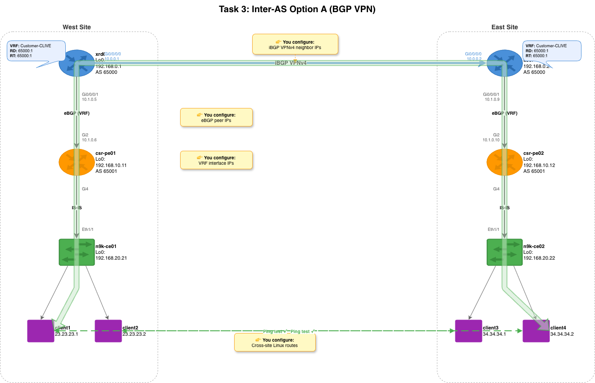

### Objective

Configure Inter-AS Option A so that west-side clients (1, 2) can reach
east-side clients (3, 4) across the full SP core. This is the most complex
task — it touches all 4 platforms and introduces BGP, VRFs, and route
redistribution.

**Before Task 3:**
- Client1 can reach Client2 and csr-pe01, but NOT Client3/4
- Client3 can reach Client4 and csr-pe02, but NOT Client1/2

**After Task 3:**
- Full east-west: Client1 pings Client3, Client2 pings Client4
- Traffic path: Client1 → N9K-CE01 → CSR-PE01 → XRd01 → XRd02 → CSR-PE02 → N9K-CE02 → Client3

### Why Inter-AS Option A?

Right now, each side of the network is isolated. The CSR PEs know about their
local clients via IS-IS, but there's no mechanism to carry those routes across
the SP core (xrd01 ↔ xrd02). Client1 can ping csr-pe01, but not client3.

**Inter-AS Option A** solves this with three components working together:

#### 1. VRFs (Virtual Routing and Forwarding)

A VRF is like a separate routing table inside a router. The XRd core routers
run both SP infrastructure traffic (IS-IS, MPLS, management) and customer
traffic — these must be isolated. The VRF named `Customer-CLIVE` creates a
dedicated routing table for customer traffic.

When we assign Gi0/0/0/1 (the link to the CSR PE) to the VRF, that interface
moves out of the global routing table and into the VRF's table. The CSR PE
routes are only visible inside the VRF — they don't leak into the SP core's
IS-IS topology. This is how real SPs keep thousands of customers isolated on
shared infrastructure.

#### 2. MP-BGP VPNv4 (iBGP between XRd routers)

The iBGP VPNv4 session carries VRF routes across the SP core between xrd01
and xrd02. "VPNv4" means each IPv4 prefix is prepended with a **Route
Distinguisher (RD)**, making it globally unique in the BGP table — even if two
customers use the same IP address space. Which VRFs actually import those
routes is controlled by **Route Targets (RT)**, configured below.

This session uses Loopback0 addresses (`192.168.0.1` ↔ `192.168.0.2`),
which are reachable via the pre-configured IS-IS/MPLS core. Using loopbacks
instead of link IPs makes the BGP session resilient — if one physical link
goes down, MPLS can reroute traffic to reach the same loopback.

**Route Targets (RT)** control which VRFs import which routes. In our lab,
both XRd routers use `65000:1` for import and export, so VRF routes from
xrd01 are imported into xrd02's VRF and vice versa.

#### 3. eBGP at the PE Edge

Each XRd router peers with its local CSR PE via eBGP inside the VRF:
- xrd01 (AS 65000) ↔ csr-pe01 (AS 65001)
- xrd02 (AS 65000) ↔ csr-pe02 (AS 65001)

The CSR PEs redistribute IS-IS routes into BGP (so client subnets get
advertised), and BGP routes back into IS-IS (so remote subnets become
reachable locally). This two-way redistribution is the glue that connects
the eBGP edge to the VPNv4 core.

**Key concept — `as-override`:** Both CSR PEs are in AS 65001. When xrd01
receives a route from csr-pe01 (AS path: `65001`), it carries it via iBGP to
xrd02, which tries to advertise it to csr-pe02. But csr-pe02 sees AS 65001
already in the path — BGP loop prevention says "I'm in AS 65001, this route
has already been through AS 65001, drop it." The `as-override` command on the
XRd routers' eBGP sessions toward the CSR PEs replaces any occurrence of
AS 65001 in the AS-path with the XRd's own AS (65000) before advertising,
bypassing this check. This is a standard SP technique when multiple PE sites
share the same AS number.

#### The Big Picture

Here's the complete data flow when client1 pings client3:

<pre>
client1 (23.23.23.1)
  → n9k-ce01 SVI (23.23.23.254)     ← static route via SVI gateway
  → csr-pe01 (IS-IS route)          ← IS-IS learned this route from the CE
  → xrd01 VRF (eBGP from CSR)       ← eBGP brings it into the VRF
  → xrd02 VRF (iBGP VPNv4)          ← VPNv4 carries it across the core
  → csr-pe02 (eBGP from XRd)        ← eBGP pushes it to the remote CSR
  → n9k-ce02 SVI (IS-IS route)      ← IS-IS redistributes it locally
  → client3 (34.34.34.1)            ← arrives at destination
</pre>

Every layer you configured (VLANs, IS-IS, BGP, VRF, static routes) plays
a role in this path. Remove any one, and the packet can't get through.

### Exercise: Complete the Playbook

This playbook has **three** plays with variables — the most complex one yet.
Open it:

```bash
nano ~/inter-as-option-a.yml
```

Take a moment to scroll through the entire playbook before editing. You'll
notice it has 6 plays total: 3 config plays, a convergence pause, and 2
verification/test plays. The TODO placeholders are only in the first 3 plays.

#### Play 1 — XRd Core Routers (VRF + BGP)

Scroll to the first `vars:` section:

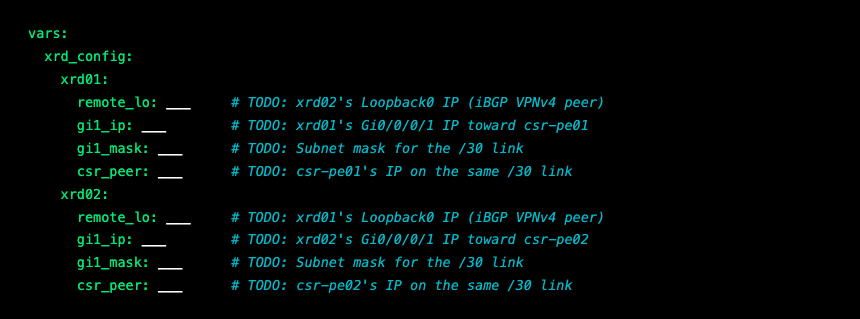

Using **Table 2** and **Table 3**, fill in:

| Variable | Hint | Where to Find It |
|----------|------|-------------------|
| `remote_lo` for xrd01 | xrd02's Loopback0 IP | Table 2, xrd02 Loopback0 row |
| `remote_lo` for xrd02 | xrd01's Loopback0 IP | Table 2, xrd01 Loopback0 row |
| `gi1_ip` for xrd01 | xrd01's IP on Gi0/0/0/1 | Table 2, xrd01 Gi0/0/0/1 row |
| `gi1_ip` for xrd02 | xrd02's IP on Gi0/0/0/1 | Table 2, xrd02 Gi0/0/0/1 row |
| `gi1_mask` (both) | Subnet mask for /30 | Always `255.255.255.252` for /30 |
| `csr_peer` for xrd01 | csr-pe01's IP toward xrd01 | Table 2, csr-pe01 Gi2 row |
| `csr_peer` for xrd02 | csr-pe02's IP toward xrd02 | Table 2, csr-pe02 Gi2 row |

> **Understanding the relationships:** Each XRd router needs to know two things:
> (1) its iBGP VPNv4 peer (`remote_lo` — the *other* XRd's loopback, reachable
> via the pre-configured IS-IS/MPLS core), and (2) its eBGP peer (`csr_peer` —
> the CSR PE on the same /30 link). These are two completely different BGP
> sessions serving different purposes.

> **Why IPs and not hostnames?** BGP peering requires exact IP addresses. The
> iBGP session uses loopback IPs (stable, doesn't go down if a single link
> flaps). The eBGP session uses directly-connected link IPs (so the TCP session
> follows the physical path).

#### Play 2 — CSR PE Routers (eBGP)

Scroll to the second `vars:` section:

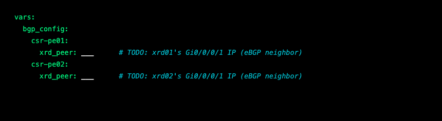

Using **Table 3**, fill in:

| Variable | Hint | Where to Find It |
|----------|------|-------------------|
| `xrd_peer` for csr-pe01 | xrd01's Gi0/0/0/1 IP | Table 2, xrd01 Gi0/0/0/1 row |
| `xrd_peer` for csr-pe02 | xrd02's Gi0/0/0/1 IP | Table 2, xrd02 Gi0/0/0/1 row |

> **Cross-check your work:** The `csr_peer` you entered in Play 1 for xrd01 and
> the `xrd_peer` here for csr-pe01 are **two ends of the same link**. They should
> be different IPs on the same /30 subnet. For example, if xrd01's `csr_peer` is
> `10.1.0.6`, then csr-pe01's `xrd_peer` should be `10.1.0.5` (the other end).
> If these don't match, the eBGP session won't establish.

#### Play 3 — Linux Client Cross-Site Routes

Scroll to the third `vars:` section:

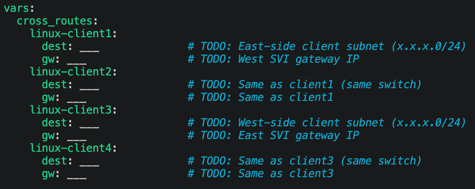

Using **Table 2**, fill in:

| Variable | Hint | Where to Find It |
|----------|------|-------------------|
| `dest` for client1/2 | The *remote* client subnet (east side) | Client3/4 are on 34.34.34.0/24 |
| `dest` for client3/4 | The *remote* client subnet (west side) | Client1/2 are on 23.23.23.0/24 |
| `gw` for client1/2 | West-side SVI gateway (no mask) | Same as Task 2 gateway |
| `gw` for client3/4 | East-side SVI gateway (no mask) | Same as Task 2 gateway |

> **Why do we need these routes?** In Task 2, we gave clients routes to reach
> their local PE. But now traffic needs to cross the entire SP core. West clients
> need a route to the east client subnet (and vice versa). The SVI gateway
> handles the forwarding — it sends the traffic up to the CSR PE, which uses
> BGP to reach the other side.

> **Think about the full path:** When client1 (23.23.23.1) pings client3
> (34.34.34.1), the packet follows this path:
> `client1 → n9k-ce01 SVI → csr-pe01 → xrd01 → xrd02 → csr-pe02 → n9k-ce02 SVI → client3`
> That's **6 hops** across **4 different platforms** — and you're configuring it
> all from a single Ansible playbook.

Save the file when done.

### Ansible Concepts in This Playbook

- **`cisco.iosxr.iosxr_command`** — Designed for exec-mode (show) commands,
  but used here as a workaround to push raw config CLI to XRd. The proper
  `iosxr_config` module relies on internal IOS-XR mechanisms that XRd doesn't
  fully support. By sending `configure terminal`, config statements, `commit`,
  and `end` as raw commands, we work around this limitation — at the cost of
  idempotency detection (the module can't tell if the config already existed).

- **IOS-XR commit model** — Unlike IOS (where config takes effect immediately),
  IOS-XR requires an explicit `commit` to apply changes. This is a safety
  feature — you can review changes before committing.

- **Multiple plays in one playbook** — This playbook has 6 plays targeting
  different device groups. Ansible runs them in order: XRd config → CSR config
  → Linux routes → convergence pause → verification → testing.

- **`ansible.builtin.pause`** — Waits 90 seconds for BGP sessions to establish
  and routes to propagate. BGP convergence takes time, especially the iBGP
  VPNv4 session between XRd routers.

### Run It

```bash
ansible-playbook ~/inter-as-option-a.yml
```

This playbook takes about 4-5 minutes to complete, including a 90-second pause
for BGP convergence. Be patient — the pause is there for a reason.

### Understanding the Output

**Play 1 — XRd configuration** sets up VRF, MPLS VPN, and BGP:

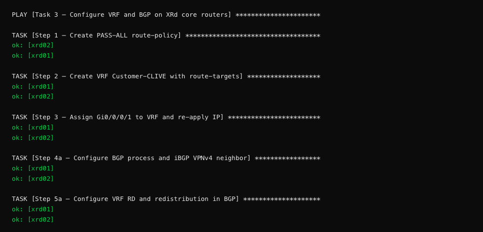

> **Why do the XRd tasks show `ok` instead of `changed`?** These tasks use
> `iosxr_command` (raw CLI mode) instead of `iosxr_config` (declarative mode).
> The raw module sends commands and checks for errors, but it can't detect
> whether the config already existed. It reports `ok` because no error occurred.
> This is a trade-off — the module works reliably with XRd, even though it
> loses the ability to show `changed` status.

> **What are all these steps doing?**
> - **Step 1** creates a route-policy named `PASS-ALL` — it accepts all routes (needed for eBGP)
> - **Step 2** creates a VRF named `Customer-CLIVE` with route-target import/export
> - **Step 3** moves the PE-facing interface (Gi0/0/0/1) into the VRF and reapplies its IP
> - **Step 4a** creates the iBGP VPNv4 session between xrd01 and xrd02 (uses your `remote_lo` value)
> - **Step 5a** sets the VRF route-distinguisher and enables route redistribution
> - **Step 5b** creates the eBGP session to the CSR PE inside the VRF (uses your `csr_peer` value)

The verification task shows the complete BGP config on each XRd:

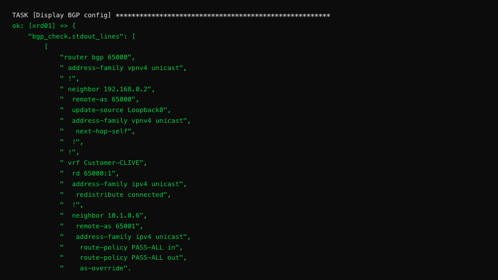

> **Reading the BGP config:** This is the complete `router bgp` hierarchy on
> xrd01. Look for: (1) `neighbor 192.168.0.2` — that's your `remote_lo` value
> (the iBGP VPNv4 peer), (2) `neighbor 10.1.0.6` — that's your `csr_peer`
> value (the eBGP neighbor inside the VRF), and (3) `as-override` — without
> this, BGP would drop routes from AS 65001 when it sees the same AS on the
> other side (both CSR PEs share AS 65001).

**Play 2 — CSR PE configuration** sets up eBGP and IS-IS redistribution:

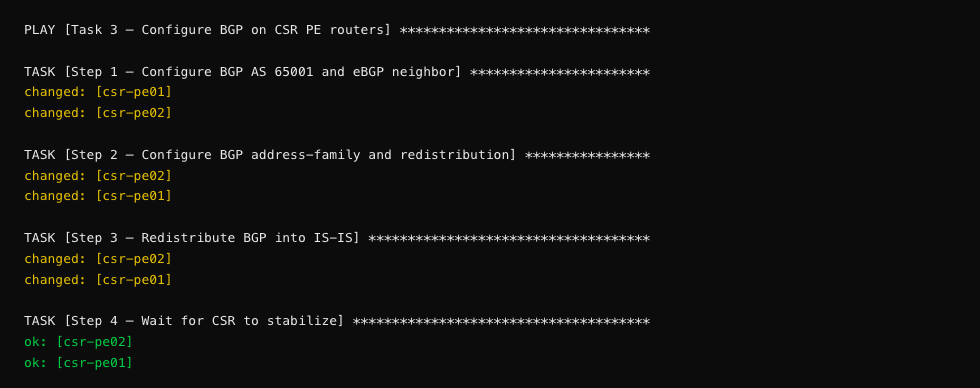

> **What is route redistribution?** The CSR PEs sit between two routing
> protocols: IS-IS (toward the N9K CE) and BGP (toward the XRd core). Step 2
> redistributes IS-IS routes *into* BGP (so local client subnets get advertised
> to the remote side), and Step 3 redistributes BGP routes *into* IS-IS (so
> remote client subnets become reachable from the local CE switch). This
> two-way redistribution is what makes end-to-end connectivity possible.

**Play 3 — Linux cross-site routes** adds the final piece:

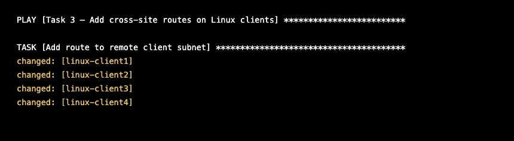

**Convergence pause** — the playbook then waits for BGP:

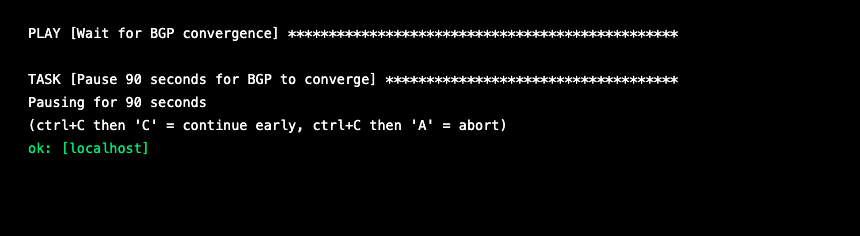

> **Why 90 seconds?** BGP convergence is not instant. The iBGP VPNv4 session
> between xrd01 and xrd02 needs to: (1) establish the TCP connection, (2)
> exchange OPEN messages, (3) negotiate capabilities (VPNv4 address-family),
> (4) exchange UPDATE messages with VPN prefixes, and (5) install routes in
> the VRF. This process can take 60-90 seconds on virtual routers, especially
> on a fresh boot. The pause ensures routes are fully propagated before the
> ping test runs.

**Verification plays** show BGP session status and learned routes:

> **Note:** On a first run, the iBGP VPNv4 session may still be exchanging
> prefixes when the verification plays execute. You might see `St/PfxRcd: 0`
> instead of `3`, and the VRF route table may show only 3 local prefixes
> instead of 6. This is normal — BGP convergence on virtual routers can take
> slightly longer than the 90-second pause. If you see this, wait another
> 30-60 seconds and check manually with `ssh xrd01 'show bgp vpnv4 unicast
> summary'`. The pings at the end of the playbook are the real validation —
> if they pass, the routes have propagated.

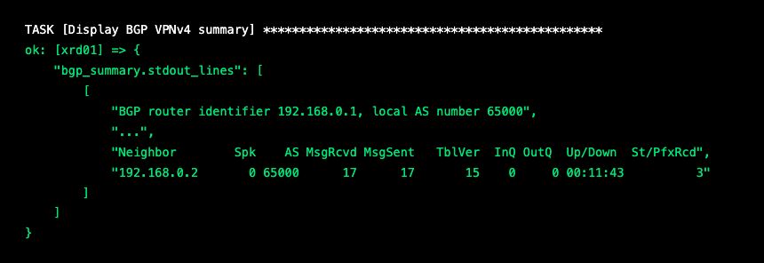

> **Reading the BGP summary:** The key columns are:
> - **Neighbor**: `192.168.0.2` — the iBGP VPNv4 peer (xrd02's loopback)
> - **Up/Down**: `00:11:43` — the session has been up for 11 minutes (good!)
> - **St/PfxRcd**: `3` — three prefixes received from the peer
>
> If `St/PfxRcd` shows a state like `Idle` or `Active` instead of a number,
> the BGP session hasn't established. Check your `remote_lo` values.

The VRF route table shows all learned prefixes:

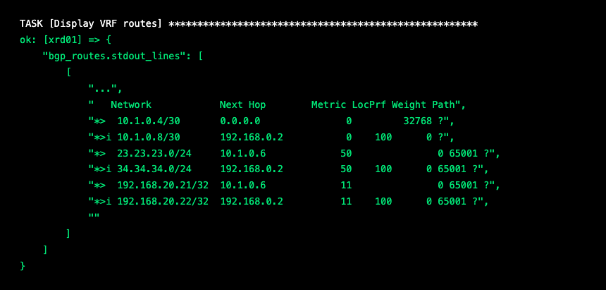

> **Reading the VRF route table:** Each line is a route in the VRF:
> - `*>` = valid, best path selected by BGP
> - `*>i` = best path, learned via iBGP (the `i` means "internal" — from the other XRd)
> - Look for both client subnets: `23.23.23.0/24` (west) and `34.34.34.0/24` (east)
> - **6 prefixes** is the expected total — if you see fewer, a route isn't propagating
>
> On xrd01, the west subnet (`23.23.23.0/24`) comes from eBGP (via csr-pe01),
> and the east subnet (`34.34.34.0/24`) comes from iBGP (via xrd02, which
> learned it from csr-pe02). This is Inter-AS Option A in action — each side
> advertises its local routes, and the VPNv4 core carries them across.

The CSR BGP verification confirms eBGP sessions are up:

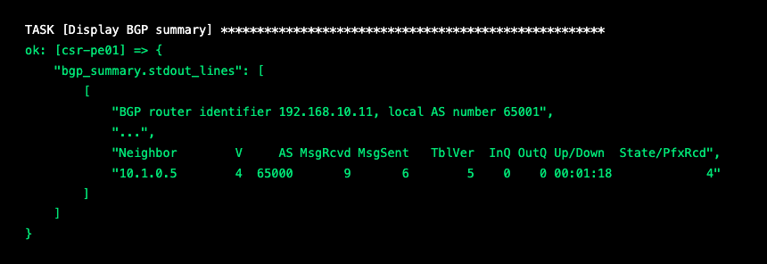

> **CSR BGP summary:** csr-pe01 peers with xrd01 (`10.1.0.5`) and has received
> 4 prefixes. The `State/PfxRcd` column showing a number (not `Idle`/`Active`)
> confirms the session is `Established`.

**The final ping tests** — the moment of truth:

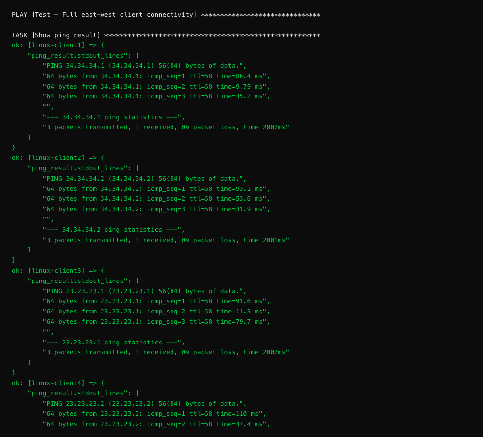

### Checkpoint

Confirm these results from the playbook output:

- [ ] XRd `show run router bgp` displays VRF, VPNv4, and eBGP neighbor config
- [ ] XRd BGP VPNv4 summary shows **3 prefixes received** from the iBGP peer
- [ ] XRd VRF routes show **6 prefixes** (both client subnets, both PE-CE links, both loopbacks)
- [ ] CSR BGP summary shows an **established** session (number in State/PfxRcd, not `Idle`/`Active`)
- [ ] client1 → client3 ping: **packets received** (2/3 or 3/3)
- [ ] client2 → client4 ping: **packets received** (2/3 or 3/3)
- [ ] client3 → client1 ping: **packets received** (2/3 or 3/3)
- [ ] client4 → client2 ping: **packets received** (2/3 or 3/3)
- [ ] PLAY RECAP shows **failed=0** for all devices

**Congratulations!** If all four cross-site pings succeed, you've built full
east-west connectivity across a multi-vendor SP network entirely through Ansible
automation. Traffic from client1 (23.23.23.1) is now reaching client3
(34.34.34.1) across VLANs, IS-IS, MPLS VPN, and BGP — all configured by code.

> **Troubleshooting:**
> - If BGP sessions show `Idle` or `Active`: check your `remote_lo`, `gi1_ip`,
>   and `csr_peer` / `xrd_peer` values. The IPs must match Table 2 exactly.
> - If BGP is up but shows 0 prefixes: wait another 30-60 seconds. VPNv4
>   convergence can be slow on virtual routers.
> - If pings fail but BGP shows prefixes: check that your Linux client `dest`
>   and `gw` values are correct, and verify the routes from Task 2 are still
>   in place.
> - Try running the playbook again — it's fully idempotent. Sometimes a second
>   run with a fresh 90-second pause is all it takes.

> **💡 Automation Insight:** Look at your 3 playbooks — they total ~300 lines of YAML. You just built full east-west L3VPN connectivity across 10 devices and 4 platforms. Now imagine onboarding a new customer site: duplicate the variables, change the IPs, run the playbook. That's the real power — the logic never changes, only the data.

---

## Idempotency Check

A key property of well-written automation is **idempotency** — running the
same playbook twice produces the same result, with no unintended side effects.
This is one of the most important concepts in Infrastructure as Code.

### Why Idempotency Matters

Imagine you have a playbook that configures 100 routers. It runs at 2 AM as
part of a CI/CD pipeline. Halfway through, a network blip causes 10 routers
to fail. You fix the blip and re-run the playbook. What happens?

- **Without idempotency:** The 90 routers that already have the config get
  *duplicate* entries. VLANs get recreated, routes get doubled, interfaces
  flap unnecessarily. You've made the problem worse.

- **With idempotency:** The 90 routers report `ok` (no changes needed). The
  10 failed routers get configured. Everything converges to the desired state.
  This is safe, repeatable automation.

### See It in Action

Re-run the Task 1 playbook:

```bash
ansible-playbook ~/ce-access-vlan.yml
```

Compare the output to your first run. Notice the differences:

**First run:**

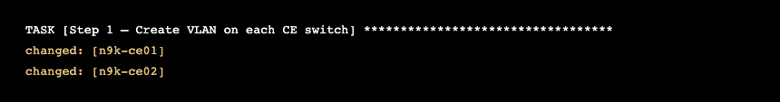

**Second run:**

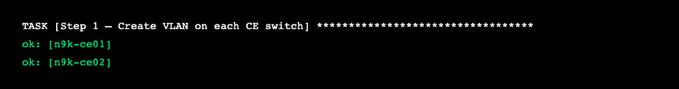

The `changed` → `ok` shift means Ansible checked the device, found the VLAN
already exists with the correct config, and made no changes. The PLAY RECAP
will show `changed=0` for most devices on the second run.

> **Exception:** Some tasks always show `changed` because their modules can't
> detect existing state. The `nxos_config` switchport tasks (Step 2) and Linux
> `raw` commands always report `changed`. The XRd tasks using `iosxr_command`
> always report `ok` (but for the opposite reason — they can't detect whether
> they made a change). These are module limitations, not playbook bugs.

> **💡 Automation Insight:** You just ran the same playbook twice and nothing broke. That `changed=0` output is the most underrated feature in automation. It means you can schedule this playbook to run every hour, and it will silently fix any config drift without touching what's already correct. That's how production teams keep 10,000 devices in compliance.

### What This Means for Production

In a real environment, idempotent playbooks enable:
- **Scheduled enforcement** — Run the playbook hourly to catch and fix config drift
- **Safe re-runs** — If something fails, just re-run. No need to figure out
  which parts succeeded and skip them
- **CI/CD integration** — Trigger playbooks on git push, knowing they'll
  only change what's different
- **Disaster recovery** — After a device replacement, run the full playbook
  to bring it to the desired state

---

---

← [Task 2](TASK2.md) | [Lab Guide](LAB-GUIDE.md) | [Task 4 →](TASK4.md)
