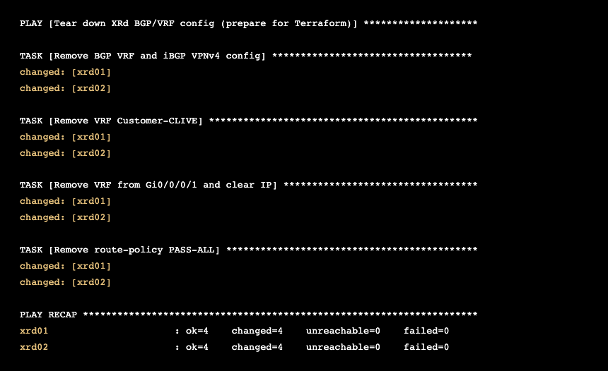

← [Task 3](TASK3.md) | [Lab Guide](LAB-GUIDE.md) | [Troubleshooting →](TROUBLESHOOTING.md)

---

## Task 4: Terraform — Same Config, Different Tool

In Tasks 1-3, you used **Ansible** to push configuration via CLI over SSH.
Now you'll use **Terraform** to configure the same XRd routers — same outcome,
different approach. This gives you a direct comparison of two leading
Infrastructure as Code tools on the same problem.

### Objective

Use Terraform to configure VRF, BGP, and route-policies on both XRd core
routers. This is the **same configuration** that Ansible applied in Task 3's
Play 1 (XRd portion only) — but expressed as Terraform resources instead of
Ansible tasks.

**Before Task 4:**
- XRd routers have no VRF, BGP VPNv4, or route-policies (Task 3 config has
  been torn down)
- East-west pings fail (no path across the SP core)

**After Task 4:**
- Full east-west connectivity restored: Client1 pings Client3
- Same configuration as Task 3, applied via Terraform + gNMI

### Ansible vs Terraform — Key Differences

Before you start, understand what makes these tools different:

| | Ansible | Terraform |
|---|---------|-----------|
| **Approach** | Procedural — tasks run in order | Declarative — describe desired state |
| **Protocol** | SSH (CLI commands) | gNMI (YANG models) |
| **State tracking** | None — re-reads device each run | State file tracks what it manages |
| **Preview changes** | `--check` mode (limited) | `terraform plan` (exact diff) |
| **Rollback** | Write a separate "undo" playbook | `terraform destroy` removes everything |
| **Drift detection** | Re-run and check for `changed` | `terraform plan` shows exact drift |
| **Config format** | YAML playbook with CLI strings | HCL with typed resource attributes |

> **Key insight:** Ansible pushes CLI commands through SSH — it speaks the same
> language a human operator would. Terraform speaks gNMI, which maps directly
> to YANG data models. Neither is "better" — they solve the same problem from
> different angles.

### Step 0: Tear Down the Ansible Config

Before Terraform can manage the XRd configuration, we need to remove what
Ansible created in Task 3. Run the teardown playbook:

```bash
cd ~/task4-terraform
ansible-playbook -i ~/inventory.yml teardown-xrd.yml
```

Expected output — 4 tasks, all `changed`:



> **Why tear down first?** Terraform tracks what it manages in a state file.
> If Ansible already created the configuration, Terraform doesn't know about
> it — it would try to create duplicate resources. Starting clean lets
> Terraform own the full lifecycle.

### Terraform Quick Primer

If this is your first time with Terraform, here are the key concepts:

**Files you'll work with:**

| File | Purpose |
|------|---------|
| `main.tf` | Resource definitions — what to create (already written) |
| `variables.tf` | Variable declarations with types and descriptions |
| `terraform.tfvars` | Variable values — **this is what you fill in** |

**The workflow:**

<pre>
terraform init    →  Download the IOS-XR provider plugin
terraform plan    →  Preview exactly what will be created (read this!)
terraform apply   →  Push the configuration to the devices
terraform plan    →  Run again — should show "No changes" (idempotency)
terraform destroy →  Clean removal of everything Terraform created
</pre>

**How it connects to the routers:**

Terraform uses the **CiscoDevNet/iosxr** provider, which communicates via
**gNMI** (gRPC Network Management Interface) on port 9339. gNMI speaks
YANG models natively — unlike Ansible's CLI-over-SSH approach, there's no
screen-scraping or regex parsing. Each Terraform resource maps directly to
a YANG model path.

### Exercise: Complete the Variables

The `main.tf` file is already written — read through it to understand the
resources, but **don't edit it**. Your job is to fill in the variable values
in `terraform.tfvars`.

Open the variables file:

```bash
nano terraform.tfvars
```

#### BGP AS Numbers

Find the two `___` placeholders for BGP:

<pre>
bgp_asn      = "___"       # TODO: SP core AS number (XRd routers)
customer_asn = "___"       # TODO: Customer PE AS number (CSR routers)
</pre>

Using **Table 3: BGP Peering**, fill in:

| Variable | Hint | Where to Find It |
|----------|------|-------------------|
| `bgp_asn` | The AS shared by both XRd routers | Table 3, "Local AS" for xrd01/xrd02 |
| `customer_asn` | The AS shared by both CSR PEs | Table 3, "Remote AS" for csr-pe01/csr-pe02 |

#### Per-Router Configuration

Scroll down to the `xrd_config` block — same variables you filled in for
Task 3, same reference tables:

<pre>
xrd_config = {
  xrd01 = {
    remote_lo = "___"       # TODO: xrd02's Loopback0 IP
    gi1_ip    = "___"       # TODO: xrd01's Gi0/0/0/1 IP toward csr-pe01
    gi1_mask  = "___"       # TODO: Subnet mask for the /30 link
    csr_peer  = "___"       # TODO: csr-pe01's IP on the same /30 link
  }
  xrd02 = {
    remote_lo = "___"       # TODO: xrd01's Loopback0 IP
    gi1_ip    = "___"       # TODO: xrd02's Gi0/0/0/1 IP toward csr-pe02
    gi1_mask  = "___"       # TODO: Subnet mask for the /30 link
    csr_peer  = "___"       # TODO: csr-pe02's IP on the same /30 link
  }
}
</pre>

Using **Table 2** and **Table 3**, fill in:

| Variable | Hint | Where to Find It |
|----------|------|-------------------|
| `remote_lo` for xrd01 | xrd02's Loopback0 IP | Table 2, xrd02 Loopback0 row |
| `remote_lo` for xrd02 | xrd01's Loopback0 IP | Table 2, xrd01 Loopback0 row |
| `gi1_ip` for xrd01 | xrd01's IP on Gi0/0/0/1 | Table 2, xrd01 Gi0/0/0/1 row |
| `gi1_ip` for xrd02 | xrd02's IP on Gi0/0/0/1 | Table 2, xrd02 Gi0/0/0/1 row |
| `gi1_mask` (both) | Subnet mask for /30 | Always `255.255.255.252` for /30 |
| `csr_peer` for xrd01 | csr-pe01's IP toward xrd01 | Table 2, csr-pe01 Gi2 row |
| `csr_peer` for xrd02 | csr-pe02's IP toward xrd02 | Table 2, csr-pe02 Gi2 row |

> **Notice:** These are the exact same values you used in Task 3. The data
> doesn't change — only the tool consuming it.

### Read the Code: main.tf Walkthrough

Before running Terraform, **read through `main.tf`** and notice how it
compares to the Ansible playbook:

| Step | What It Does | Terraform Resource | Ansible Equivalent |
|------|-------------|-------------------|-------------------|
| 1 | Route-policy PASS-ALL | `iosxr_route_policy` | `iosxr_config` with RPL text |
| 2 | VRF with route-targets | `iosxr_vrf` | `iosxr_config` with CLI lines |
| 3 | Interface VRF + IP | `iosxr_interface_ethernet` | `iosxr_config` with interface parents |
| 4 | BGP process + iBGP neighbor | `iosxr_router_bgp` | `iosxr_config` with `router bgp` parents |
| 4b | VPNv4 address-family | `iosxr_router_bgp_address_family` | Nested in same `iosxr_config` task |
| 4c | iBGP neighbor AF activation | `iosxr_router_bgp_neighbor_address_family` | Nested in same `iosxr_config` task |
| 5 | BGP VRF + eBGP neighbor | `iosxr_router_bgp_vrf` | `iosxr_config` with `vrf` parents |
| 5b | VRF address-family | `iosxr_router_bgp_vrf_address_family` | Nested in same task |
| 5c | Neighbor route-policies | `iosxr_router_bgp_vrf_neighbor_address_family` | Nested in same task |

> **Key difference:** In Ansible, one `iosxr_config` task pushes a block of
> CLI commands. In Terraform, each configuration element is a separate
> **resource** with typed attributes. More verbose, but each piece is
> independently trackable, plannable, and destroyable.

### Run It

#### Step 1: Install the IOS-XR Terraform Provider

Terraform needs the CiscoDevNet IOS-XR provider to manage XRd routers via
gNMI. This provider isn't in the default Terraform Registry, so we download
it manually and place it in the local filesystem mirror.

Run these commands to download and install the provider:

```bash
mkdir -p ~/.terraform.d/plugins/registry.terraform.io/ciscodevnet/iosxr/0.7.1/linux_amd64
curl -sL https://github.com/CiscoDevNet/terraform-provider-iosxr/releases/download/v0.7.1/terraform-provider-iosxr_0.7.1_linux_amd64.zip \
  -o /tmp/terraform-provider-iosxr.zip
unzip -o /tmp/terraform-provider-iosxr.zip \
  -d ~/.terraform.d/plugins/registry.terraform.io/ciscodevnet/iosxr/0.7.1/linux_amd64/
rm /tmp/terraform-provider-iosxr.zip
```

Verify the binary is in place:

```bash
ls -la ~/.terraform.d/plugins/registry.terraform.io/ciscodevnet/iosxr/0.7.1/linux_amd64/
```

You should see `terraform-provider-iosxr_v0.7.1` (about 30 MB).

> **Why a local mirror?** The lab server uses a `.terraformrc` file that tells
> Terraform to load CiscoDevNet providers from the local filesystem instead of
> the public registry. This ensures consistent versions and works in
> environments with restricted internet access. You're placing the binary
> exactly where `.terraformrc` tells Terraform to look.

#### Step 2: Initialize Terraform

Download the IOS-XR provider plugin:

```bash
terraform init
```

Expected output:

<pre>
Initializing the backend...
Initializing provider plugins...
- Finding ciscodevnet/iosxr versions matching ">= 0.5.0"...
- Installing ciscodevnet/iosxr v0.7.1...
- Installed ciscodevnet/iosxr v0.7.1 (unauthenticated)
Terraform has created a lock file .terraform.lock.hcl to record the provider
selections it made above. Include this file in your version control repository
so that Terraform can guarantee to make the same selections by default when
you run "terraform init" in the future.


Warning: Incomplete lock file information for providers

Due to your customized provider installation methods, Terraform was forced to
calculate lock file checksums locally for the following providers:
  - ciscodevnet/iosxr

The current .terraform.lock.hcl file only includes checksums for linux_amd64,
so Terraform running on another platform will fail to install these
providers.

To calculate additional checksums for another platform, run:
  terraform providers lock -platform=linux_amd64
(where linux_amd64 is the platform to generate)
Terraform has been successfully initialized!

You may now begin working with Terraform. Try running "terraform plan" to see
any changes that are required for your infrastructure. All Terraform commands
should now work.

If you ever set or change modules or backend configuration for Terraform,
rerun this command to reinitialize your working directory. If you forget, other
commands will detect it and remind you to do so if necessary.
</pre>

> **Don't worry about the warnings.** The "unauthenticated" and "incomplete lock
> file" messages are expected — we're using a local filesystem mirror for the
> provider plugin instead of downloading from the Terraform Registry. This is
> normal in lab and air-gapped environments.

#### Step 3: Preview the Changes

This is where Terraform shines — you see exactly what will happen before
anything touches the routers:

```bash
terraform plan
```

Read the output carefully. Terraform shows every resource it will create,
with every attribute value. You should see **18 resources to add** across
both XRd routers (9 per router).

<details>
<summary>Full terraform plan output (click to expand)</summary>

<pre>
Terraform used the selected providers to generate the following execution
plan. Resource actions are indicated with the following symbols:
  + create

Terraform will perform the following actions:

  # iosxr_interface_ethernet.gi1_xrd01 will be created
  + resource "iosxr_interface_ethernet" "gi1_xrd01" {
      + device       = "xrd01"
      + id           = (known after apply)
      + ipv4_address = "10.1.0.5"
      + ipv4_netmask = "255.255.255.252"
      + name         = "0/0/0/1"
      + shutdown     = false
      + type         = "GigabitEthernet"
      + vrf          = "Customer-CLIVE"
    }

  # iosxr_interface_ethernet.gi1_xrd02 will be created
  + resource "iosxr_interface_ethernet" "gi1_xrd02" {
      + device       = "xrd02"
      + id           = (known after apply)
      + ipv4_address = "10.1.0.9"
      + ipv4_netmask = "255.255.255.252"
      + name         = "0/0/0/1"
      + shutdown     = false
      + type         = "GigabitEthernet"
      + vrf          = "Customer-CLIVE"
    }

  # iosxr_route_policy.pass_all_xrd01 will be created
  + resource "iosxr_route_policy" "pass_all_xrd01" {
      + device            = "xrd01"
      + id                = (known after apply)
      + route_policy_name = "PASS-ALL"
      + rpl               = <<-EOT
            route-policy PASS-ALL
              pass
            end-policy
        EOT
    }

  # iosxr_route_policy.pass_all_xrd02 will be created
  + resource "iosxr_route_policy" "pass_all_xrd02" {
      + device            = "xrd02"
      + id                = (known after apply)
      + route_policy_name = "PASS-ALL"
      + rpl               = <<-EOT
            route-policy PASS-ALL
              pass
            end-policy
        EOT
    }

  # iosxr_router_bgp.bgp_xrd01 will be created
  + resource "iosxr_router_bgp" "bgp_xrd01" {
      + as_number = "65000"
      + device    = "xrd01"
      + id        = (known after apply)
      + neighbors = [
          + {
              + address       = "192.168.0.2"
              + remote_as     = "65000"
              + update_source = "Loopback0"
            },
        ]
    }

  # iosxr_router_bgp.bgp_xrd02 will be created
  + resource "iosxr_router_bgp" "bgp_xrd02" {
      + as_number = "65000"
      + device    = "xrd02"
      + id        = (known after apply)
      + neighbors = [
          + {
              + address       = "192.168.0.1"
              + remote_as     = "65000"
              + update_source = "Loopback0"
            },
        ]
    }

  # iosxr_router_bgp_address_family.vpnv4_xrd01 will be created
  + resource "iosxr_router_bgp_address_family" "vpnv4_xrd01" {
      + af_name   = "vpnv4-unicast"
      + as_number = "65000"
      + device    = "xrd01"
      + id        = (known after apply)
    }

  # iosxr_router_bgp_address_family.vpnv4_xrd02 will be created
  + resource "iosxr_router_bgp_address_family" "vpnv4_xrd02" {
      + af_name   = "vpnv4-unicast"
      + as_number = "65000"
      + device    = "xrd02"
      + id        = (known after apply)
    }

  # iosxr_router_bgp_neighbor_address_family.vpnv4_nbr_xrd01 will be created
  + resource "iosxr_router_bgp_neighbor_address_family" "vpnv4_nbr_xrd01" {
      + address   = "192.168.0.2"
      + af_name   = "vpnv4-unicast"
      + as_number = "65000"
      + device    = "xrd01"
      + id        = (known after apply)
    }

  # iosxr_router_bgp_neighbor_address_family.vpnv4_nbr_xrd02 will be created
  + resource "iosxr_router_bgp_neighbor_address_family" "vpnv4_nbr_xrd02" {
      + address   = "192.168.0.1"
      + af_name   = "vpnv4-unicast"
      + as_number = "65000"
      + device    = "xrd02"
      + id        = (known after apply)
    }

  # iosxr_router_bgp_vrf.vrf_bgp_xrd01 will be created
  + resource "iosxr_router_bgp_vrf" "vrf_bgp_xrd01" {
      + as_number             = "65000"
      + device                = "xrd01"
      + id                    = (known after apply)
      + neighbors             = [
          + {
              + address     = "10.1.0.6"
              + as_override = "enable"
              + remote_as   = "65001"
            },
        ]
      + rd_two_byte_as_index  = 1
      + rd_two_byte_as_number = "65000"
      + vrf_name              = "Customer-CLIVE"
    }

  # iosxr_router_bgp_vrf.vrf_bgp_xrd02 will be created
  + resource "iosxr_router_bgp_vrf" "vrf_bgp_xrd02" {
      + as_number             = "65000"
      + device                = "xrd02"
      + id                    = (known after apply)
      + neighbors             = [
          + {
              + address     = "10.1.0.10"
              + as_override = "enable"
              + remote_as   = "65001"
            },
        ]
      + rd_two_byte_as_index  = 1
      + rd_two_byte_as_number = "65000"
      + vrf_name              = "Customer-CLIVE"
    }

  # iosxr_router_bgp_vrf_address_family.vrf_af_xrd01 will be created
  + resource "iosxr_router_bgp_vrf_address_family" "vrf_af_xrd01" {
      + af_name                = "ipv4-unicast"
      + as_number              = "65000"
      + device                 = "xrd01"
      + id                     = (known after apply)
      + redistribute_connected = true
      + vrf_name               = "Customer-CLIVE"
    }

  # iosxr_router_bgp_vrf_address_family.vrf_af_xrd02 will be created
  + resource "iosxr_router_bgp_vrf_address_family" "vrf_af_xrd02" {
      + af_name                = "ipv4-unicast"
      + as_number              = "65000"
      + device                 = "xrd02"
      + id                     = (known after apply)
      + redistribute_connected = true
      + vrf_name               = "Customer-CLIVE"
    }

  # iosxr_router_bgp_vrf_neighbor_address_family.vrf_nbr_af_xrd01 will be created
  + resource "iosxr_router_bgp_vrf_neighbor_address_family" "vrf_nbr_af_xrd01" {
      + address          = "10.1.0.6"
      + af_name          = "ipv4-unicast"
      + as_number        = "65000"
      + device           = "xrd01"
      + id               = (known after apply)
      + route_policy_in  = "PASS-ALL"
      + route_policy_out = "PASS-ALL"
      + vrf_name         = "Customer-CLIVE"
    }

  # iosxr_router_bgp_vrf_neighbor_address_family.vrf_nbr_af_xrd02 will be created
  + resource "iosxr_router_bgp_vrf_neighbor_address_family" "vrf_nbr_af_xrd02" {
      + address          = "10.1.0.10"
      + af_name          = "ipv4-unicast"
      + as_number        = "65000"
      + device           = "xrd02"
      + id               = (known after apply)
      + route_policy_in  = "PASS-ALL"
      + route_policy_out = "PASS-ALL"
      + vrf_name         = "Customer-CLIVE"
    }

  # iosxr_vrf.customer_clive_xrd01 will be created
  + resource "iosxr_vrf" "customer_clive_xrd01" {
      + device                                              = "xrd01"
      + id                                                  = (known after apply)
      + ipv4_unicast                                        = true
      + ipv4_unicast_export_route_target_two_byte_as_format = [
          + {
              + asn2_index         = 1
              + stitching          = "disable"
              + two_byte_as_number = 65000
            },
        ]
      + ipv4_unicast_import_route_target_two_byte_as_format = [
          + {
              + asn2_index         = 1
              + stitching          = "disable"
              + two_byte_as_number = 65000
            },
        ]
      + vrf_name                                            = "Customer-CLIVE"
    }

  # iosxr_vrf.customer_clive_xrd02 will be created
  + resource "iosxr_vrf" "customer_clive_xrd02" {
      + device                                              = "xrd02"
      + id                                                  = (known after apply)
      + ipv4_unicast                                        = true
      + ipv4_unicast_export_route_target_two_byte_as_format = [
          + {
              + asn2_index         = 1
              + stitching          = "disable"
              + two_byte_as_number = 65000
            },
        ]
      + ipv4_unicast_import_route_target_two_byte_as_format = [
          + {
              + asn2_index         = 1
              + stitching          = "disable"
              + two_byte_as_number = 65000
            },
        ]
      + vrf_name                                            = "Customer-CLIVE"
    }

Plan: 18 to add, 0 to change, 0 to destroy.
</pre>

</details>

Take a moment to read through the plan. Notice how each resource maps to
something you configured manually in Task 3:

| Plan Resource | What It Creates |
|---------------|----------------|
| `iosxr_route_policy.pass_all_xrd01/02` | The `PASS-ALL` route-policy on each router |
| `iosxr_vrf.customer_clive_xrd01/02` | VRF `Customer-CLIVE` with RT import/export `65000:1` |
| `iosxr_interface_ethernet.gi1_xrd01/02` | Gi0/0/0/1 with VRF, IP address, and `shutdown = false` |
| `iosxr_router_bgp.bgp_xrd01/02` | BGP AS 65000 with iBGP neighbor (update-source Loopback0) |
| `iosxr_router_bgp_address_family.vpnv4_xrd01/02` | VPNv4 unicast address-family |
| `iosxr_router_bgp_neighbor_address_family.vpnv4_nbr_xrd01/02` | VPNv4 activation on the iBGP neighbor |
| `iosxr_router_bgp_vrf.vrf_bgp_xrd01/02` | BGP VRF with eBGP neighbor (AS 65001, as-override) |
| `iosxr_router_bgp_vrf_address_family.vrf_af_xrd01/02` | VRF IPv4 unicast with redistribute connected |
| `iosxr_router_bgp_vrf_neighbor_address_family.vrf_nbr_af_xrd01/02` | VRF neighbor route-policies (PASS-ALL in/out) |

Every attribute value in the `+` lines came from **your** `terraform.tfvars`
entries. If any IP address or AS number looks wrong, **fix it now** in
`terraform.tfvars` and re-run `terraform plan` — nothing has touched the
routers yet.

> **Compare to Ansible:** With Ansible, `--check` mode gives you a rough
> idea of what will change, but it can't show you the exact attribute values.
> Terraform's plan is precise — it tells you exactly which attributes will be
> set on which device, before a single byte is sent.

#### Step 4: Apply the Configuration

Push the config to both XRd routers:

```bash
terraform apply
```

Terraform will show the full plan again and ask for confirmation. Type `yes`:

<pre>
Do you want to perform these actions?
  Terraform will perform the actions described above.
  Only 'yes' will be accepted to approve.

  Enter a value: yes
</pre>

Watch the resources being created — Terraform automatically determines the
correct order based on `depends_on` relationships (VRF before interface,
BGP before VRF-BGP):

<pre>
iosxr_route_policy.pass_all_xrd01: Creating...
iosxr_route_policy.pass_all_xrd02: Creating...
iosxr_vrf.customer_clive_xrd01: Creating...
iosxr_vrf.customer_clive_xrd02: Creating...
iosxr_router_bgp.bgp_xrd01: Creating...
iosxr_router_bgp.bgp_xrd02: Creating...
iosxr_route_policy.pass_all_xrd02: Creation complete after 1s
iosxr_route_policy.pass_all_xrd01: Creation complete after 1s
iosxr_vrf.customer_clive_xrd02: Creation complete after 1s
iosxr_vrf.customer_clive_xrd01: Creation complete after 1s
iosxr_interface_ethernet.gi1_xrd02: Creating...
iosxr_interface_ethernet.gi1_xrd01: Creating...
iosxr_router_bgp.bgp_xrd02: Creation complete after 1s
iosxr_router_bgp.bgp_xrd01: Creation complete after 1s
iosxr_router_bgp_address_family.vpnv4_xrd02: Creating...
iosxr_router_bgp_address_family.vpnv4_xrd01: Creating...
iosxr_router_bgp_vrf.vrf_bgp_xrd01: Creating...
iosxr_router_bgp_vrf.vrf_bgp_xrd02: Creating...
iosxr_interface_ethernet.gi1_xrd02: Creation complete after 0s
iosxr_interface_ethernet.gi1_xrd01: Creation complete after 0s
iosxr_router_bgp_address_family.vpnv4_xrd02: Creation complete after 0s
iosxr_router_bgp_neighbor_address_family.vpnv4_nbr_xrd02: Creating...
iosxr_router_bgp_address_family.vpnv4_xrd01: Creation complete after 1s
iosxr_router_bgp_neighbor_address_family.vpnv4_nbr_xrd01: Creating...
iosxr_router_bgp_vrf.vrf_bgp_xrd02: Creation complete after 1s
iosxr_router_bgp_vrf_neighbor_address_family.vrf_nbr_af_xrd02: Creating...
iosxr_router_bgp_vrf.vrf_bgp_xrd01: Creation complete after 1s
iosxr_router_bgp_vrf_address_family.vrf_af_xrd02: Creating...
iosxr_router_bgp_vrf_neighbor_address_family.vrf_nbr_af_xrd01: Creating...
iosxr_router_bgp_vrf_address_family.vrf_af_xrd01: Creating...
iosxr_router_bgp_neighbor_address_family.vpnv4_nbr_xrd02: Creation complete after 0s
iosxr_router_bgp_neighbor_address_family.vpnv4_nbr_xrd01: Creation complete after 0s
iosxr_router_bgp_vrf_address_family.vrf_af_xrd02: Creation complete after 0s
iosxr_router_bgp_vrf_address_family.vrf_af_xrd01: Creation complete after 1s

Apply complete! Resources: 18 added, 0 changed, 0 destroyed.
</pre>

> **Timing race note:** On the first apply, you may see an error on the last
> 2 resources (`vrf_nbr_af_xrd01` / `vrf_nbr_af_xrd02`) with the message
> `"The address family has not been initialized"`. This is a gNMI timing
> issue — the VRF address-family hasn't fully committed on the device before
> Terraform tries to configure the neighbor under it. **This is normal.**
> Simply run `terraform apply` again and Terraform will create just the 2
> remaining resources:
>
> <pre>
> Plan: 2 to add, 0 to change, 0 to destroy.
> ...
> Apply complete! Resources: 2 added, 0 changed, 0 destroyed.
> </pre>
>
> This is a great teaching moment: Terraform is **idempotent and resumable**.
> A partial failure doesn't corrupt anything — you just re-apply and it
> picks up where it left off.

> **Speed comparison:** Terraform applies all 18 resources in about 3-5
> seconds via gNMI. The equivalent Ansible playbook takes longer because
> it runs tasks sequentially. Terraform can apply resources in parallel
> across both routers simultaneously, as you can see in the interleaved
> output above.

### Verify: Check for Drift

Run the plan again — it should show no changes:

```bash
terraform plan
```

Terraform reads the live configuration from both routers via gNMI, compares
it against the desired state in your `.tf` files, and reports:

<pre>
iosxr_route_policy.pass_all_xrd02: Refreshing state...
iosxr_route_policy.pass_all_xrd01: Refreshing state...
iosxr_vrf.customer_clive_xrd02: Refreshing state...
iosxr_vrf.customer_clive_xrd01: Refreshing state...
iosxr_router_bgp.bgp_xrd02: Refreshing state...
iosxr_router_bgp.bgp_xrd01: Refreshing state...
iosxr_interface_ethernet.gi1_xrd02: Refreshing state...
iosxr_interface_ethernet.gi1_xrd01: Refreshing state...
iosxr_router_bgp_address_family.vpnv4_xrd01: Refreshing state...
iosxr_router_bgp_address_family.vpnv4_xrd02: Refreshing state...
iosxr_router_bgp_vrf.vrf_bgp_xrd01: Refreshing state...
iosxr_router_bgp_vrf.vrf_bgp_xrd02: Refreshing state...
iosxr_router_bgp_neighbor_address_family.vpnv4_nbr_xrd01: Refreshing state...
iosxr_router_bgp_neighbor_address_family.vpnv4_nbr_xrd02: Refreshing state...
iosxr_router_bgp_vrf_neighbor_address_family.vrf_nbr_af_xrd01: Refreshing state...
iosxr_router_bgp_vrf_address_family.vrf_af_xrd01: Refreshing state...
iosxr_router_bgp_vrf_address_family.vrf_af_xrd02: Refreshing state...
iosxr_router_bgp_vrf_neighbor_address_family.vrf_nbr_af_xrd02: Refreshing state...

No changes. Your infrastructure matches the configuration.

Terraform has compared your real infrastructure against your configuration
and found no differences, so no changes are needed.
</pre>

Notice the "Refreshing state..." lines — Terraform is actively reading the
live device config via gNMI and comparing every attribute against what it
expects. All 18 resources match, so the output is "No changes."

This is Terraform's version of idempotency. The state file records what
was last known, `plan` refreshes it from the live device, then diffs against
your `.tf` configuration. If someone manually changed something on the router,
this command would show you exactly what drifted (you'll see this in Task 4b).

### Verify: East-West Connectivity

Test that the configuration works — same ping test as Task 3:

```bash
cd ~
ansible -i inventory.yml linux-client1 -m raw -a "ping -c 3 34.34.34.1"
```

> **Note:** After `terraform apply`, BGP needs about 30-60 seconds to
> converge — the iBGP VPNv4 session must establish and exchange VPN labels
> before end-to-end traffic flows. If you get 100% packet loss, wait a
> minute and try again.

Expected output — 100% success:

<pre>
linux-client1 | CHANGED | rc=0 >>
PING 34.34.34.1 (34.34.34.1) 56(84) bytes of data.
64 bytes from 34.34.34.1: icmp_seq=1 ttl=58 time=13.4 ms
64 bytes from 34.34.34.1: icmp_seq=2 ttl=58 time=10.5 ms
64 bytes from 34.34.34.1: icmp_seq=3 ttl=58 time=10.1 ms

--- 34.34.34.1 ping statistics ---
3 packets transmitted, 3 received, 0% packet loss, time 2003ms
rtt min/avg/max/mdev = 10.117/11.334/13.350/1.435 ms
</pre>

Full east-west connectivity — rebuilt entirely with Terraform. The traffic
path is identical to Task 3: client1 (23.23.23.1) → n9k-ce01 → csr-pe01 →
xrd01 → xrd02 → csr-pe02 → n9k-ce02 → client3 (34.34.34.1), crossing
6 devices, 4 platforms, and 4 technologies (VLAN, IS-IS, MPLS, BGP VPNv4).

### Bonus: Clean Destroy

One of Terraform's strongest features is clean teardown. Try it:

```bash
cd ~/task4-terraform
terraform destroy
```

Type `yes` when prompted. Terraform removes all 18 resources in reverse
dependency order — leaf resources first, then their parents:

<details>
<summary>Full terraform destroy output (click to expand)</summary>

<pre>
Terraform will perform the following actions:

  # iosxr_interface_ethernet.gi1_xrd01 will be destroyed
  - resource "iosxr_interface_ethernet" "gi1_xrd01" {
      - device       = "xrd01" -> null
      - ipv4_address = "10.1.0.5" -> null
      - ipv4_netmask = "255.255.255.252" -> null
      - name         = "0/0/0/1" -> null
      - shutdown     = false -> null
      - type         = "GigabitEthernet" -> null
      - vrf          = "Customer-CLIVE" -> null
    }

  # iosxr_interface_ethernet.gi1_xrd02 will be destroyed
  - resource "iosxr_interface_ethernet" "gi1_xrd02" {
      - device       = "xrd02" -> null
      - ipv4_address = "10.1.0.9" -> null
      - ipv4_netmask = "255.255.255.252" -> null
      - name         = "0/0/0/1" -> null
      - shutdown     = false -> null
      - type         = "GigabitEthernet" -> null
      - vrf          = "Customer-CLIVE" -> null
    }

  ... (all 18 resources shown with - destroy markers)

Plan: 0 to add, 0 to change, 18 to destroy.

iosxr_router_bgp_neighbor_address_family.vpnv4_nbr_xrd01: Destroying...
iosxr_router_bgp_neighbor_address_family.vpnv4_nbr_xrd02: Destroying...
iosxr_router_bgp_vrf_address_family.vrf_af_xrd01: Destroying...
iosxr_router_bgp_vrf_address_family.vrf_af_xrd02: Destroying...
iosxr_router_bgp_vrf_neighbor_address_family.vrf_nbr_af_xrd02: Destroying...
iosxr_router_bgp_vrf_neighbor_address_family.vrf_nbr_af_xrd01: Destroying...
iosxr_interface_ethernet.gi1_xrd02: Destroying...
iosxr_interface_ethernet.gi1_xrd01: Destroying...
iosxr_router_bgp_neighbor_address_family.vpnv4_nbr_xrd02: Destruction complete after 0s
iosxr_router_bgp_address_family.vpnv4_xrd02: Destroying...
iosxr_router_bgp_vrf_neighbor_address_family.vrf_nbr_af_xrd01: Destruction complete after 1s
iosxr_route_policy.pass_all_xrd01: Destroying...
iosxr_router_bgp_vrf_neighbor_address_family.vrf_nbr_af_xrd02: Destruction complete after 1s
iosxr_route_policy.pass_all_xrd02: Destroying...
iosxr_router_bgp_vrf_address_family.vrf_af_xrd01: Destruction complete after 1s
iosxr_router_bgp_vrf.vrf_bgp_xrd01: Destroying...
iosxr_router_bgp_vrf_address_family.vrf_af_xrd02: Destruction complete after 1s
iosxr_router_bgp_vrf.vrf_bgp_xrd02: Destroying...
iosxr_router_bgp_neighbor_address_family.vpnv4_nbr_xrd01: Destruction complete after 1s
iosxr_router_bgp_address_family.vpnv4_xrd01: Destroying...
iosxr_interface_ethernet.gi1_xrd02: Destruction complete after 1s
iosxr_interface_ethernet.gi1_xrd01: Destruction complete after 1s
iosxr_route_policy.pass_all_xrd02: Destruction complete after 1s
iosxr_route_policy.pass_all_xrd01: Destruction complete after 0s
iosxr_router_bgp_vrf.vrf_bgp_xrd01: Destruction complete after 1s
iosxr_vrf.customer_clive_xrd01: Destroying...
iosxr_router_bgp_vrf.vrf_bgp_xrd02: Destruction complete after 1s
iosxr_vrf.customer_clive_xrd02: Destroying...
iosxr_router_bgp_address_family.vpnv4_xrd01: Destruction complete after 1s
iosxr_router_bgp.bgp_xrd01: Destroying...
iosxr_router_bgp_address_family.vpnv4_xrd02: Destruction complete after 0s
iosxr_router_bgp.bgp_xrd02: Destroying...
iosxr_vrf.customer_clive_xrd02: Destruction complete after 0s
iosxr_vrf.customer_clive_xrd01: Destruction complete after 0s
iosxr_router_bgp.bgp_xrd01: Destruction complete after 0s
iosxr_router_bgp.bgp_xrd02: Destruction complete after 1s

Destroy complete! Resources: 18 destroyed.
</pre>

</details>

> **Timing race note:** Similar to apply, you may see a gNMI error during
> destroy (e.g., `"The address family cannot be disabled; there are still
> neighbors/groups which have configuration for it"`). This is the same race
> condition — just run `terraform destroy` again and the remaining 1-2
> resources will be cleaned up.

Verify the config is gone — pings should fail:

```bash
cd ~
ansible -i inventory.yml linux-client1 -m raw -a "ping -c 3 -W 2 34.34.34.1"
```

Expected output — 100% loss:

<pre>
linux-client1 | FAILED | rc=1 >>
PING 34.34.34.1 (34.34.34.1) 56(84) bytes of data.

--- 34.34.34.1 ping statistics ---
3 packets transmitted, 0 received, 100% packet loss, time 2025ms
</pre>

The VRF, BGP, and route-policies have been cleanly removed from both XRd
routers. The data plane is down because the SP core no longer carries the
customer VPN routes.

**Now re-apply the config** before moving to Task 4b:

```bash
cd ~/task4-terraform
terraform apply -auto-approve
```

(If you see the timing error, run `terraform apply -auto-approve` once more.)

Wait about 90 seconds for BGP to converge, then confirm east-west pings
are working again before proceeding.

> **Compare to Ansible:** To undo Ansible's work, you'd need to write a
> separate teardown playbook (like we did in Step 0). Terraform tracks what
> it created and can remove exactly those resources — nothing more, nothing
> less. And re-creating everything is just `terraform apply` away.

### Checkpoint

- [ ] IOS-XR provider binary installed in local mirror
- [ ] `terraform init` loaded the IOS-XR provider
- [ ] `terraform plan` showed 18 resources to add
- [ ] `terraform apply` created all 18 resources successfully
- [ ] `terraform plan` (second run) showed "No changes"
- [ ] East-west ping from client1 to client3 succeeded
- [ ] (Bonus) `terraform destroy` cleanly removed all config

> **Automation Insight:** You just configured the same network with two
> different tools. In practice, teams often use both: Terraform for
> provisioning (spinning up infrastructure from scratch) and Ansible for
> day-2 operations (ongoing config changes, compliance checks, OS upgrades).
> Understanding both gives you the flexibility to choose the right tool for
> each job.

---

## Task 4b: Terraform Drift Detection & Remediation

In Task 1b, you saw how Ansible handles configuration drift — you broke
something, re-ran the playbook, and Ansible fixed it. The output showed
`changed` on the affected tasks, but you had to infer *what* changed.

Terraform takes drift detection further. When someone manually changes a
router's configuration, `terraform plan` shows you the **exact diff** —
which attribute changed, what the current value is, and what Terraform will
set it back to. No guessing, no re-reading show commands.

### Objective

Manually break the XRd configuration, use `terraform plan` to detect the
exact drift, and `terraform apply` to remediate it.

**Before drift:**
- East-west pings working (client1 → client3)
- `terraform plan` shows "No changes"

**After remediation:**
- East-west pings restored
- `terraform plan` shows "No changes" again

### Step 1: Break Something

> **Important:** If you ran `terraform destroy` in the bonus step above,
> first re-apply the config: `terraform apply -auto-approve`

Manually shut down the PE-facing interface on xrd01. Use the ContainerLab
VS Code extension to open a terminal to **xrd01**, then run:

```
configure
interface GigabitEthernet0/0/0/1
 shutdown
commit
end
```

> **Alternative — SSH from the jump host terminal:**
> ```bash
> ssh -i ~/.ssh/id_rsa clab@172.20.20.10
> ```
> Then run the same IOS-XR commands above. Type `exit` when done.

This simulates a common real-world scenario — someone logs into a router
and makes an out-of-band change that breaks connectivity.

### Step 2: Confirm the Damage

Verify that east-west connectivity is broken:

```bash
cd ~
ansible -i inventory.yml linux-client1 -m raw -a "ping -c 3 -W 2 34.34.34.1"
```

Expected output — 100% packet loss:

<pre>
linux-client1 | FAILED | rc=1 >>
PING 34.34.34.1 (34.34.34.1) 56(84) bytes of data.

--- 34.34.34.1 ping statistics ---
3 packets transmitted, 0 received, 100% packet loss, time 2048ms
</pre>

The interface is down, so the eBGP VRF session to csr-pe01 drops, VPN
routes are withdrawn, and client1 has no path to reach client3's network.

### Step 3: Detect the Drift

This is where Terraform shines. Run:

```bash
cd ~/task4-terraform
terraform plan
```

Terraform reads the live device configuration via gNMI, compares it against
the desired state in your `.tf` files, and shows you exactly what drifted:

<pre>
iosxr_route_policy.pass_all_xrd01: Refreshing state...
iosxr_route_policy.pass_all_xrd02: Refreshing state...
iosxr_vrf.customer_clive_xrd02: Refreshing state...
iosxr_vrf.customer_clive_xrd01: Refreshing state...
iosxr_router_bgp.bgp_xrd02: Refreshing state...
iosxr_router_bgp.bgp_xrd01: Refreshing state...
iosxr_interface_ethernet.gi1_xrd02: Refreshing state...
iosxr_interface_ethernet.gi1_xrd01: Refreshing state...
iosxr_router_bgp_address_family.vpnv4_xrd01: Refreshing state...
iosxr_router_bgp_address_family.vpnv4_xrd02: Refreshing state...
iosxr_router_bgp_vrf.vrf_bgp_xrd01: Refreshing state...
iosxr_router_bgp_vrf.vrf_bgp_xrd02: Refreshing state...
iosxr_router_bgp_neighbor_address_family.vpnv4_nbr_xrd01: Refreshing state...
iosxr_router_bgp_neighbor_address_family.vpnv4_nbr_xrd02: Refreshing state...
iosxr_router_bgp_vrf_address_family.vrf_af_xrd02: Refreshing state...
iosxr_router_bgp_vrf_neighbor_address_family.vrf_nbr_af_xrd02: Refreshing state...
iosxr_router_bgp_vrf_address_family.vrf_af_xrd01: Refreshing state...
iosxr_router_bgp_vrf_neighbor_address_family.vrf_nbr_af_xrd01: Refreshing state...

Terraform used the selected providers to generate the following execution
plan. Resource actions are indicated with the following symbols:
  ~ update in-place

Terraform will perform the following actions:

  # iosxr_interface_ethernet.gi1_xrd01 will be updated in-place
  ~ resource "iosxr_interface_ethernet" "gi1_xrd01" {
        id           = "Cisco-IOS-XR-um-interface-cfg:/interfaces/interface[interface-name=GigabitEthernet0/0/0/1]"
        name         = "0/0/0/1"
      ~ shutdown     = true -> false
        # (5 unchanged attributes hidden)
    }

Plan: 0 to add, 1 to change, 0 to destroy.
</pre>

Read this output carefully — it's packed with information:

- **"Refreshing state..."** — Terraform read all 18 resources from the live
  devices via gNMI. It checked every VRF, every interface, every BGP config.
- **Only 1 resource drifted** — `iosxr_interface_ethernet.gi1_xrd01` on
  device `xrd01`
- **The exact change** — `shutdown = true -> false` — the interface is
  currently shut (`true`) and Terraform will set it to `false` (no shutdown)
- **Everything else matched** — 17 other resources show no drift
- **"0 to add, 1 to change, 0 to destroy"** — surgical precision

> **Compare to Ansible:** When you re-ran the Task 1 playbook after breaking
> a port, Ansible showed `changed: [n9k-ce01]` — you knew *something* changed,
> but had to read the task name to figure out what. Terraform's plan tells you
> the exact attribute (`shutdown = true → false`), the exact resource
> (`gi1_xrd01`), and the exact device (`xrd01`). This precision matters when
> you're managing hundreds of resources across dozens of devices.
>
> And critically: **`terraform plan` didn't change anything.** It's a
> read-only operation. You can run it as many times as you want — against
> production, against lab, against anything — without risk. Ansible's
> equivalent (`--check`) can sometimes trigger side effects on certain
> modules.

### Step 4: Let Terraform Fix It

Apply the remediation:

```bash
terraform apply -auto-approve
```

Expected output — watch Terraform refresh all 18 resources, find the one
that drifted, and fix only that:

<pre>
iosxr_route_policy.pass_all_xrd02: Refreshing state...
iosxr_route_policy.pass_all_xrd01: Refreshing state...
iosxr_vrf.customer_clive_xrd01: Refreshing state...
iosxr_vrf.customer_clive_xrd02: Refreshing state...
iosxr_router_bgp.bgp_xrd02: Refreshing state...
iosxr_router_bgp.bgp_xrd01: Refreshing state...
iosxr_interface_ethernet.gi1_xrd02: Refreshing state...
iosxr_interface_ethernet.gi1_xrd01: Refreshing state...
iosxr_router_bgp_address_family.vpnv4_xrd02: Refreshing state...
iosxr_router_bgp_address_family.vpnv4_xrd01: Refreshing state...
iosxr_router_bgp_vrf.vrf_bgp_xrd01: Refreshing state...
iosxr_router_bgp_vrf.vrf_bgp_xrd02: Refreshing state...
iosxr_router_bgp_neighbor_address_family.vpnv4_nbr_xrd02: Refreshing state...
iosxr_router_bgp_neighbor_address_family.vpnv4_nbr_xrd01: Refreshing state...
iosxr_router_bgp_vrf_address_family.vrf_af_xrd02: Refreshing state...
iosxr_router_bgp_vrf_neighbor_address_family.vrf_nbr_af_xrd02: Refreshing state...
iosxr_router_bgp_vrf_address_family.vrf_af_xrd01: Refreshing state...
iosxr_router_bgp_vrf_neighbor_address_family.vrf_nbr_af_xrd01: Refreshing state...

Terraform used the selected providers to generate the following execution
plan. Resource actions are indicated with the following symbols:
  ~ update in-place

Terraform will perform the following actions:

  # iosxr_interface_ethernet.gi1_xrd01 will be updated in-place
  ~ resource "iosxr_interface_ethernet" "gi1_xrd01" {
        id           = "Cisco-IOS-XR-um-interface-cfg:/interfaces/interface[interface-name=GigabitEthernet0/0/0/1]"
        name         = "0/0/0/1"
      ~ shutdown     = true -> false
        # (5 unchanged attributes hidden)
    }

Plan: 0 to add, 1 to change, 0 to destroy.
iosxr_interface_ethernet.gi1_xrd01: Modifying...
iosxr_interface_ethernet.gi1_xrd01: Modifications complete after 0s

Apply complete! Resources: 0 added, 1 changed, 0 destroyed.
</pre>

Notice: **0 added, 1 changed, 0 destroyed.** Terraform only touched the
one resource that drifted — `gi1_xrd01` on `xrd01`. The other 17 resources
across both routers were left completely alone. It didn't re-push the VRF,
didn't re-create the BGP config, didn't touch xrd02 at all.

### Step 5: Verify the Fix

Confirm connectivity is restored:

```bash
cd ~
ansible -i inventory.yml linux-client1 -m raw -a "ping -c 3 34.34.34.1"
```

> **Note:** Wait about 30-60 seconds after the apply for BGP to reconverge.
> The eBGP VRF session needs to re-establish and exchange routes before
> end-to-end traffic flows.

Expected output — 100% success:

<pre>
linux-client1 | CHANGED | rc=0 >>
PING 34.34.34.1 (34.34.34.1) 56(84) bytes of data.
64 bytes from 34.34.34.1: icmp_seq=1 ttl=58 time=13.4 ms
64 bytes from 34.34.34.1: icmp_seq=2 ttl=58 time=10.5 ms
64 bytes from 34.34.34.1: icmp_seq=3 ttl=58 time=10.1 ms

--- 34.34.34.1 ping statistics ---
3 packets transmitted, 3 received, 0% packet loss, time 2003ms
rtt min/avg/max/mdev = 10.117/11.334/13.350/1.435 ms
</pre>

Now confirm Terraform sees no remaining drift:

```bash
cd ~/task4-terraform
terraform plan
```

<pre>
iosxr_route_policy.pass_all_xrd01: Refreshing state...
iosxr_route_policy.pass_all_xrd02: Refreshing state...
iosxr_vrf.customer_clive_xrd02: Refreshing state...
iosxr_vrf.customer_clive_xrd01: Refreshing state...
iosxr_router_bgp.bgp_xrd02: Refreshing state...
iosxr_router_bgp.bgp_xrd01: Refreshing state...
iosxr_interface_ethernet.gi1_xrd02: Refreshing state...
iosxr_interface_ethernet.gi1_xrd01: Refreshing state...
iosxr_router_bgp_address_family.vpnv4_xrd01: Refreshing state...
iosxr_router_bgp_address_family.vpnv4_xrd02: Refreshing state...
iosxr_router_bgp_vrf.vrf_bgp_xrd01: Refreshing state...
iosxr_router_bgp_vrf.vrf_bgp_xrd02: Refreshing state...
iosxr_router_bgp_neighbor_address_family.vpnv4_nbr_xrd01: Refreshing state...
iosxr_router_bgp_neighbor_address_family.vpnv4_nbr_xrd02: Refreshing state...
iosxr_router_bgp_vrf_neighbor_address_family.vrf_nbr_af_xrd01: Refreshing state...
iosxr_router_bgp_vrf_address_family.vrf_af_xrd01: Refreshing state...
iosxr_router_bgp_vrf_address_family.vrf_af_xrd02: Refreshing state...
iosxr_router_bgp_vrf_neighbor_address_family.vrf_nbr_af_xrd02: Refreshing state...

No changes. Your infrastructure matches the configuration.

Terraform has compared your real infrastructure against your configuration
and found no differences, so no changes are needed.
</pre>

All 18 resources refreshed, all 18 match. The drift has been fully
remediated. The full cycle is complete:

1. **Detect** — `terraform plan` found the exact drift
2. **Fix** — `terraform apply` corrected only what changed
3. **Verify** — `terraform plan` confirms everything is back in sync

### Drift Detection: Ansible vs Terraform

| | Ansible (Task 1b) | Terraform (Task 4b) |
|---|-------------------|---------------------|
| **Detect drift** | Re-run playbook, look for `changed` | `terraform plan` shows exact diff |
| **What you learn** | "Something changed on this device" | "shutdown changed from false to true on gi1_xrd01" |
| **Remediate** | Re-run the same playbook | `terraform apply` |
| **Scope of fix** | Re-pushes all config (idempotent but broad) | Only changes what drifted |
| **Without running?** | Must execute to detect | `plan` is read-only — safe to run anytime |

> **Key insight:** Terraform's state file is a double-edged sword. It enables
> precise drift detection, but it also means Terraform only knows about
> resources **it created**. If someone adds a new interface or route outside
> of Terraform, it won't detect that. Ansible, with no state file, re-evaluates
> the full config every time — different trade-off.

### Checkpoint

- [ ] Manually shut down Gi0/0/0/1 on xrd01
- [ ] Confirmed east-west pings broke
- [ ] `terraform plan` showed the exact drift (`shutdown = true → false`)
- [ ] `terraform apply` fixed only the drifted resource
- [ ] East-west pings restored
- [ ] `terraform plan` confirmed "No changes"

> **Automation Insight:** In production, teams run `terraform plan` on a
> schedule (via CI/CD) against live infrastructure. If the plan shows any
> changes, it triggers an alert — someone made an out-of-band change. The
> team can then decide whether to remediate (apply the plan) or update the
> code to match the new reality. Either way, drift is visible, not hidden.

---

---

← [Task 3](TASK3.md) | [Lab Guide](LAB-GUIDE.md) | [Troubleshooting →](TROUBLESHOOTING.md)
