← [Task 4](TASK4.md) | [Lab Guide](LAB-GUIDE.md) | [Task 6 →](TASK6.md)

---

## Task 5 — Infrastructure as Code with Terraform

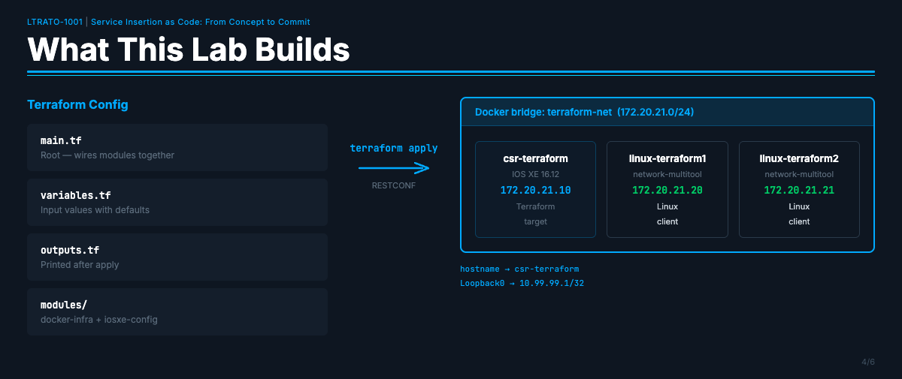

### Objective

Use Terraform to provision a three-container Docker network and configure a Cisco IOS XE
router entirely via RESTCONF — all from a single `terraform apply`.

**Before Task 5:**
- No containers running; the `terraform-net` Docker network does not exist
- The CSR has no hostname or Loopback0 configured

**After Task 5:**
- Three containers deployed on a dedicated Docker bridge network (`172.20.21.0/24`)
- CSR hostname set to `csr-terraform` and Loopback0 configured at `10.99.99.1/32` via RESTCONF
- Drift simulated, detected with `terraform plan`, and remediated with `terraform apply`
- Everything torn down cleanly with `terraform destroy`

### Why Terraform?

In Tasks 1–3 you used Ansible to push configuration to network devices over SSH.
Terraform takes a different approach — instead of describing *tasks to run*, you describe
the *desired end state* and Terraform figures out what to create, change, or destroy to
get there.

This lab runs **independently** of the main ContainerLab topology. It uses a separate
Docker bridge network and does not interfere with the LTRATO-1001 nodes.

Terraform also configures the CSR via RESTCONF (not SSH), so you will see a completely
different protocol in action:

- Hostname → `csr-terraform`
- Loopback0 → `10.99.99.1/32` (description: "Managed by Terraform")

### Lab Topology

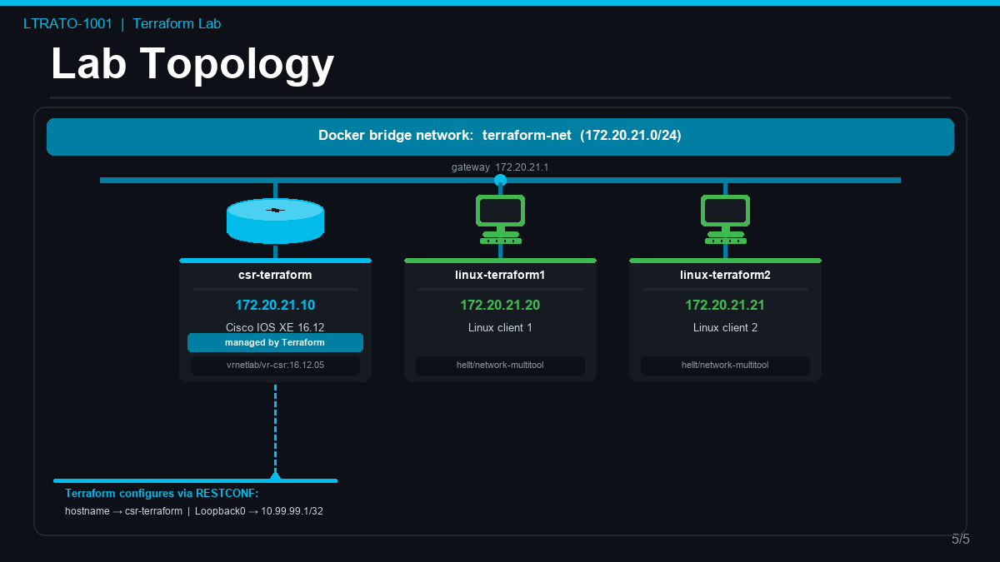

| Container | Image | IP | Role |
|---|---|---|---|
| `csr-terraform` | `vrnetlab/vr-csr:16.12.05` | `172.20.21.10` | Cisco IOS XE router — Terraform target |
| `linux-terraform1` | `ghcr.io/hellt/network-multitool` | `172.20.21.20` | Linux client |
| `linux-terraform2` | `ghcr.io/hellt/network-multitool` | `172.20.21.21` | Linux client |

---

## Prerequisites

The lab server already has everything pre-installed and initialized:

| Tool | Version | Location |
|---|---|---|
| Terraform | v1.14.7 | `/usr/bin/terraform` |
| Docker | 27.5.1 | `/usr/bin/docker` |
| `sshpass` | — | `/usr/bin/sshpass` |
| `kreuzwerker/docker` provider | 3.9.0 | `~/.terraform.d/plugins/` |
| `CiscoDevNet/iosxe` provider | 0.16.0 | `~/.terraform.d/plugins/` |

> **Note:** The server has no internet access to the Terraform registry. Providers are
> pre-installed in a local filesystem mirror. `terraform init` reads from there — no
> download needed.

All Terraform files are in: **`~/terraform-lab/terraform/`**

---

## Part 1 — Explore the Configuration

Before deploying anything, take a few minutes to understand what Terraform will build.

### Step 1 — Navigate to the Working Directory

```bash
cd ~/terraform-lab/terraform
```

### Step 2 — Explore the File Structure

Run `ls -la` to see the full directory listing with permissions and sizes:

```bash
ls -la
```

> Expected output (timestamps and sizes may differ slightly — that is normal):

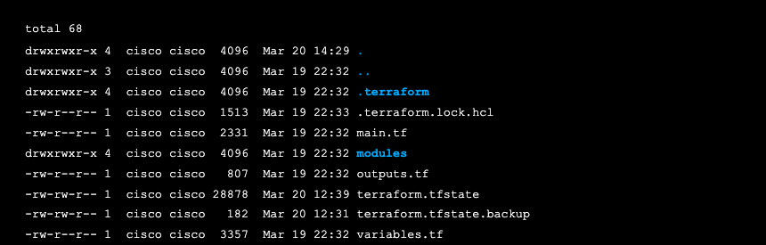

> **Why are there state files already?**
> On a brand-new Terraform project, `terraform.tfstate` would not exist until after the
> first `terraform apply`. The state files you see here exist because this lab environment
> was pre-tested and then cleaned up with `terraform destroy` before you received it.
>
> - `terraform.tfstate` (183 bytes) — after `terraform destroy` completes, Terraform writes
>   a near-empty state file rather than deleting it. The 183-byte size tells you it contains
>   only the format header — no resources are tracked. You can confirm this with
>   `terraform show`, which will print `The state file is empty`.
> - `terraform.tfstate.backup` — a copy of the full state from the last `apply`, saved
>   automatically by Terraform when `destroy` ran.
> - `terraform.tfstate.1774032510.backup` — an older backup from a prior run.
>
> You will see this same pattern yourself at the end of Part 5 after you run
> `terraform destroy`.

Here is what each file does:

| File / Directory | Purpose |
|---|---|
| `main.tf` | Root module — ties the two sub-modules together |
| `variables.tf` | All input variables with their default values |
| `outputs.tf` | Values printed to the screen after `terraform apply` |
| `modules/` | Folder containing the two sub-modules |
| `.terraform/` | Terraform's internal directory — provider plugins live here |
| `.terraform.lock.hcl` | Records the exact provider versions in use (like a lock file) |
| `terraform.tfstate` | Terraform's memory — currently empty (post-destroy residue). Will be populated after `terraform apply` |
| `terraform.tfstate.backup` | Automatic backup of the previous state, saved when `destroy` ran |

Now run `ls -l modules/` to see what modules are available:

```bash
ls -l modules/
```

> Expected output:

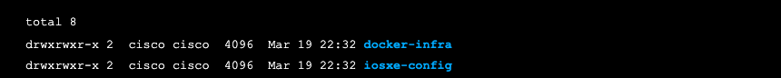

### Step 3 — Read the Root Module

```bash
cat main.tf
```

> Expected output:

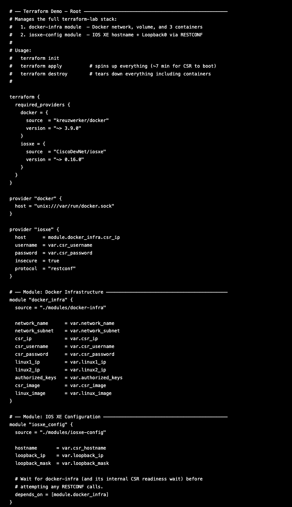

This is the entry point for the entire lab. Read through it and notice:

- The `terraform { required_providers { ... } }` block declares which providers this
  configuration needs — `kreuzwerker/docker` and `CiscoDevNet/iosxe`.
- The `provider "iosxe"` block tells the IOS XE provider where to connect: it points at
  `172.20.21.10` (the CSR container) and uses `protocol = "restconf"`.
- The two `module` blocks pull in the sub-modules from the `modules/` folder.
- `module "iosxe_config"` has `depends_on = [module.docker_infra]` — this tells Terraform
  to finish **all** docker-infra work (including waiting for the CSR to boot) before
  attempting any RESTCONF configuration. Without this, Terraform might try to configure
  the router before it has even started up.

### Step 4 — Read the Variables

```bash
cat variables.tf
```

> Expected output:

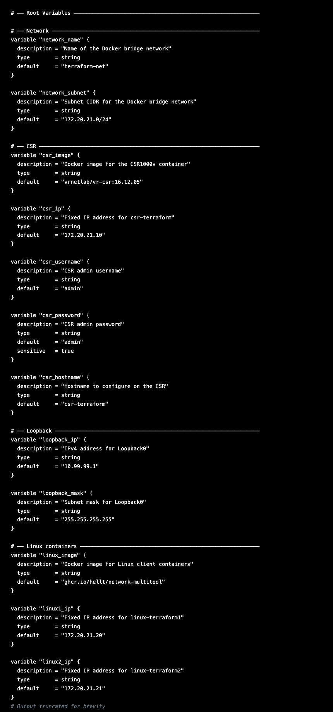

Each `variable` block defines an input to the configuration. All of them have `default`
values, so no manual input is required — Terraform uses the defaults automatically.

Key defaults:

| Variable | Default | What it controls |
|---|---|---|
| `csr_ip` | `172.20.21.10` | IP address assigned to the CSR container |
| `csr_username` / `csr_password` | `admin` / `admin` | Login credentials for the CSR |
| `csr_hostname` | `csr-terraform` | Hostname Terraform will configure on the CSR |
| `loopback_ip` | `10.99.99.1` | IP address for Loopback0 |
| `linux1_ip` / `linux2_ip` | `172.20.21.20` / `172.20.21.21` | IPs for the Linux containers |

> You will also see an `authorized_keys` variable with two long SSH public keys. These
> are pre-loaded keys that allow the lab server to SSH into the Linux containers without
> a password. You do not need to modify them.

### Step 5 — Read the Docker Infrastructure Module

```bash
cat modules/docker-infra/main.tf
```

> Expected output (excerpt):

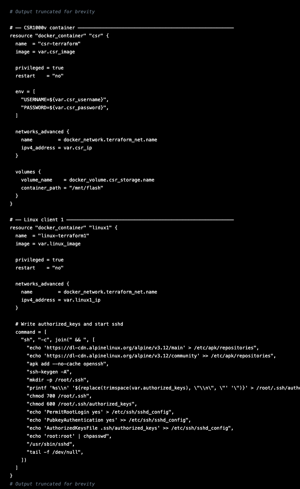

This module creates the Docker network, the storage volume, and the three containers.
Scroll down to find the `null_resource.csr_ready` block near the bottom. This is where
Terraform waits for the CSR to boot:

- It runs a shell script (`local-exec` provisioner) that polls the CSR's RESTCONF API
  every 10 seconds.
- If RESTCONF is not responding yet, it also tries to enable it over SSH.
- Once RESTCONF responds with HTTP 200, the script exits and Terraform proceeds.
- The CSR takes approximately **7-8 minutes** to complete its cold boot from a fresh volume.

### Step 6 — Read the IOS XE Configuration Module

```bash
cat modules/iosxe-config/main.tf
```

> Expected output:

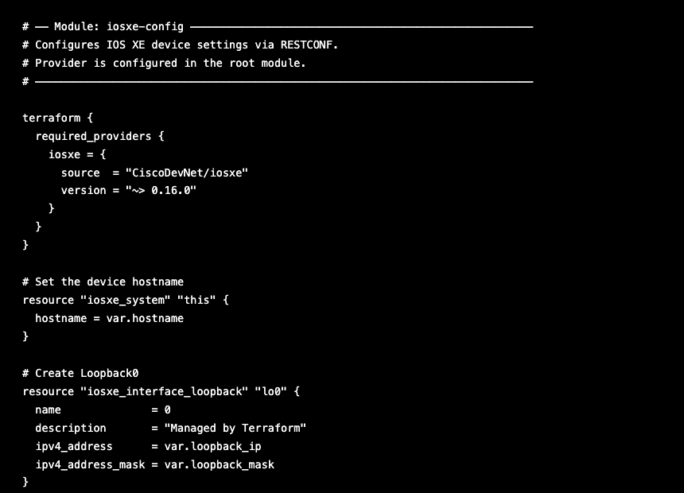

This module is simple — just two resources:
- `iosxe_system.this` — sends a RESTCONF call to set the hostname to `csr-terraform`
- `iosxe_interface_loopback.lo0` — sends a RESTCONF call to create Loopback0 with IP
  `10.99.99.1/32`

These two resources only run after `module.docker_infra` is fully complete (due to the
`depends_on` in `main.tf`).

### Step 7 — Read the Outputs

```bash
cat outputs.tf
```

> Expected output:

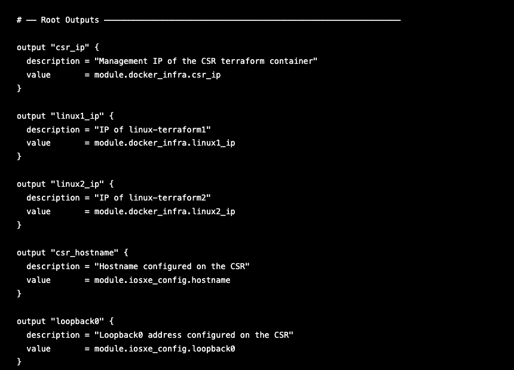

After `terraform apply` finishes, these five values will be printed to the terminal so
you can see a summary of what was deployed.

### Step 8 — Initialize Terraform

`terraform init` prepares the working directory — it reads the provider requirements and
links them from the local filesystem mirror. Since providers are pre-installed, this is
instantaneous (no download).

```bash
terraform init
```

> Expected output:

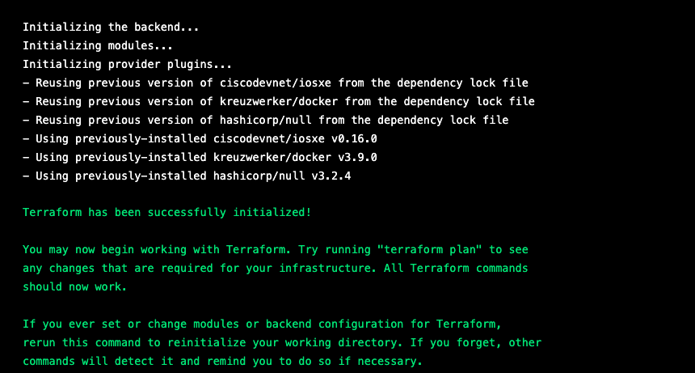

> If you see `Terraform has been successfully initialized!` you are ready to proceed.

---

## Part 2 — Plan and Deploy

### Step 9 — Confirm Nothing is Running Yet

Before deploying, verify the Docker environment is clean:

```bash
docker ps --filter name=terraform
```

> Expected output:


```bash
docker network ls --filter name=terraform
```

> Expected output:


### Step 10 — Preview the Deployment with terraform plan

`terraform plan` is a dry run. It compares your configuration against the current state
and shows you exactly what will be created, changed, or destroyed — **without touching
anything**.

```bash
terraform plan
```

> **Heads up:** The full output is verbose — Terraform lists every single attribute of
> every resource it plans to create, most of which say `(known after apply)` because the
> values won't exist until the resource is actually created. **Scroll past the details and
> focus on the summary lines at the very bottom.**
>
> `(known after apply)` simply means "Terraform will fill this in once the resource
> exists." For example, a container's ID is not known until Docker creates it.

The summary at the bottom of your output should look like this:

> Expected output (bottom of the plan):
<pre>
Plan: 8 to add, 0 to change, 0 to destroy.

Changes to Outputs:
  + csr_hostname = "csr-terraform"
  + csr_ip       = "172.20.21.10"
  + linux1_ip    = "172.20.21.20"
  + linux2_ip    = "172.20.21.21"
  + loopback0    = "10.99.99.1/255.255.255.255"

Note: You didn't use the -out option to save this plan, so Terraform can't
guarantee to take exactly these actions if you run "terraform apply" now.
</pre>

The `Plan: 8 to add` means Terraform is planning to create 8 resources:

1. `module.docker_infra.docker_network.terraform_net` — the bridge network
2. `module.docker_infra.docker_volume.csr_storage` — CSR persistent storage volume
3. `module.docker_infra.docker_container.csr` — the CSR container
4. `module.docker_infra.docker_container.linux1` — linux-terraform1
5. `module.docker_infra.docker_container.linux2` — linux-terraform2
6. `module.docker_infra.null_resource.csr_ready` — the readiness + RESTCONF provisioner
7. `module.iosxe_config.iosxe_system.this` — CSR hostname via RESTCONF
8. `module.iosxe_config.iosxe_interface_loopback.lo0` — Loopback0 via RESTCONF

> **Nothing has been deployed yet.** `plan` is always safe to run.

### Step 11 — Deploy with terraform apply

```bash
terraform apply -auto-approve
```

> The `-auto-approve` flag skips the interactive confirmation prompt. In the lab we use
> it to save time. In a production environment, always omit this flag — Terraform will
> print the plan and ask you to type `yes` before making any changes.

**What happens next (in order):**

1. Docker network `terraform-net` is created (~2s)
2. CSR storage volume is created (~0s)
3. All three containers start simultaneously (~1s each)
4. The `null_resource.csr_ready` provisioner begins — it polls RESTCONF every 10 seconds
   while waiting for the CSR to boot. **This takes approximately 7-8 minutes.**
   You will see `Still creating...` messages ticking by — this is normal. Do not interrupt it.
5. Once the CSR is ready, Terraform applies the hostname and Loopback0 via RESTCONF
   (~1 second each).

While waiting, open a second terminal and watch the CSR boot progress:

```bash
docker logs -f csr-terraform
```

Look for this line to confirm the CSR has finished booting:

<pre>
Startup complete in: 0:07:XX
</pre>

Press `Ctrl+C` to stop following the logs.

> **Why is the provisioner output suppressed?** The `csr_password` variable is marked
> `sensitive = true` in `variables.tf`. Terraform automatically suppresses the output of
> any provisioner that uses a sensitive variable to avoid accidentally printing passwords
> to the screen. That is why you see `(output suppressed due to sensitive value in config)`
> instead of the polling loop messages.

> Expected output (key lines):
<pre>
module.docker_infra.docker_volume.csr_storage: Creating...
module.docker_infra.docker_network.terraform_net: Creating...
module.docker_infra.docker_volume.csr_storage: Creation complete after 0s [id=csr-terraform-storage]
module.docker_infra.docker_network.terraform_net: Creation complete after 2s [id=d1921eb1ab7e...]
module.docker_infra.docker_container.linux1: Creating...
module.docker_infra.docker_container.csr: Creating...
module.docker_infra.docker_container.linux2: Creating...
module.docker_infra.docker_container.linux1: Creation complete after 1s [id=cf2b394afde8...]
module.docker_infra.docker_container.linux2: Creation complete after 1s [id=5d90d3868ae6...]
module.docker_infra.docker_container.csr: Creation complete after 1s [id=8fdc981b800e...]
module.docker_infra.null_resource.csr_ready: Creating...
module.docker_infra.null_resource.csr_ready: Provisioning with 'local-exec'...
module.docker_infra.null_resource.csr_ready (local-exec): (output suppressed due to sensitive value in config)
module.docker_infra.null_resource.csr_ready: Still creating... [00m10s elapsed]
module.docker_infra.null_resource.csr_ready: Still creating... [00m20s elapsed]
...
module.docker_infra.null_resource.csr_ready: Still creating... [07m30s elapsed]
module.docker_infra.null_resource.csr_ready: Creation complete after 7m39s [id=8057386960410116714]
module.iosxe_config.iosxe_interface_loopback.lo0: Creating...
module.iosxe_config.iosxe_system.this: Creating...
module.iosxe_config.iosxe_interface_loopback.lo0: Creation complete after 0s [id=Cisco-IOS-XE-native:native/interface/Loopback=0]
module.iosxe_config.iosxe_system.this: Creation complete after 1s [id=Cisco-IOS-XE-native:native]

Apply complete! Resources: 8 added, 0 changed, 0 destroyed.

Outputs:

csr_hostname = "csr-terraform"
csr_ip = "172.20.21.10"
linux1_ip = "172.20.21.20"
linux2_ip = "172.20.21.21"
loopback0 = "10.99.99.1/255.255.255.255"
</pre>

> The hex IDs (like `[id=cf2b394afde8...]`) will be different on your run — they are
> Docker container IDs generated at creation time.

> **💡 Automation Insight:** Notice the dependency ordering Terraform enforced automatically —
> the network had to exist before containers could attach to it, the CSR had to be running
> before RESTCONF config could be applied. You did not write any of that logic. You
> declared *what* you wanted; Terraform figured out *in what order* to build it.

### Checkpoint — Part 2

- [ ] `docker ps --filter name=terraform` showed empty before deploy
- [ ] `terraform plan` showed **Plan: 8 to add, 0 to change, 0 to destroy**
- [ ] `terraform apply` completed with **Apply complete! Resources: 8 added**
- [ ] Outputs printed: `csr_hostname`, `csr_ip`, `linux1_ip`, `linux2_ip`, `loopback0`

---

## Part 3 — Verify the Deployment

### Step 12 — Check Running Containers

```bash
docker ps --filter name=terraform --format "table {{.ID}}\t{{.Image}}\t{{.Status}}\t{{.Names}}"
```

> Expected output:
<pre>
CONTAINER ID   IMAGE                             STATUS                   NAMES
5d90d3868ae6   ghcr.io/hellt/network-multitool   Up 7 minutes             linux-terraform2
cf2b394afde8   ghcr.io/hellt/network-multitool   Up 7 minutes             linux-terraform1
8fdc981b800e   vrnetlab/vr-csr:16.12.05          Up 7 minutes (healthy)   csr-terraform
</pre>

The CSR shows `(healthy)` — the vrnetlab healthcheck confirms the IOS XE VM is fully
booted and responding.

### Step 13 — Check Container IP Addresses

```bash
docker inspect csr-terraform --format '{{range .NetworkSettings.Networks}}{{.IPAddress}}{{end}}'
```

> Expected output:
<pre>
172.20.21.10
</pre>

```bash
docker inspect linux-terraform1 --format '{{range .NetworkSettings.Networks}}{{.IPAddress}}{{end}}'
```

> Expected output:
<pre>
172.20.21.20
</pre>

```bash
docker inspect linux-terraform2 --format '{{range .NetworkSettings.Networks}}{{.IPAddress}}{{end}}'
```

> Expected output:
<pre>
172.20.21.21
</pre>

### Step 14 — Check Terraform Output

```bash
terraform output
```

> Expected output:
<pre>
csr_hostname = "csr-terraform"
csr_ip = "172.20.21.10"
linux1_ip = "172.20.21.20"
linux2_ip = "172.20.21.21"
loopback0 = "10.99.99.1/255.255.255.255"
</pre>

### Step 15 — Verify RESTCONF is Responding on the CSR

```bash
curl -sk -u admin:admin \
  -H "Accept: application/yang-data+json" \
  https://172.20.21.10/restconf/data/Cisco-IOS-XE-native:native/hostname
```

> Expected output:
<pre>
{
  "Cisco-IOS-XE-native:hostname": "csr-terraform"
}
</pre>

### Step 16 — Verify Loopback0 Exists on the CSR

```bash
curl -sk -u admin:admin \
  -H "Accept: application/yang-data+json" \
  "https://172.20.21.10/restconf/data/Cisco-IOS-XE-native:native/interface/Loopback=0"
```

> Expected output:
<pre>
{
  "Cisco-IOS-XE-native:Loopback": {
    "name": 0,
    "description": "Managed by Terraform",
    "ip": {
      "address": {
        "primary": {
          "address": "10.99.99.1",
          "mask": "255.255.255.255"
        }
      }
    }
  }
}
</pre>

### Step 17 — SSH into the CSR and Verify

The CSR is an older IOS XE image that uses legacy SSH algorithms. The extra flags below
tell your SSH client to allow those older algorithms — without them the connection will
be refused.

```bash
ssh -o KexAlgorithms=+diffie-hellman-group14-sha1 \
    -o HostKeyAlgorithms=+ssh-rsa \
    admin@172.20.21.10
```

Password: `admin`

> If prompted with `Are you sure you want to continue connecting (yes/no)?`, type `yes`
> and press Enter.

Once logged in, you will see the IOS XE prompt (`csr-terraform#`). Run the following
commands:

```
show running-config | include hostname
```

> Expected output:
<pre>
hostname csr-terraform
</pre>

Now verify that Loopback0 was created with the correct IP and description:

```
show interfaces Loopback0
```

> Expected output:
<pre>
Loopback0 is up, line protocol is up
  Hardware is Loopback
  Description: Managed by Terraform
  Internet address is 10.99.99.1/32
  MTU 1514 bytes, BW 8000000 Kbit/sec, DLY 5000 usec,
     reliability 255/255, txload 1/255, rxload 1/255
  Encapsulation LOOPBACK, loopback not set
  Keepalive set (10 sec)
  Last input 00:00:08, output never, output hang never
  Last clearing of "show interface" counters never
  Input queue: 0/75/0/0 (size/max/drops/flushes); Total output drops: 0
  Queueing strategy: fifo
  Output queue: 0/0 (size/max)
  5 minute input rate 0 bits/sec, 0 packets/sec
  5 minute output rate 0 bits/sec, 0 packets/sec
     0 packets input, 0 bytes, 0 no buffer
     Received 0 broadcasts (0 IP multicasts)
     0 runts, 0 giants, 0 throttles
     0 input errors, 0 CRC, 0 frame, 0 overrun, 0 ignored, 0 abort
     4 packets output, 330 bytes, 0 underruns
</pre>

Type `exit` to leave the CSR.

### Step 18 — SSH into a Linux Container and Verify

> **Before connecting:** If you have connected to `172.20.21.20` before (from a previous
> lab run), clear the old host key first to avoid an SSH error:
>
> ```bash
> ssh-keygen -f ~/.ssh/known_hosts -R 172.20.21.20
> ```

```bash
ssh root@172.20.21.20
```

Password: `root`

> If prompted with `Are you sure you want to continue connecting (yes/no)?`, type `yes`
> and press Enter.

Once logged in:

```
hostname
```

> Expected output:
<pre>
0591fa78ea57
</pre>

> **Note:** The hostname is the short container ID, not `linux-terraform1`. This is
> normal — the Terraform config does not explicitly set a hostname inside the container,
> so Docker uses the container ID by default. Your container ID will be different.

```
ip addr show eth0
```

> Expected output (interface number and MAC address will differ on your system):
<pre>
59: eth0@if60: <BROADCAST,MULTICAST,UP,LOWER_UP> mtu 1500 qdisc noqueue state UP group default
    link/ether 02:42:ac:14:15:14 brd ff:ff:ff:ff:ff:ff link-netnsid 0
    inet 172.20.21.20/24 brd 172.20.21.255 scope global eth0
       valid_lft forever preferred_lft forever
</pre>

The important line is `inet 172.20.21.20/24` — that confirms the container has the
correct IP address on the `terraform-net` network.

Type `exit` to leave the Linux container and return to the lab server.

### Step 19 — Inspect the State File

Everything is deployed and verified. Before moving on, take a few minutes to look at
what Terraform actually recorded — the state file is what makes every subsequent
`plan`, `apply`, and `destroy` possible.

#### View the human-readable state with terraform show

```bash
terraform show
```

Terraform reads `terraform.tfstate` and formats it for humans. The output lists every
resource it manages, with all the attribute values recorded at creation time. The output
is verbose — scroll through your terminal to see all 8 resources.

Here is the first resource as an example of what to look for:

> Expected output (first resource — your `id` values will differ):
<pre>
# module.docker_infra.docker_network.terraform_net:
resource "docker_network" "terraform_net" {
    driver                  = "bridge"
    id                      = "d1921eb1ab7e8f3c2a4b..."
    internal                = false
    name                    = "terraform-net"

    ipam_config {
        gateway = "172.20.21.1"
        subnet  = "172.20.21.0/24"
    }
}

# (remaining 7 resources follow — scroll to see docker_volume, docker_container x3,
#  null_resource, iosxe_system, and iosxe_interface_loopback)
</pre>

> Notice the `id` field — this is a real runtime value that did not exist anywhere in
> your `.tf` files. Terraform recorded it the moment Docker created the network. Every
> resource has an `id` like this that Terraform uses to track and manage it going forward.

#### View the raw state file

```bash
cat terraform.tfstate
```

The state file is plain JSON. You do not need to read all of it — here is the structure
of one resource entry so you understand what Terraform is storing:

> Expected output (trimmed — the `docker_network` resource entry):
<pre>
{
  "version": 4,
  "terraform_version": "1.14.7",
  "resources": [
    {
      "module": "module.docker_infra",
      "mode": "managed",
      "type": "docker_network",
      "name": "terraform_net",
      "instances": [
        {
          "attributes": {
            "driver": "bridge",
            "id": "d1921eb1ab7e8f3c2a4b...",
            "name": "terraform-net",
            "ipam_config": [
              {
                "gateway": "172.20.21.1",
                "subnet": "172.20.21.0/24"
              }
            ]
          }
        }
      ]
    },
    ...
  ]
}
</pre>

> **What the state file is doing for you:**
>
> - **Every `plan` reads it first.** Terraform compares this file against your `.tf`
>   configuration to calculate exactly what needs to change. If they match — `No changes`.
>   If something is missing or different — Terraform shows you what it will fix.
>
> - **It is how drift gets detected.** If a resource exists in this file but has been
>   deleted outside of Terraform, the next `plan` will flag it for recreation. You will
>   see this in action in Part 4.
>
> - **It is how `destroy` knows what to remove.** Terraform reads this file to get the
>   complete list of everything it created — container IDs, network IDs, volume names —
>   and removes exactly those resources, nothing more.
>
> - **Never edit it by hand.** If you manually change a value in this file, Terraform's
>   view of the world will be wrong and subsequent operations will behave unpredictably.
>   If you ever need to manipulate state directly, use the `terraform state` subcommands
>   (`terraform state list`, `terraform state show`, `terraform state rm`).

### Checkpoint — Part 3

- [ ] All three containers show `Up` in `docker ps`
- [ ] CSR shows `(healthy)` status
- [ ] `curl` to RESTCONF hostname endpoint returned `"csr-terraform"`
- [ ] `curl` to RESTCONF Loopback endpoint returned `10.99.99.1` with description `"Managed by Terraform"`
- [ ] SSH to CSR confirmed `hostname csr-terraform` and `Loopback0 is up`
- [ ] SSH to linux-terraform1 confirmed IP `172.20.21.20/24` on `eth0`

---

## Part 4 — Infrastructure Drift

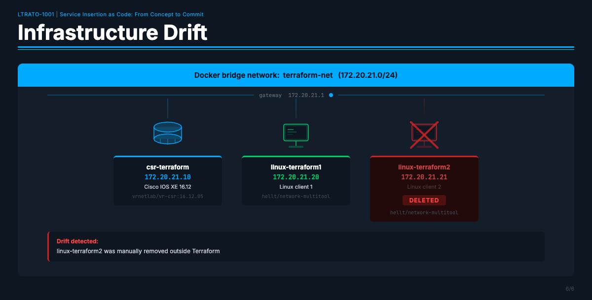

**Infrastructure drift** is what happens when the real state of your infrastructure no
longer matches what Terraform expects based on its state file. This is one of the most
common real-world problems in infrastructure management.

Drift can happen when:

- Someone manually deletes or modifies a resource outside of Terraform ("I'll just fix it
  quickly in the CLI...")
- A container crashes and is removed automatically by Docker
- An engineer makes a "quick fix" directly on a device instead of going through the IaC
  pipeline

In a traditional environment, drift often goes unnoticed until something breaks.
Terraform can **detect** it and **fix** it automatically.

### Step 20 — Simulate Drift: Manually Delete a Container

We are going to pretend to be a colleague who deleted a container by hand, bypassing
Terraform entirely. Without touching any Terraform files, directly remove
`linux-terraform2` using Docker:

```bash
docker rm -f linux-terraform2
```

> Expected output:
<pre>
linux-terraform2
</pre>

### Step 21 — Confirm It Is Gone

```bash
docker ps --filter name=terraform --format "table {{.ID}}\t{{.Image}}\t{{.Status}}\t{{.Names}}"
```

> Expected output:
<pre>
CONTAINER ID   IMAGE                             STATUS                   NAMES
cf2b394afde8   ghcr.io/hellt/network-multitool   Up 8 minutes             linux-terraform1
8fdc981b800e   vrnetlab/vr-csr:16.12.05          Up 8 minutes (healthy)   csr-terraform
</pre>

`linux-terraform2` is missing. The infrastructure has **drifted** from the Terraform
configuration.

### Step 22 — Detect Drift with terraform plan

Run `terraform plan`. Terraform will first **refresh** its state by checking the actual
state of every resource against what is recorded in `terraform.tfstate`. When it finds
that `linux-terraform2` no longer exists, it will add it to the plan as something that
needs to be re-created:

```bash
terraform plan
```

Look for this in the output summary at the bottom:

> Expected output (bottom of the plan):
<pre>
Plan: 1 to add, 0 to change, 0 to destroy.
</pre>

> **Terraform found the drift.** It knows `linux-terraform2` should exist (it's in the
> state file) but doesn't (it's not running in Docker). Only the missing container needs
> to be re-created — everything else matches, so Terraform leaves it alone.

### Step 23 — Remediate Drift with terraform apply

Run `terraform apply -auto-approve`. Because the CSR is already running and RESTCONF is
already active, Terraform only needs to re-create the one missing container. This
completes in under 2 seconds:

```bash
terraform apply -auto-approve
```

> Expected output:
<pre>
module.docker_infra.docker_container.linux2: Creating...
module.docker_infra.docker_container.linux2: Creation complete after 0s [id=a3d3c8160a11...]

Apply complete! Resources: 1 added, 0 changed, 0 destroyed.

Outputs:

csr_hostname = "csr-terraform"
csr_ip = "172.20.21.10"
linux1_ip = "172.20.21.20"
linux2_ip = "172.20.21.21"
loopback0 = "10.99.99.1/255.255.255.255"
</pre>

> Notice that Terraform only created **1** resource — it did not touch the CSR,
> linux-terraform1, the network, or the volume. It only fixed exactly what was missing.

### Step 24 — Confirm All Three Containers Are Running Again

```bash
docker ps --filter name=terraform --format "table {{.ID}}\t{{.Image}}\t{{.Status}}\t{{.Names}}"
```

> Expected output:
<pre>
CONTAINER ID   IMAGE                             STATUS                   NAMES
a3d3c8160a11   ghcr.io/hellt/network-multitool   Up 8 seconds             linux-terraform2
cf2b394afde8   ghcr.io/hellt/network-multitool   Up 8 minutes             linux-terraform1
8fdc981b800e   vrnetlab/vr-csr:16.12.05          Up 8 minutes (healthy)   csr-terraform
</pre>

Note that `linux-terraform2` shows a fresh uptime (8 seconds) while the others are still
at their original age — it was just recreated.

### Step 25 — Verify terraform plan Now Shows No Changes

```bash
terraform plan
```

> Expected output (bottom of the plan):
<pre>
No changes. Your infrastructure matches the configuration.

Terraform has compared your real infrastructure against your configuration
and found no differences, so no changes are needed.
</pre>

This is the Terraform "all clear." The real world matches the desired state exactly.
In a production IaC pipeline, seeing `No changes` when you run `plan` is the goal —
it means your infrastructure is exactly where you left it.

> **💡 Automation Insight:** In production, teams run `terraform plan` on a schedule
> (via CI/CD) against live infrastructure. If the plan shows any changes, it triggers an
> alert — someone made an out-of-band change. The team can then decide whether to
> remediate (apply the plan) or update the code to match the new reality. Either way,
> drift is **visible**, not hidden.

### Checkpoint — Part 4

- [ ] `docker rm -f linux-terraform2` removed the container
- [ ] `docker ps` confirmed only 2 containers remained
- [ ] `terraform plan` showed **Plan: 1 to add**
- [ ] `terraform apply` showed **Resources: 1 added, 0 changed, 0 destroyed**
- [ ] `docker ps` confirmed all 3 containers running again (`linux-terraform2` with fresh uptime)
- [ ] `terraform plan` confirmed **No changes**

---

## Part 5 — Tear Down

At the end of this section, **tear down the Terraform environment completely** before
moving on to the ContainerLab section. The CSR uses significant RAM (~3.5 GiB) that the
ContainerLab topology needs.

### Step 26 — Destroy All Resources

> In the lab, use `-auto-approve` to skip the confirmation prompt. In production,
> always omit this flag and review the destruction plan carefully before confirming.

Terraform destroys resources in the correct dependency order — IOS XE config first, then
containers, then the network and volume.

> **Heads up:** Just like `plan` and `apply`, the `destroy` output is verbose — it lists
> every attribute being removed. Scroll to the bottom to see the final summary.

```bash
terraform destroy -auto-approve
```

> Expected output (key lines):
<pre>
module.iosxe_config.iosxe_interface_loopback.lo0: Destroying...
module.iosxe_config.iosxe_system.this: Destroying...
module.iosxe_config.iosxe_interface_loopback.lo0: Destruction complete after 3s
module.iosxe_config.iosxe_system.this: Destruction complete after 6s
module.docker_infra.null_resource.csr_ready: Destroying...
module.docker_infra.null_resource.csr_ready: Destruction complete after 0s
module.docker_infra.docker_container.linux1: Destroying...
module.docker_infra.docker_container.linux2: Destroying...
module.docker_infra.docker_container.csr: Destroying...
module.docker_infra.docker_container.linux2: Destruction complete after 1s
module.docker_infra.docker_container.linux1: Destruction complete after 1s
module.docker_infra.docker_container.csr: Destruction complete after 1s
module.docker_infra.docker_volume.csr_storage: Destroying...
module.docker_infra.docker_network.terraform_net: Destroying...
module.docker_infra.docker_volume.csr_storage: Destruction complete after 2s
module.docker_infra.docker_network.terraform_net: Destruction complete after 2s

Destroy complete! Resources: 8 destroyed.
</pre>

### Step 27 — Verify Everything Is Cleaned Up

```bash
docker ps --filter name=terraform --format "table {{.ID}}\t{{.Image}}\t{{.Status}}\t{{.Names}}"
```

> Expected output:
<pre>
CONTAINER ID   IMAGE     STATUS    NAMES
</pre>

```bash
docker network ls --filter name=terraform
```

> Expected output:
<pre>
NETWORK ID   NAME      DRIVER    SCOPE
</pre>

```bash
docker volume ls --filter name=terraform
```

> Expected output:
<pre>
DRIVER    VOLUME NAME
</pre>

### Step 28 — Confirm Terraform State Is Empty

```bash
terraform show
```

> Expected output:
<pre>
The state file is empty. No resources are represented.
</pre>

Everything is clean. You are ready to move on to the ContainerLab section.

---

## Quick Reference

| Command | What it does |
|---|---|
| `terraform init` | Initialize working directory, link providers |
| `terraform plan` | Preview changes — safe, makes no modifications |
| `terraform apply -auto-approve` | Deploy or update infrastructure to match config |
| `terraform destroy -auto-approve` | Remove all Terraform-managed resources |
| `terraform show` | Display current state in human-readable form |
| `terraform output` | Print output values |
| `docker ps --filter name=terraform` | Check which terraform containers are running |
| `docker logs -f csr-terraform` | Follow CSR boot log |
| `curl -sk -u admin:admin -H "Accept: application/yang-data+json" https://172.20.21.10/restconf/...` | Query CSR via RESTCONF |

---

## Summary

In this lab you:

1. Explored a modular Terraform configuration managing both Docker infrastructure and
   Cisco IOS XE device configuration from a single `terraform apply`
2. Used `terraform plan` to safely preview changes before applying them
3. Deployed a three-container network lab including a Cisco CSR1000v router configured
   entirely via Terraform and RESTCONF
4. Verified the deployment through Docker, RESTCONF API queries, and direct SSH
5. Simulated infrastructure drift by manually deleting a container outside of Terraform
6. Used `terraform plan` to detect the drift and `terraform apply` to remediate it in
   under 1 second
7. Performed a clean teardown with `terraform destroy` and verified all resources were removed

The key takeaway: with IaC, your infrastructure is **defined, versioned, and repeatable**.
Drift is detectable and correctable. The same configuration file that built this lab today
will build the exact same lab tomorrow, next week, or on a completely different server.

---

← [Task 4](TASK4.md) | [Lab Guide](LAB-GUIDE.md) | [Task 6 →](TASK6.md)
