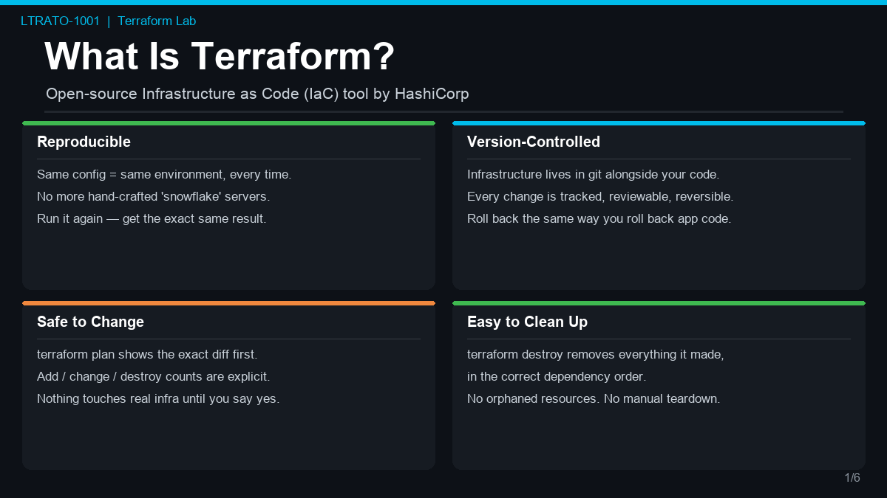
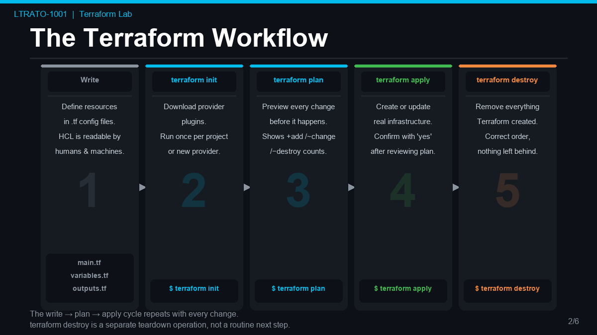
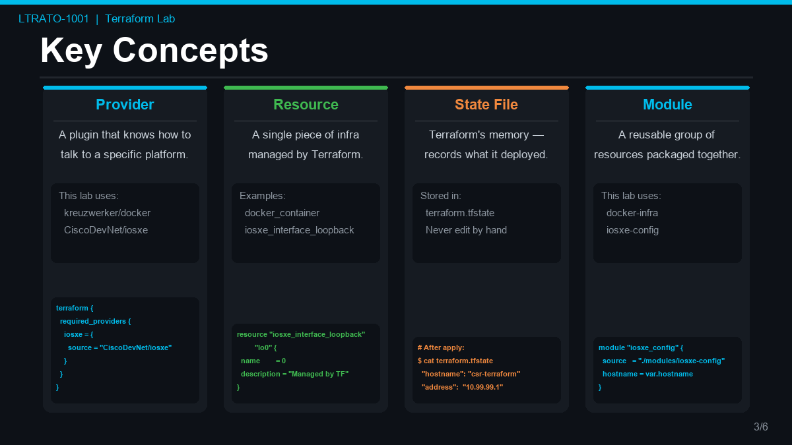

# Overview

## What Is Terraform?

Terraform is an open-source Infrastructure as Code (IaC) tool created by HashiCorp. It
lets you define your infrastructure — servers, networks, routers, firewalls, cloud
resources — in plain text configuration files, and then deploy, modify, or destroy that
infrastructure with a single command.

### Why use Terraform instead of doing it manually?

| Problem with manual configuration | How Terraform solves it |
|---|---|
| Hard to reproduce — "works on my machine" | The config file **is** the environment. Anyone with the file gets the same result |
| Easy to forget what you changed | Every change is tracked in code and version-controlled in git |
| Risky to modify — hard to know what will change | `terraform plan` shows you exactly what will change **before** you apply anything |
| Hard to clean up — did I delete everything? | `terraform destroy` removes every resource Terraform created, nothing more, nothing less |
| Snowflake servers — each one slightly different | Idempotent — run `apply` 10 times, you always end up with the same state |

In a network engineering context, Terraform is increasingly used to:

- Provision virtual routers and network infrastructure (exactly what this lab does)
- Configure network devices via RESTCONF, NETCONF, or APIs
- Manage cloud networking (VPCs, subnets, security groups)
- Orchestrate lab environments for testing and CI/CD pipelines

### The Terraform Workflow

| Step | Command | What it does |
|---|---|---|
| 1 | **Write** | Define your infrastructure in `.tf` config files using HCL. Describe *what* you want — Terraform figures out *how* to build it. |
| 2 | `terraform init` | Downloads and installs the provider plugins your configuration requires. Run once per project, or whenever you add a new provider. |
| 3 | `terraform plan` | Compares your config against the current state and previews every change — additions, modifications, and deletions — before anything is touched. |
| 4 | `terraform apply` | Executes the plan and creates or updates real infrastructure to match your configuration. **Loop back to Write → plan → apply for every subsequent change.** |
| — | `terraform destroy` | Teardown only — removes every resource Terraform created when you are done with the environment. Not a routine step after every apply. |

!!! tip "The real lifecycle is a loop"
    Write → plan → apply → Write → plan → apply, repeating with every change.
    `terraform destroy` is a separate decommission operation — not a routine next step after every apply.

### Key Concepts

**Provider** — a plugin that knows how to talk to a specific platform. This lab uses two:

- `kreuzwerker/docker` — creates Docker containers and networks
- `CiscoDevNet/iosxe` — configures Cisco IOS XE devices via RESTCONF

**Resource** — a single piece of infrastructure managed by Terraform (a container, a
network, a router interface, a hostname).

**State file** (`terraform.tfstate`) — Terraform's memory. It records what it has
deployed so it knows what to add, change, or remove on the next run.

**Module** — a reusable group of resources. This lab uses two modules:

- `docker-infra` — handles the Docker network, storage volume, and containers
- `iosxe-config` — handles IOS XE device configuration via RESTCONF

---

!!! next "Up next"
    Continue to [Lab Topology](topology.md) to see what this lab builds.
