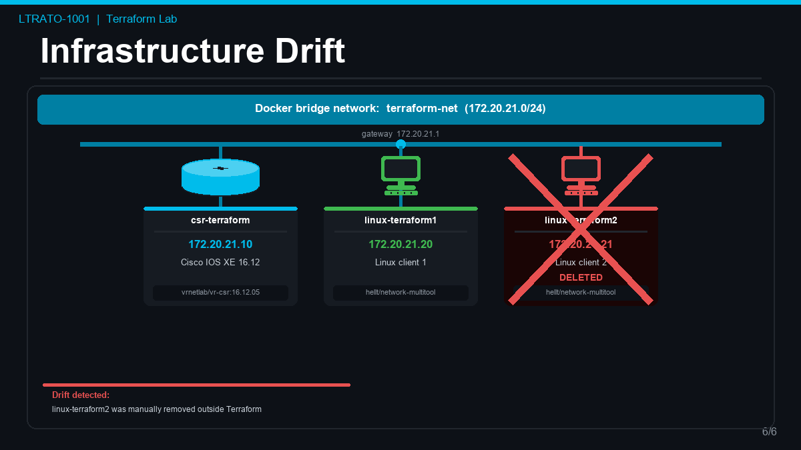

# Part 4 — Infrastructure Drift



**Infrastructure drift** is what happens when the real state of your infrastructure no
longer matches what Terraform expects based on its state file. This is one of the most
common real-world problems in infrastructure management.

Drift can happen when:

- Someone manually deletes or modifies a resource outside of Terraform ("I'll just fix it
  quickly in the CLI...")
- A container crashes and is removed automatically by Docker
- An engineer makes a "quick fix" directly on a device instead of going through the IaC
  pipeline

In a traditional environment, drift often goes unnoticed until something breaks.
Terraform can **detect** it and **fix** it automatically.

## Step 1 — Simulate drift: manually delete a container

We are going to pretend to be a colleague who deleted a container by hand, bypassing
Terraform entirely. Without touching any Terraform files, directly remove
`linux-terraform2` using Docker:

```bash
docker rm -f linux-terraform2
```

??? success "Expected output"
    ```
    linux-terraform2
    ```

## Step 2 — Confirm it is gone

```bash
docker ps --filter name=terraform --format "table {{.ID}}\t{{.Image}}\t{{.Status}}\t{{.Names}}"
```

??? success "Expected output"
    ```
    CONTAINER ID   IMAGE                             STATUS                   NAMES
    cf2b394afde8   ghcr.io/hellt/network-multitool   Up 8 minutes             linux-terraform1
    8fdc981b800e   vrnetlab/vr-csr:16.12.05          Up 8 minutes (healthy)   csr-terraform
    ```

`linux-terraform2` is missing. The infrastructure has **drifted** from the Terraform
configuration.

## Step 3 — Detect drift with terraform plan

Run `terraform plan`. Terraform will first **refresh** its state by checking the actual
state of every resource against what is recorded in `terraform.tfstate`. When it finds
that `linux-terraform2` no longer exists, it will add it to the plan as something that
needs to be re-created:

```bash
terraform plan
```

Look for this in the output summary at the bottom:

??? success "Expected output (bottom of the plan)"
    ```
    Plan: 1 to add, 0 to change, 0 to destroy.
    ```

!!! success "Terraform found the drift"
    It knows `linux-terraform2` should exist (it's in the state file) but doesn't
    (it's not running in Docker). Only the missing container needs to be re-created —
    everything else matches, so Terraform leaves it alone.

## Step 4 — Remediate drift with terraform apply

Run `terraform apply -auto-approve`. Because the CSR is already running and RESTCONF is
already active, Terraform only needs to re-create the one missing container. This
completes in under 2 seconds:

```bash
terraform apply -auto-approve
```

??? success "Expected output"
    ```
    module.docker_infra.docker_container.linux2: Creating...
    module.docker_infra.docker_container.linux2: Creation complete after 0s [id=a3d3c8160a11...]

    Apply complete! Resources: 1 added, 0 changed, 0 destroyed.

    Outputs:

    csr_hostname = "csr-terraform"
    csr_ip = "172.20.21.10"
    linux1_ip = "172.20.21.20"
    linux2_ip = "172.20.21.21"
    loopback0 = "10.99.99.1/255.255.255.255"
    ```

!!! info
    Notice that Terraform only created **1** resource — it did not touch the CSR,
    linux-terraform1, the network, or the volume. It only fixed exactly what was missing.

## Step 5 — Confirm all three containers are running again

```bash
docker ps --filter name=terraform --format "table {{.ID}}\t{{.Image}}\t{{.Status}}\t{{.Names}}"
```

??? success "Expected output"
    ```
    CONTAINER ID   IMAGE                             STATUS                   NAMES
    a3d3c8160a11   ghcr.io/hellt/network-multitool   Up 8 seconds             linux-terraform2
    cf2b394afde8   ghcr.io/hellt/network-multitool   Up 8 minutes             linux-terraform1
    8fdc981b800e   vrnetlab/vr-csr:16.12.05          Up 8 minutes (healthy)   csr-terraform
    ```

Note that `linux-terraform2` shows a fresh uptime (8 seconds) while the others are still
at their original age — it was just recreated.

## Step 6 — Verify terraform plan now shows no changes

```bash
terraform plan
```

??? success "Expected output (bottom of the plan)"
    ```
    No changes. Your infrastructure matches the configuration.

    Terraform has compared your real infrastructure against your configuration
    and found no differences, so no changes are needed.
    ```

This is the Terraform "all clear." The real world matches the desired state exactly.
In a production IaC pipeline, seeing `No changes` when you run `plan` is the goal —
it means your infrastructure is exactly where you left it.

---

!!! tip "Up next"
    Continue to [Part 5 — Tear Down](part5-teardown.md) to cleanly destroy all resources before moving on.
